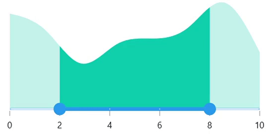

# Interval in .NET MAUI Range Selector (SfRangeSelector)

This section explains about how to add the interval for numeric Range Selector.

## Numeric interval

Range Selector elements like labels, ticks and dividers are rendered based on the [`Interval`](https://help.syncfusion.com/cr/maui/Syncfusion.Maui.Sliders.SliderBase.html#Syncfusion_Maui_Sliders_SliderBase_Interval), [`Minimum`](https://help.syncfusion.com/cr/maui/Syncfusion.Maui.Sliders.NumericRangeSliderBase.html#Syncfusion_Maui_Sliders_NumericRangeSliderBase_Minimum) and [`Maximum`](https://help.syncfusion.com/cr/maui/Syncfusion.Maui.Sliders.NumericRangeSliderBase.html#Syncfusion_Maui_Sliders_NumericRangeSliderBase_Maximum) properties. The default value is `Zero`.

For example, if [`Minimum`](https://help.syncfusion.com/cr/maui/Syncfusion.Maui.Sliders.NumericRangeSliderBase.html#Syncfusion_Maui_Sliders_NumericRangeSliderBase_Minimum) is 0.0 and [`Maximum`](https://help.syncfusion.com/cr/maui/Syncfusion.Maui.Sliders.NumericRangeSliderBase.html#Syncfusion_Maui_Sliders_NumericRangeSliderBase_Maximum) is 10.0 and [`Interval`](https://help.syncfusion.com/cr/maui/Syncfusion.Maui.Sliders.SliderBase.html#Syncfusion_Maui_Sliders_SliderBase_Interval) is 2.0, the Range Selector will render the labels, major ticks, and dividers at 0.0, 2.0, 4.0 and so on.





<ContentPage 
             ...
             xmlns:sliders="clr-namespace:Syncfusion.Maui.Sliders;assembly=Syncfusion.Maui.Sliders"
             xmlns:charts="clr-namespace:Syncfusion.Maui.Charts;assembly=Syncfusion.Maui.Charts">
    
    <sliders:SfRangeSelector Minimum="0" 
                             Maximum="10"  
                             RangeStart="2" 
                             RangeEnd="8"
                             Interval="2" 
                             ShowLabels="True" 
                             ShowTicks="True" 
                             ShowDividers="True">
        
        <charts:SfCartesianChart>
            ...
        </charts:SfCartesianChart>
    
    </rangeselector:SfRangeSelector>
</ContentPage>





SfRangeSelector rangeSelector = new SfRangeSelector();
rangeSelector.Minimum = 0;
rangeSelector.Maximum = 10;
rangeSelector.RangeStart = 2;
rangeSelector.RangeEnd = 8;
rangeSelector.Interval = 2;
rangeSelector.ShowLabels = true;
rangeSelector.ShowTicks = true;
rangeSelector.ShowDividers = true;
SfCartesianChart chart = new SfCartesianChart();
rangeSelector.Content = chart;
         




## Discrete selection for numeric values

Move the thumb in discrete manner for numeric values using the [`StepSize`](https://help.syncfusion.com/cr/maui/Syncfusion.Maui.Sliders.NumericRangeSliderBase.html#Syncfusion_Maui_Sliders_NumericRangeSliderBase_StepSize) property in the Range Selector.





<ContentPage 
             ...
             xmlns:sliders="clr-namespace:Syncfusion.Maui.Sliders;assembly=Syncfusion.Maui.Sliders"
             xmlns:charts="clr-namespace:Syncfusion.Maui.Charts;assembly=Syncfusion.Maui.Charts">

    <sliders:SfRangeSelector Minimum="0" 
                             Maximum="10"                                
                             RangeStart="2" 
                             RangeEnd="8"
                             Interval="2" 
                             ShowLabels="True" 
                             ShowTicks="True" 
                             ShowDividers="True">
        
        <charts:SfCartesianChart>
            ...
        </charts:SfCartesianChart>
    
    </sliders:SfRangeSelector>
</ContentPage>





SfRangeSelector rangeSelector = new SfRangeSelector();
rangeSelector.StepSize = 2;
rangeSelector.Minimum = 0;
rangeSelector.Maximum = 10;
rangeSelector.RangeStart = 2;
rangeSelector.RangeEnd = 8;
rangeSelector.Interval = 2;
rangeSelector.ShowLabels = true;
rangeSelector.ShowTicks = true;
rangeSelector.ShowDividers = true;
SfCartesianChart chart = new SfCartesianChart();
rangeSelector.Content = chart;
         




## Interval Selection

Drag thumbs only in interval when the [EnableIntervalSelection](https://help.syncfusion.com/cr/maui/Syncfusion.Maui.Sliders.RangeSliderBase.html#Syncfusion_Maui_Sliders_RangeSliderBase_EnableIntervalSelection) is true.
If true, both the thumbs can only be moved on the selector Interval.





<ContentPage 
             ...
             xmlns:sliders="clr-namespace:Syncfusion.Maui.Sliders;assembly=Syncfusion.Maui.Sliders"
             xmlns:charts="clr-namespace:Syncfusion.Maui.Charts;assembly=Syncfusion.Maui.Charts">
    
    <sliders:SfRangeSelector Minimum="0" 
                             Maximum="10"
                             RangeStart="2"
                             RangeEnd="8"
                             Interval="2" 
                             ShowTicks="True"
                             ShowLabels="True"
                             EnableIntervalSelection="True">

        <charts:SfCartesianChart>
            ...
        </charts:SfCartesianChart>
    
    </sliders:SfRangeSelector>
</ContentPage>





SfRangeSelector rangeSelector = new SfRangeSelector();
rangeSelector.Minimum = 0;
rangeSelector.Maximum = 0;
rangeSelector.RangeStart = 2; 
rangeSelector.RangeEnd = 8;        
rangeSelector.ShowLables = true;
rangeSelector.ShowTicks = true;    
rangeSelector.EnableIntervalSelection = true;
SfCartesianChart chart = new SfCartesianChart();
rangeSelector.Content = chart;
         




