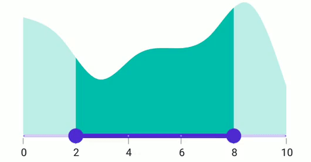
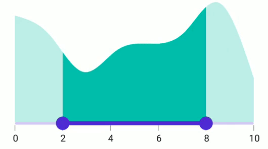

# Interval in .NET MAUI Range Selector (SfRangeSelector)

This section explains about how to add the interval for numeric and date range selector.

## Numeric interval

Range Selector elements like labels, ticks and dividers are rendered based on the [`Interval`](https://help.syncfusion.com/cr/maui/Syncfusion.Maui.Sliders.SliderBase.html#Syncfusion_Maui_Sliders_SliderBase_Interval), [`Minimum`](https://help.syncfusion.com/cr/maui/Syncfusion.Maui.Sliders.SliderBase.html#Syncfusion_Maui_Sliders_SliderBase_Minimum) and [`Maximum`](https://help.syncfusion.com/cr/maui/Syncfusion.Maui.Sliders.SliderBase.html#Syncfusion_Maui_Sliders_SliderBase_Maximum) properties. The default value is `Zero`.

For example, if [`Minimum`](https://help.syncfusion.com/cr/maui/Syncfusion.Maui.Sliders.SliderBase.html#Syncfusion_Maui_Sliders_SliderBase_Minimum) is 0.0 and [`Maximum`](https://help.syncfusion.com/cr/maui/Syncfusion.Maui.Sliders.SliderBase.html#Syncfusion_Maui_Sliders_SliderBase_Maximum) is 10.0 and [`Interval`](https://help.syncfusion.com/cr/maui/Syncfusion.Maui.Sliders.SliderBase.html#Syncfusion_Maui_Sliders_SliderBase_Interval) is 2.0, the range selector will render the labels, major ticks, and dividers at 0.0, 2.0, 4.0 and so on.





<ContentPage 
             ...
             xmlns:rangeselector="clr-namespace:Syncfusion.Maui.Sliders;assembly=Syncfusion.Maui.Sliders"
             xmlns:chart="clr-namespace:Syncfusion.Maui.Charts;assembly=Syncfusion.Maui.Charts"
             xmlns:local="clr-namespace:SliderTestbedSample.RangeSelector">
    <ContentPage.BindingContext>
        <local:ViewModel />
    </ContentPage.BindingContext>
    <rangeselector:SfRangeSelector Minimum="0" 
                                   Maximum="10" 
                                   Interval="2"  
                                   RangeStart="2" 
                                   RangeEnd="8" 
                                   ShowLabels="True" 
                                   ShowTicks="True" 
                                   ShowDividers="True">
        <chart:SfCartesianChart>
            <chart:SfCartesianChart.XAxes>
               <chart:DateTimeAxis IsVisible="False"
                                   ShowMajorGridLines="False" />
            </chart:SfCartesianChart.XAxes>
            <chart:SfCartesianChart.YAxes>
               <chart:NumericalAxis IsVisible="False"
                                    ShowMajorGridLines="False" />
            </chart:SfCartesianChart.YAxes>
            <chart:SfCartesianChart.Series>
               <chart:SplineAreaSeries ItemsSource="{Binding Source}"
                                       XBindingPath="X"
                                       YBindingPath="Y"
                                       Fill="Blue">
               </chart:SplineAreaSeries>
            </chart:SfCartesianChart.Series>
        </chart:SfCartesianChart>
    </rangeselector:SfRangeSelector>
</ContentPage>





SfRangeSelector rangeSelector = new SfRangeSelector();
rangeSelector.Minimum = 0;
rangeSelector.Maximum = 10;
rangeSelector.RangeStart = 2;
rangeSelector.RangeEnd = 8;
rangeSelector.Interval = 2;
rangeSelector.ShowLabels = true;
rangeSelector.ShowTicks = true;
rangeSelector.ShowDividers = true;
SfCartesianChart chart = new SfCartesianChart();
DateTimeAxis primaryAxis = new DateTimeAxis();
chart.XAxes = primaryAxis;
NumericalAxis secondaryAxis = new NumericalAxis();
chart.YAxes = secondaryAxis;
SplineAreaSeries series = new SplineAreaSeries();
series.ItemsSource = (new ViewModel()).Source;
series.XBindingPath = "X";
series.YBindingPath = "Y";
rangeSelector.Content = chart;
         




## Date interval

The type of date interval. It can be years to seconds. It is mandatory for date [`SfDateTimeRangeSelector`](https://help.syncfusion.com/cr/maui/Syncfusion.Maui.Sliders.SfDateTimeRangeSelector.html). The default value of [`DateIntervalType`](https://help.syncfusion.com/cr/maui/Syncfusion.Maui.Sliders.SliderBase.html#Syncfusion_Maui_Sliders_SliderBase_DateIntervalType) property is `DateTime.Year`.

For date values, the range selector does not have auto interval support. So, it is mandatory to set [`Interval`](https://help.syncfusion.com/cr/maui/Syncfusion.Maui.Sliders.SliderBase.html#Syncfusion_Maui_Sliders_SliderBase_Interval), [`DateIntervalType`](https://help.syncfusion.com/cr/maui/Syncfusion.Maui.Sliders.SliderBase.html#Syncfusion_Maui_Sliders_SliderBase_DateIntervalType), and [`DateFormat`](https://help.syncfusion.com/cr/maui/Syncfusion.Maui.Sliders.SliderBase.html#Syncfusion_Maui_Sliders_SliderBase_DateFormat) for date values.

For example, if [`Minimum`](https://help.syncfusion.com/cr/maui/Syncfusion.Maui.Sliders.SliderBase.html#Syncfusion_Maui_Sliders_SliderBase_Minimum) is `DateTime(2000, 01, 01)` and [`Maximum`](https://help.syncfusion.com/cr/maui/Syncfusion.Maui.Sliders.SliderBase.html#Syncfusion_Maui_Sliders_SliderBase_Maximum) is `DateTime(2005, 01, 01)` and [`Interval`](https://help.syncfusion.com/cr/maui/Syncfusion.Maui.Sliders.SliderBase.html#Syncfusion_Maui_Sliders_SliderBase_Interval) is `1`, [`DateIntervalType`](https://help.syncfusion.com/cr/maui/Syncfusion.Maui.Sliders.SliderBase.html#Syncfusion_Maui_Sliders_SliderBase_DateIntervalType) is [`SliderDateIntervalType.years`](https://help.syncfusion.com/cr/maui/Syncfusion.Maui.Sliders.SliderDateIntervalType.html#Syncfusion_Maui_Sliders_SliderDateIntervalType_Years), [`DateFormat`](https://help.syncfusion.com/cr/maui/Syncfusion.Maui.Sliders.SliderBase.html#Syncfusion_Maui_Sliders_SliderBase_DateFormat) is `yyyy` then the range slider will render the labels, major ticks, and dividers at 2000, 2001, 2002 and so on.





<ContentPage 
             ...
             xmlns:rangeselector="clr-namespace:Syncfusion.Maui.Sliders;assembly=Syncfusion.Maui.Sliders"
             xmlns:chart="clr-namespace:Syncfusion.Maui.Charts;assembly=Syncfusion.Maui.Charts"
             xmlns:local="clr-namespace:SliderTestbedSample.RangeSelector">
    <ContentPage.BindingContext>
        <local:ViewModel />
    </ContentPage.BindingContext>
    <rangeselector:SfDateTimeRangeSelector Minimum="2000-01-01" 
                                           Maximum="2005-01-01" 
                                           Interval="1" 
                                           RangeStart="2001-01-01" 
                                           RangeEnd="2004-01-01" 
                                           DateFormat="yyyy" 
                                           DateIntervalType="Years" 
                                           ShowLabels="True" 
                                           ShowTicks="True" 
                                           ShowDividers="True">
        <chart:SfCartesianChart>
            <chart:SfCartesianChart.XAxes>
               <chart:DateTimeAxis IsVisible="False"
                                   ShowMajorGridLines="False" />
            </chart:SfCartesianChart.XAxes>
            <chart:SfCartesianChart.YAxes>
               <chart:NumericalAxis IsVisible="False"
                                    ShowMajorGridLines="False" />
            </chart:SfCartesianChart.YAxes>
            <chart:SfCartesianChart.Series>
               <chart:SplineAreaSeries ItemsSource="{Binding Source}"
                                       XBindingPath="X"
                                       YBindingPath="Y"
                                       Fill="Blue">
               </chart:SplineAreaSeries>
            </chart:SfCartesianChart.Series>
        </chart:SfCartesianChart>
    </rangeselector:SfDateTimeRangeSelector>
</ContentPage>





SfRangeSelector rangeSelector = new SfRangeSelector();
rangeSelector.Minimum = new DateTime(2000, 01, 01);
rangeSelector.Maximum = new DateTime(2005, 01, 01);
rangeSelector.RangeStart = new DateTime(2001, 01, 01); 
rangeSelector.RangeEnd = new DateTime(2004, 01, 01);            
rangeSelector.Interval = 1;
rangeSelector.DateIntervalType = SliderDateIntervalType.Years;
rangeSelector.DateFormat = "yyyy";
rangeSelector.ShowLabels = true;
rangeSelector.ShowTicks = true;
rangeSelector.ShowDividers = true;
SfCartesianChart chart = new SfCartesianChart();
DateTimeAxis primaryAxis = new DateTimeAxis();
chart.XAxes = primaryAxis;
NumericalAxis secondaryAxis = new NumericalAxis();
chart.YAxes = secondaryAxis;
SplineAreaSeries series = new SplineAreaSeries();
series.ItemsSource = (new ViewModel()).Source;
series.XBindingPath = "X";
series.YBindingPath = "Y";
rangeSelector.Content = chart;
        




## Discrete selection for numeric values

You can move the thumb in discrete manner for numeric values using the [`StepSize`](https://help.syncfusion.com/cr/maui/Syncfusion.Maui.Sliders.SliderBase.html#Syncfusion_Maui_Sliders_SliderBase_StepSize) property in the range slider.





<ContentPage 
             ...
             xmlns:rangeselector="clr-namespace:Syncfusion.Maui.Sliders;assembly=Syncfusion.Maui.Sliders"
             xmlns:chart="clr-namespace:Syncfusion.Maui.Charts;assembly=Syncfusion.Maui.Charts"
             xmlns:local="clr-namespace:SliderTestbedSample.RangeSelector">
    <ContentPage.BindingContext>
        <local:ViewModel />
    </ContentPage.BindingContext>
    <rangeselector:SfRangeSelector StepSize="2"
                                   Minimum="0" 
                                   Maximum="10" 
                                   Interval="2"  
                                   RangeStart="2" 
                                   RangeEnd="8" 
                                   ShowLabels="True" 
                                   ShowTicks="True" 
                                   ShowDividers="True">
        <chart:SfCartesianChart>
            <chart:SfCartesianChart.XAxes>
               <chart:DateTimeAxis IsVisible="False"
                                   ShowMajorGridLines="False" />
            </chart:SfCartesianChart.XAxes>
            <chart:SfCartesianChart.YAxes>
               <chart:NumericalAxis IsVisible="False"
                                    ShowMajorGridLines="False" />
            </chart:SfCartesianChart.YAxes>
            <chart:SfCartesianChart.Series>
               <chart:SplineAreaSeries ItemsSource="{Binding Source}"
                                       XBindingPath="X"
                                       YBindingPath="Y"
                                       Fill="Blue">
               </chart:SplineAreaSeries>
            </chart:SfCartesianChart.Series>
        </chart:SfCartesianChart>
    </rangeselector:SfRangeSelector>
</ContentPage>





SfRangeSelector rangeSelector = new SfRangeSelector();
rangeSelector.StepSize = 2;
rangeSelector.Minimum = 0;
rangeSelector.Maximum = 10;
rangeSelector.RangeStart = 2;
rangeSelector.RangeEnd = 8;
rangeSelector.Interval = 2;
rangeSelector.ShowLabels = true;
rangeSelector.ShowTicks = true;
rangeSelector.ShowDividers = true;
SfCartesianChart chart = new SfCartesianChart();
DateTimeAxis primaryAxis = new DateTimeAxis();
chart.XAxes = primaryAxis;
NumericalAxis secondaryAxis = new NumericalAxis();
chart.YAxes = secondaryAxis;
SplineAreaSeries series = new SplineAreaSeries();
series.ItemsSource = (new ViewModel()).Source;
series.XBindingPath = "X";
series.YBindingPath = "Y";
rangeSelector.Content = chart;
         




## Discrete selection for date values

You can move the thumb in discrete manner for date values using the [`StepDuration`](https://help.syncfusion.com/cr/maui/Syncfusion.Maui.Sliders.SliderBase.html#Syncfusion_Maui_Sliders_SliderBase_StepDuration) property in the range slider.

For example, if [`Minimum`](https://help.syncfusion.com/cr/maui/Syncfusion.Maui.Sliders.SliderBase.html#Syncfusion_Maui_Sliders_SliderBase_Minimum) is DateTime(2015, 01, 01) and [`Maximum`](https://help.syncfusion.com/cr/maui/Syncfusion.Maui.Sliders.SliderBase.html#Syncfusion_Maui_Sliders_SliderBase_Maximum) is DateTime(2020, 01, 01) and [`StepDuration`](https://help.syncfusion.com/cr/maui/Syncfusion.Maui.Sliders.SliderBase.html#Syncfusion_Maui_Sliders_SliderBase_StepDuration) is `1`, the range slider will move the thumbs at DateTime(2015, 01, 01), DateTime(2016, 01, 01), DateTime(2017, 01, 01),and DateTime(2018, 01, 01).





<ContentPage 
             ...
             xmlns:rangeselector="clr-namespace:Syncfusion.Maui.Sliders;assembly=Syncfusion.Maui.Sliders"
             xmlns:chart="clr-namespace:Syncfusion.Maui.Charts;assembly=Syncfusion.Maui.Charts"
             xmlns:local="clr-namespace:SliderTestbedSample.RangeSelector">
    <ContentPage.BindingContext>
        <local:ViewModel />
    </ContentPage.BindingContext>
    <rangeselector:SfDateTimeRangeSelector Minimum="2000-01-01" 
                                           Maximum="2005-01-01" 
                                           RangeStart="2001-01-01"
                                           RangeEnd="2004-01-01"  
                                           StepDuration="1"
                                           ShowLabels="True" 
                                           ShowTicks="True" 
                                           ShowDividers="True">
        <chart:SfCartesianChart>
            <chart:SfCartesianChart.XAxes>
               <chart:DateTimeAxis IsVisible="False"
                                   ShowMajorGridLines="False" />
            </chart:SfCartesianChart.XAxes>
            <chart:SfCartesianChart.YAxes>
               <chart:NumericalAxis IsVisible="False"
                                    ShowMajorGridLines="False" />
            </chart:SfCartesianChart.YAxes>
            <chart:SfCartesianChart.Series>
               <chart:SplineAreaSeries ItemsSource="{Binding Source}"
                                       XBindingPath="X"
                                       YBindingPath="Y"
                                       Fill="Blue">
               </chart:SplineAreaSeries>
            </chart:SfCartesianChart.Series>
        </chart:SfCartesianChart>
    </rangeselector:SfDateTimeRangeSelector>
</ContentPage>





SfRangeSelector rangeSelector = new SfRangeSelector();
rangeSelector.Minimum = new DateTime(2000, 01, 01);
rangeSelector.Maximum = new DateTime(2005, 01, 01);
rangeSelector.RangeStart = new DateTime(2001, 01, 01); 
rangeSelector.RangeEnd = new DateTime(2004, 01, 01);     
rangeSelector.ShowLables = true;
rangeSelector.ShowTicks = true;      
rangeSelector.ShowDividers = true;    
rangeSelector.StepDuration = new SliderStepDuration(years: 1);
SfCartesianChart chart = new SfCartesianChart();
DateTimeAxis primaryAxis = new DateTimeAxis();
chart.XAxes = primaryAxis;
NumericalAxis secondaryAxis = new NumericalAxis();
chart.YAxes = secondaryAxis;
SplineAreaSeries series = new SplineAreaSeries();
series.ItemsSource = (new ViewModel()).Source;
series.XBindingPath = "X";
series.YBindingPath = "Y";
rangeSelector.Content = chart;
         




## Interval Selection

You can drag thumbs only in interval when [EnableIntervalSelection](https://help.syncfusion.com/cr/maui/Syncfusion.Maui.Sliders.SfRangeSlider.html#Syncfusion_Maui_Sliders_SfRangeSlider_EnableIntervalSelection) is true.
If true, both the thumbs can be only moved on the selector Interval.





<ContentPage 
             ...
             xmlns:rangeselector="clr-namespace:Syncfusion.Maui.Sliders;assembly=Syncfusion.Maui.Sliders"
             xmlns:chart="clr-namespace:Syncfusion.Maui.Charts;assembly=Syncfusion.Maui.Charts"
             xmlns:local="clr-namespace:SliderTestbedSample.RangeSelector">
    <ContentPage.BindingContext>
        <local:ViewModel />
    </ContentPage.BindingContext>
    <rangeselector:SfRangeSelector Minimum="0" 
                                   Maximum="10"
                                   Interval="2" 
                                   RangeStart="2"
                                   RangeEnd="8"
                                   ShowTicks="True"
                                   ShowLabels="True"
                                   EnableIntervalSelection="True">
        <chart:SfCartesianChart>
            <chart:SfCartesianChart.XAxes>
               <chart:DateTimeAxis IsVisible="False"
                                   ShowMajorGridLines="False" />
            </chart:SfCartesianChart.XAxes>
            <chart:SfCartesianChart.YAxes>
               <chart:NumericalAxis IsVisible="False"
                                    ShowMajorGridLines="False" />
            </chart:SfCartesianChart.YAxes>
            <chart:SfCartesianChart.Series>
               <chart:SplineAreaSeries ItemsSource="{Binding Source}"
                                       XBindingPath="X"
                                       YBindingPath="Y"
                                       Fill="Blue">
               </chart:SplineAreaSeries>
            </chart:SfCartesianChart.Series>
        </chart:SfCartesianChart>
    </rangeselector:SfRangeSelector>
</ContentPage>





SfRangeSelector rangeSelector = new SfRangeSelector();
rangeSelector.Minimum = 0;
rangeSelector.Maximum = 0;
rangeSelector.RangeStart = 2; 
rangeSelector.RangeEnd = 8;        
rangeSelector.ShowLables = true;
rangeSelector.ShowTicks = true;    
rangeSelector.EnableIntervalSelection = true;
SfCartesianChart chart = new SfCartesianChart();
DateTimeAxis primaryAxis = new DateTimeAxis();
chart.XAxes = primaryAxis;
NumericalAxis secondaryAxis = new NumericalAxis();
chart.YAxes = secondaryAxis;
SplineAreaSeries series = new SplineAreaSeries();
series.ItemsSource = (new ViewModel()).Source;
series.XBindingPath = "X";
series.YBindingPath = "Y";
rangeSelector.Content = chart;
         




