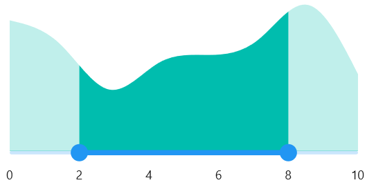
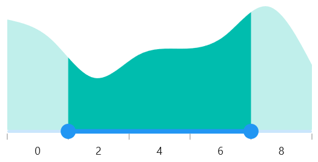
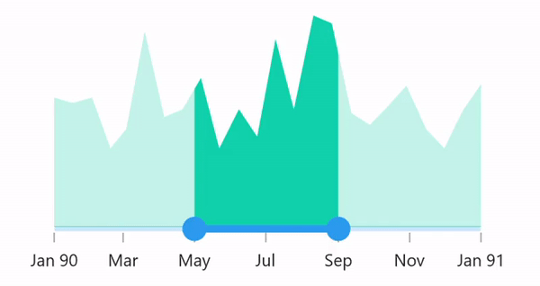
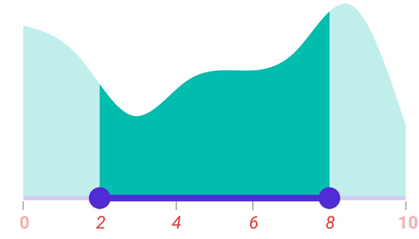
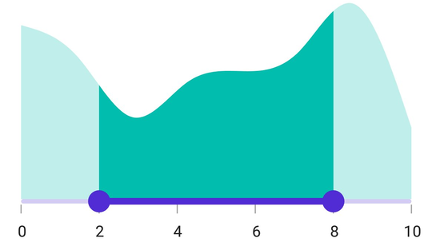

# Labels in .NET MAUI Range Selector (SfRangeSelector)

This section explains about how to add the labels in the Range Selector.

## Show labels

The [`ShowLabels`](https://help.syncfusion.com/cr/maui/Syncfusion.Maui.Sliders.SliderBase.html#Syncfusion_Maui_Sliders_SliderBase_ShowLabels) property is used to render the labels on given interval. The default value of [`ShowLabels`](https://help.syncfusion.com/cr/maui/Syncfusion.Maui.Sliders.SliderBase.html#Syncfusion_Maui_Sliders_SliderBase_ShowLabels) property is `False`.





<ContentPage 
             ...
             xmlns:sliders="clr-namespace:Syncfusion.Maui.Sliders;assembly=Syncfusion.Maui.Sliders"
             xmlns:charts="clr-namespace:Syncfusion.Maui.Charts;assembly=Syncfusion.Maui.Charts">

    <sliders:SfRangeSelector Minimum="0" 
                             Maximum="10"
                             RangeStart="2"
                             RangeEnd="8" 
                             Interval="2" 
                             ShowLabels="True"
                             ShowTicks="True">

        <charts:SfCartesianChart>
            ...
        </charts:SfCartesianChart>

    </sliders:SfRangeSelector>
</ContentPage>





SfRangeSelector rangeSelector = new SfRangeSelector();
rangeSelector.Minimum = 0;
rangeSelector.Maximum = 10;
rangeSelector.RangeStart = 2;
rangeSelector.RangeEnd = 8;
rangeSelector.Interval = 2;
rangeSelector.ShowLabels = true;
rangeSelector.ShowTicks = true;
SfCartesianChart chart = new SfCartesianChart();
rangeSelector.Content = chart;





## Number format

The [`NumberFormat`](https://help.syncfusion.com/cr/maui/Syncfusion.Maui.Sliders.NumericRangeSliderBase.html#Syncfusion_Maui_Sliders_NumericRangeSliderBase_NumberFormat) property is used to format the numeric labels. The default value of [`NumberFormat`](https://help.syncfusion.com/cr/maui/Syncfusion.Maui.Sliders.NumericRangeSliderBase.html#Syncfusion_Maui_Sliders_NumericRangeSliderBase_NumberFormat) property is `0.##`.





<ContentPage 
             ...
             xmlns:sliders="clr-namespace:Syncfusion.Maui.Sliders;assembly=Syncfusion.Maui.Sliders"
             xmlns:charts="clr-namespace:Syncfusion.Maui.Charts;assembly=Syncfusion.Maui.Charts">

    <sliders:SfRangeSelector Minimum="0" 
                             Maximum="10"
                             RangeStart="2"
                             RangeEnd="8" 
                             Interval="2"
                             NumberFormat="$#" 
                             ShowLabels="True"
                             ShowTicks="True">

        <charts:SfCartesianChart>
            ...
        </charts:SfCartesianChart>
    
    </sliders:SfRangeSelector>
</ContentPage>





SfRangeSelector rangeSelector = new SfRangeSelector();
rangeSelector.Minimum = 0;
rangeSelector.Maximum = 10;
rangeSelector.RangeStart = 2;
rangeSelector.RangeEnd = 8;
rangeSelector.Interval = 2;
rangeSelector.NumberFormat = "$##";
rangeSelector.ShowLabels = true;
rangeSelector.ShowTicks = true;
SfCartesianChart chart = new SfCartesianChart();
rangeSelector.Content = chart;





## Label placement

The [`LabelsPlacement`](https://help.syncfusion.com/cr/maui/Syncfusion.Maui.Sliders.SliderBase.html#Syncfusion_Maui_Sliders_SliderBase_LabelsPlacement) property is used to place the labels either between the major ticks or on the major ticks. The default value of the [`LabelsPlacement`](https://help.syncfusion.com/cr/maui/Syncfusion.Maui.Sliders.SliderBase.html#Syncfusion_Maui_Sliders_SliderBase_LabelsPlacement) property is [`SliderLabelsPlacement.OnTicks`](https://help.syncfusion.com/cr/maui/Syncfusion.Maui.Sliders.SliderLabelsPlacement.html#Syncfusion_Maui_Sliders_SliderLabelsPlacement_OnTicks).





<ContentPage 
             ...
             xmlns:sliders="clr-namespace:Syncfusion.Maui.Sliders;assembly=Syncfusion.Maui.Sliders"
             xmlns:charts="clr-namespace:Syncfusion.Maui.Charts;assembly=Syncfusion.Maui.Charts">

    <sliders:SfRangeSelector Minimum="0" 
                             Maximum="10" 
                             Interval="2"
                             RangeStart="2"
                             RangeEnd="8" 
                             LabelsPlacement="BetweenTicks"  
                             ShowLabels="True" 
                             ShowTicks="True">

        <charts:SfCartesianChart>
            ...
        </charts:SfCartesianChart>

    </sliders:SfRangeSelector>
</ContentPage>





SfRangeSelector rangeSelector = new SfRangeSelector();
rangeSelector.Minimum = 0;
rangeSelector.Maximum = 10;
rangeSelector.RangeStart = 2;
rangeSelector.RangeEnd = 8;
rangeSelector.Interval = 2;
rangeSelector.LabelsPlacement = SliderLabelsPlacement.BetweenTicks;
rangeSelector.ShowLabels = true;
rangeSelector.ShowTicks = true;
SfCartesianChart chart = new SfCartesianChart();
rangeSelector.Content = chart;





N> Refer [here](https://help.syncfusion.com/maui/range-slider/events) to customize label text format through range slider events.

## Edge labels placement

The `EdgeLabelsPlacement` property is used to move the first and last label either inside the track bounds or based on the intervals. The default value of the `EdgeLabelsPlacement` property is `SliderEdgeLabelPlacement.Default`.

If the `TrackExtent` > 0 and `EdgeLabelsPlacement` is `SliderEdgeLabelsPlacement.Inside`, the labels get placed inside the extended track edges. 





<ContentPage 
             ...
             xmlns:sliders="clr-namespace:Syncfusion.Maui.Sliders;assembly=Syncfusion.Maui.Sliders"
             xmlns:charts="clr-namespace:Syncfusion.Maui.Charts;assembly=Syncfusion.Maui.Charts">

    <sliders:SfDateTimeRangeSelector Minimum="2002-01-07"
                                     Maximum="2002-01-13"
                                     RangeStart="2002-01-09"
                                     RangeEnd="2002-01-11"
                                     Interval="1"
                                     IntervalType="Days"
                                     DateFormat="ddd" 
                                     EdgeLabelsPlacement="Inside" 
                                     ShowLabels="True" 
                                     ShowTicks="True">

        <charts:SfCartesianChart>
            ...
        </charts:SfCartesianChart>

    </sliders:SfRangeSelector>
</ContentPage>





SfDateTimeRangeSelector rangeSelector = new SfDateTimeRangeSelector();
rangeSelector.Minimum = new DateTime(2002, 01, 07);
rangeSelector.Maximum = new DateTime(2002, 01, 13);
rangeSelector.RangeStart = new DateTime(2002, 01, 09);
rangeSelector.RangeEnd = new DateTime(2002, 01, 11);
rangeSelector.Interval = 1;
rangeSelector.IntervalType = SliderDateIntervalType.Days;
rangeSelector.DateFormat = "ddd";
rangeSelector.EdgeLabelsPlacement = SliderEdgeLabelsPlacement.Inside;
rangeSelector.ShowLabels = true;
rangeSelector.ShowTicks = true;
SfCartesianChart chart = new SfCartesianChart();
rangeSelector.Content = chart;





## Label style

You can change the active and inactive label appearance of the Range Selector using the [`ActiveTextColor`](https://help.syncfusion.com/cr/maui/Syncfusion.Maui.Sliders.SliderLabelStyle.html#Syncfusion_Maui_Sliders_SliderLabelStyle_ActiveTextColor), [`ActiveFontSize`](https://help.syncfusion.com/cr/maui/Syncfusion.Maui.Sliders.SliderLabelStyle.html#Syncfusion_Maui_Sliders_SliderLabelStyle_ActiveFontSize), [`ActiveFontFamily`](https://help.syncfusion.com/cr/maui/Syncfusion.Maui.Sliders.SliderLabelStyle.html#Syncfusion_Maui_Sliders_SliderLabelStyle_ActiveFontFamily), [`ActiveFontAttributes`](https://help.syncfusion.com/cr/maui/Syncfusion.Maui.Sliders.SliderLabelStyle.html#Syncfusion_Maui_Sliders_SliderLabelStyle_ActiveFontAttributes), [`InactiveTextColor`](https://help.syncfusion.com/cr/maui/Syncfusion.Maui.Sliders.SliderLabelStyle.html#Syncfusion_Maui_Sliders_SliderLabelStyle_InactiveTextColor), [`InactiveFontSize`](https://help.syncfusion.com/cr/maui/Syncfusion.Maui.Sliders.SliderLabelStyle.html#Syncfusion_Maui_Sliders_SliderLabelStyle_InactiveFontSize), [`InactiveFontFamily`](https://help.syncfusion.com/cr/maui/Syncfusion.Maui.Sliders.SliderLabelStyle.html#Syncfusion_Maui_Sliders_SliderLabelStyle_InactiveFontFamily), [`InactiveFontAttributes`](https://help.syncfusion.com/cr/maui/Syncfusion.Maui.Sliders.SliderLabelStyle.html#Syncfusion_Maui_Sliders_SliderLabelStyle_InactiveFontAttributes) and [`Offset`](https://help.syncfusion.com/cr/maui/Syncfusion.Maui.Sliders.SliderLabelStyle.html#Syncfusion_Maui_Sliders_SliderLabelStyle_Offset)  properties of the [`LabelStyle`](https://help.syncfusion.com/cr/maui/Syncfusion.Maui.Sliders.SliderLabelStyle.html) class.

The active side of the Range Selector is between start and end thumbs.

The inactive side of the Range Selector is between the [`Minimum`](hhttps://help.syncfusion.com/cr/maui/Syncfusion.Maui.Sliders.NumericRangeSliderBase.html#Syncfusion_Maui_Sliders_NumericRangeSliderBase_Minimum) value and the left thumb, and the right thumb and the [`Maximum`](https://help.syncfusion.com/cr/maui/Syncfusion.Maui.Sliders.NumericRangeSliderBase.html#Syncfusion_Maui_Sliders_NumericRangeSliderBase_Maximum) value.





<ContentPage 
             ...
             xmlns:sliders="clr-namespace:Syncfusion.Maui.Sliders;assembly=Syncfusion.Maui.Sliders"
             xmlns:charts="clr-namespace:Syncfusion.Maui.Charts;assembly=Syncfusion.Maui.Charts">

    <sliders:SfRangeSelector Minimum="2" 
                             Maximum="10" 
                             RangeStart="2" 
                             RangeEnd="6"
                             Interval="2"  
                             ShowLabels="True" 
                             ShowTicks="True">

        <sliders:SfRangeSelector.LabelStyle>
            <sliders:SliderLabelStyle ActiveTextColor="#EE3F3F" 
                                      InactiveTextColor="#F7B1AE" 
                                      ActiveFontAttributes="Italic" 
                                      InactiveFontAttributes="Italic" 
                                      ActiveFontSize="16" 
                                      InactiveFontSize="16" />
            </sliders:SfRangeSelector.LabelStyle>

        <charts:SfCartesianChart>
            ...
        </charts:SfCartesianChart>

    </sliders:SfRangeSelector>
</ContentPage>





SfRangeSelector rangeSelector = new SfRangeSeletor();
rangeSelector.Minimum = 0;
rangeSelector.Maximum = 10;
rangeSelector.RangeStart = 2;
rangeSelector.RangeEnd = 6;
rangeSelector.Interval = 2;
rangeSelector.ShowLabels = true;
rangeSelector.ShowTicks = true;
rangeSelector.LabelStyle.ActiveTextColor = Color.FromArgb("#EE3F3F");
rangeSelector.LabelStyle.InactiveTextColor = Color.FromArgb("#F7B1AE");
rangeSelector.LabelStyle.ActiveFontSize = 16;
rangeSelector.LabelStyle.InactiveFontSize = 16;
rangeSelector.LabelStyle.ActiveFontAttributes = FontAttributes.Italic;
rangeSelector.LabelStyle.InactiveFontAttributes = FontAttributes.Italic;
SfCartesianChart chart = new SfCartesianChart();
rangeSelector.Content = chart;





## Label offset

You can adjust the space between ticks and labels of the Range Selector using the [`Offset`](https://help.syncfusion.com/cr/maui/Syncfusion.Maui.Sliders.SliderLabelStyle.html#Syncfusion_Maui_Sliders_SliderLabelStyle_OffsetProperty) property. The default value of the [`Offset`](https://help.syncfusion.com/cr/maui/Syncfusion.Maui.Sliders.SliderLabelStyle.html#Syncfusion_Maui_Sliders_SliderLabelStyle_Offset) property is 5.0 when [`ShowTicks`](https://help.syncfusion.com/cr/maui/Syncfusion.Maui.Sliders.SliderBase.html#Syncfusion_Maui_Sliders_SliderBase_ShowTicks) enabled, otherwise it is `15.0` by default.





<ContentPage 
             ...
             xmlns:sliders="clr-namespace:Syncfusion.Maui.Sliders;assembly=Syncfusion.Maui.Sliders"
             xmlns:charts="clr-namespace:Syncfusion.Maui.Charts;assembly=Syncfusion.Maui.Charts">
    
    <sliders:SfRangeSelector Minimum="0"
                             Maximum="10"
                             RangeStart="2"
                             RangeEnd="8"
                             Interval="2" 
                             ShowLabels="True" 
                             ShowTicks="True">
        
        <sliders:SfRangeSelector.LabelStyle>
            <sliders:SliderLabelStyle Offset="10" />
        </sliders:SfRangeSelector.LabelStyle>
        
        <charts:SfCartesianChart>
            ...
        </charts:SfCartesianChart>
    
    </sliders:SfRangeSelector>
</ContentPage>





SfRangeSelector rangeSelector = new SfRangeSelector();
rangeSelector.Minimum = 0;
rangeSelector.Maximum = 10;
rangeSelector.RangeStart = 2;
rangeSelector.RangeEnd = 8;
rangeSelector.Interval = 2;
rangeSelector.ShowLabels = true;
rangeSelector.ShowTicks = true;
rangeSelector.LabelStyle.Offset = 10;
SfCartesianChart chart = new SfCartesianChart();
rangeSelector.Content = chart;





