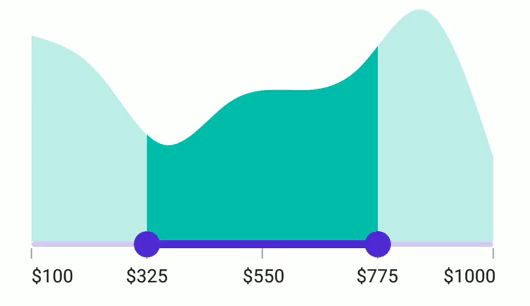

# Labels in .NET MAUI Range Selector (SfRangeSelector)

This section explains how to add labels in the Range Selector.

## Show Labels

The [`ShowLabels`](https://help.syncfusion.com/cr/maui/Syncfusion.Maui.Sliders.RangeView-1.html#Syncfusion_Maui_Sliders_RangeView_1_ShowLabels) property is used to render labels at a specified interval. The default value of this property is `False`.





<ContentPage 
             ...
             xmlns:sliders="clr-namespace:Syncfusion.Maui.Sliders;assembly=Syncfusion.Maui.Sliders"
             xmlns:charts="clr-namespace:Syncfusion.Maui.Charts;assembly=Syncfusion.Maui.Charts">

    <sliders:SfRangeSelector Minimum="0" 
                             Maximum="10"
                             RangeStart="2"
                             RangeEnd="8" 
                             Interval="2" 
                             ShowLabels="True"
                             ShowTicks="True">

        <charts:SfCartesianChart>
            ...
        </charts:SfCartesianChart>

    </sliders:SfRangeSelector>
</ContentPage>





SfRangeSelector rangeSelector = new SfRangeSelector();
rangeSelector.Minimum = 0;
rangeSelector.Maximum = 10;
rangeSelector.RangeStart = 2;
rangeSelector.RangeEnd = 8;
rangeSelector.Interval = 2;
rangeSelector.ShowLabels = true;
rangeSelector.ShowTicks = true;
SfCartesianChart chart = new SfCartesianChart();
rangeSelector.Content = chart;





## Number Format

The [`NumberFormat`](https://help.syncfusion.com/cr/maui/Syncfusion.Maui.Sliders.INumericElement.html#Syncfusion_Maui_Sliders_INumericElement_NumberFormat) property is used to format the numeric labels. The default value of this property is `0.##`.





<ContentPage 
             ...
             xmlns:sliders="clr-namespace:Syncfusion.Maui.Sliders;assembly=Syncfusion.Maui.Sliders"
             xmlns:charts="clr-namespace:Syncfusion.Maui.Charts;assembly=Syncfusion.Maui.Charts">

    <sliders:SfRangeSelector Minimum="0" 
                             Maximum="10"
                             RangeStart="2"
                             RangeEnd="8" 
                             Interval="2"
                             NumberFormat="$#" 
                             ShowLabels="True"
                             ShowTicks="True">

        <charts:SfCartesianChart>
            ...
        </charts:SfCartesianChart>
    
    </sliders:SfRangeSelector>
</ContentPage>





SfRangeSelector rangeSelector = new SfRangeSelector();
rangeSelector.Minimum = 0;
rangeSelector.Maximum = 10;
rangeSelector.RangeStart = 2;
rangeSelector.RangeEnd = 8;
rangeSelector.Interval = 2;
rangeSelector.NumberFormat = "$##";
rangeSelector.ShowLabels = true;
rangeSelector.ShowTicks = true;
SfCartesianChart chart = new SfCartesianChart();
rangeSelector.Content = chart;





## Label Placement

The [`LabelsPlacement`](https://help.syncfusion.com/cr/maui/Syncfusion.Maui.Sliders.RangeView-1.html#Syncfusion_Maui_Sliders_RangeView_1_LabelsPlacement) property positions labels either between the major ticks or on the major ticks. Its default value is [`SliderLabelsPlacement.OnTicks`](https://help.syncfusion.com/cr/maui/Syncfusion.Maui.Sliders.SliderLabelsPlacement.html#Syncfusion_Maui_Sliders_SliderLabelsPlacement_OnTicks).





<ContentPage 
             ...
             xmlns:sliders="clr-namespace:Syncfusion.Maui.Sliders;assembly=Syncfusion.Maui.Sliders"
             xmlns:charts="clr-namespace:Syncfusion.Maui.Charts;assembly=Syncfusion.Maui.Charts">

    <sliders:SfRangeSelector Minimum="0" 
                             Maximum="10" 
                             Interval="2"
                             RangeStart="2"
                             RangeEnd="8" 
                             LabelsPlacement="BetweenTicks"  
                             ShowLabels="True" 
                             ShowTicks="True">

        <charts:SfCartesianChart>
            ...
        </charts:SfCartesianChart>

    </sliders:SfRangeSelector>
</ContentPage>





SfRangeSelector rangeSelector = new SfRangeSelector();
rangeSelector.Minimum = 0;
rangeSelector.Maximum = 10;
rangeSelector.RangeStart = 2;
rangeSelector.RangeEnd = 8;
rangeSelector.Interval = 2;
rangeSelector.LabelsPlacement = SliderLabelsPlacement.BetweenTicks;
rangeSelector.ShowLabels = true;
rangeSelector.ShowTicks = true;
SfCartesianChart chart = new SfCartesianChart();
rangeSelector.Content = chart;





> Note: Refer [here](https://help.syncfusion.com/maui/range-slider/events) to customize label text format through range slider events.

## Edge Labels Placement

The [`EdgeLabelsPlacement`](https://help.syncfusion.com/cr/maui/Syncfusion.Maui.Sliders.RangeView-1.html#Syncfusion_Maui_Sliders_RangeView_1_EdgeLabelsPlacement) property determines whether the first and last labels are placed inside the track bounds or based on the intervals. Its default value is [`SliderEdgeLabelsPlacement.Default`](https://help.syncfusion.com/cr/maui/Syncfusion.Maui.Sliders.SliderEdgeLabelsPlacement.html#Syncfusion_Maui_Sliders_SliderEdgeLabelsPlacement_Default).

If the [`TrackExtent`](https://help.syncfusion.com/cr/maui/Syncfusion.Maui.Sliders.RangeView-1.html#Syncfusion_Maui_Sliders_RangeView_1_TrackExtent) is greater than 0 and the [`EdgeLabelsPlacement`](https://help.syncfusion.com/cr/maui/Syncfusion.Maui.Sliders.RangeView-1.html#Syncfusion_Maui_Sliders_RangeView_1_EdgeLabelsPlacement) is [`SliderEdgeLabelsPlacement.Inside`](https://help.syncfusion.com/cr/maui/Syncfusion.Maui.Sliders.SliderEdgeLabelsPlacement.html#Syncfusion_Maui_Sliders_SliderEdgeLabelsPlacement_Inside), the labels will be placed inside the extended track edges.





<ContentPage 
             ...
             xmlns:sliders="clr-namespace:Syncfusion.Maui.Sliders;assembly=Syncfusion.Maui.Sliders"
             xmlns:charts="clr-namespace:Syncfusion.Maui.Charts;assembly=Syncfusion.Maui.Charts">

    <sliders:SfRangeSelector Minimum="100"
                             Maximum="1000"
                             Interval="225"
                             RangeStart="325"
                             RangeEnd="775"
                             NumberFormat="$#"
                             ShowLabels="True"
                             ShowTicks="True"
                             EdgeLabelsPlacement="Inside">

        <charts:SfCartesianChart>
            ...
        </charts:SfCartesianChart>

    </sliders:SfRangeSelector>
</ContentPage>





SfRangeSelector rangeSelector = new SfRangeSelector();
rangeSelector.Minimum = "100";
rangeSelector.Maximum = "1000";
rangeSelector.RangeStart = "325";
rangeSelector.RangeEnd = "725";
rangeSelector.Interval = 225;
rangeSelector.NumberFormat = "$#";
rangeSelector.EdgeLabelsPlacement = SliderEdgeLabelsPlacement.Inside;
rangeSelector.ShowLabels = true;
rangeSelector.ShowTicks = true;
SfCartesianChart chart = new SfCartesianChart();
rangeSelector.Content = chart;





## Label Style

Customize the appearance of active and inactive labels in the Range Selector using the [`ActiveTextColor`](https://help.syncfusion.com/cr/maui/Syncfusion.Maui.Sliders.SliderLabelStyle.html#Syncfusion_Maui_Sliders_SliderLabelStyle_ActiveTextColor), [`ActiveFontSize`](https://help.syncfusion.com/cr/maui/Syncfusion.Maui.Sliders.SliderLabelStyle.html#Syncfusion_Maui_Sliders_SliderLabelStyle_ActiveFontSize), [`ActiveFontFamily`](https://help.syncfusion.com/cr/maui/Syncfusion.Maui.Sliders.SliderLabelStyle.html#Syncfusion_Maui_Sliders_SliderLabelStyle_ActiveFontFamily), [`ActiveFontAttributes`](https://help.syncfusion.com/cr/maui/Syncfusion.Maui.Sliders.SliderLabelStyle.html#Syncfusion_Maui_Sliders_SliderLabelStyle_ActiveFontAttributes), [`InactiveTextColor`](https://help.syncfusion.com/cr/maui/Syncfusion.Maui.Sliders.SliderLabelStyle.html#Syncfusion_Maui_Sliders_SliderLabelStyle_InactiveTextColor), [`InactiveFontSize`](https://help.syncfusion.com/cr/maui/Syncfusion.Maui.Sliders.SliderLabelStyle.html#Syncfusion_Maui_Sliders_SliderLabelStyle_InactiveFontSize), [`InactiveFontFamily`](https://help.syncfusion.com/cr/maui/Syncfusion.Maui.Sliders.SliderLabelStyle.html#Syncfusion_Maui_Sliders_SliderLabelStyle_InactiveFontFamily), [`InactiveFontAttributes`](https://help.syncfusion.com/cr/maui/Syncfusion.Maui.Sliders.SliderLabelStyle.html#Syncfusion_Maui_Sliders_SliderLabelStyle_InactiveFontAttributes), and [`Offset`](https://help.syncfusion.com/cr/maui/Syncfusion.Maui.Sliders.SliderLabelStyle.html#Syncfusion_Maui_Sliders_SliderLabelStyle_Offset) properties of the [`LabelStyle`](https://help.syncfusion.com/cr/maui/Syncfusion.Maui.Sliders.SliderLabelStyle.html) class.

The active side is between the start and end thumbs, and the inactive side is between the [`Minimum`](https://help.syncfusion.com/cr/maui/Syncfusion.Maui.Sliders.RangeView-1.html#Syncfusion_Maui_Sliders_RangeView_1_Minimum) and the left thumb, and the right thumb and the [`Maximum`](https://help.syncfusion.com/cr/maui/Syncfusion.Maui.Sliders.RangeView-1.html#Syncfusion_Maui_Sliders_RangeView_1_Maximum).





<ContentPage 
             ...
             xmlns:sliders="clr-namespace:Syncfusion.Maui.Sliders;assembly=Syncfusion.Maui.Sliders"
             xmlns:charts="clr-namespace:Syncfusion.Maui.Charts;assembly=Syncfusion.Maui.Charts">

    <sliders:SfRangeSelector Minimum="0" 
                             Maximum="10" 
                             RangeStart="2" 
                             RangeEnd="8"
                             Interval="2"  
                             ShowLabels="True" 
                             ShowTicks="True">

        <sliders:SfRangeSelector.LabelStyle>
            <sliders:SliderLabelStyle ActiveTextColor="#EE3F3F" 
                                      InactiveTextColor="#F7B1AE" 
                                      ActiveFontAttributes="Italic" 
                                      InactiveFontAttributes="Bold" 
                                      ActiveFontSize="16" 
                                      InactiveFontSize="16" />
            </sliders:SfRangeSelector.LabelStyle>

        <charts:SfCartesianChart>
            ...
        </charts:SfCartesianChart>

    </sliders:SfRangeSelector>
</ContentPage>





SfRangeSelector rangeSelector = new SfRangeSeletor();
rangeSelector.Minimum = 0;
rangeSelector.Maximum = 10;
rangeSelector.RangeStart = 2;
rangeSelector.RangeEnd = 8;
rangeSelector.Interval = 2;
rangeSelector.ShowLabels = true;
rangeSelector.ShowTicks = true;
rangeSelector.LabelStyle.ActiveTextColor = Color.FromArgb("#EE3F3F");
rangeSelector.LabelStyle.InactiveTextColor = Color.FromArgb("#F7B1AE");
rangeSelector.LabelStyle.ActiveFontSize = 16;
rangeSelector.LabelStyle.InactiveFontSize = 16;
rangeSelector.LabelStyle.ActiveFontAttributes = FontAttributes.Italic;
rangeSelector.LabelStyle.InactiveFontAttributes = FontAttributes.Bold;
SfCartesianChart chart = new SfCartesianChart();
rangeSelector.Content = chart;





## Label Offset

Adjust the space between ticks and labels in the Range Selector using the [`Offset`](https://help.syncfusion.com/cr/maui/Syncfusion.Maui.Sliders.SliderLabelStyle.html#Syncfusion_Maui_Sliders_SliderLabelStyle_OffsetProperty) property. The default value of the `Offset` property is 5.0 when [`ShowTicks`](https://help.syncfusion.com/cr/maui/Syncfusion.Maui.Sliders.RangeView-1.html#Syncfusion_Maui_Sliders_RangeView_1_ShowTicks) is enabled; otherwise, it defaults to 15.0.





<ContentPage 
             ...
             xmlns:sliders="clr-namespace:Syncfusion.Maui.Sliders;assembly=Syncfusion.Maui.Sliders"
             xmlns:charts="clr-namespace:Syncfusion.Maui.Charts;assembly=Syncfusion.Maui.Charts">
    
    <sliders:SfRangeSelector Minimum="0"
                             Maximum="10"
                             RangeStart="2"
                             RangeEnd="8"
                             Interval="2" 
                             ShowLabels="True" 
                             ShowTicks="True">
        
        <sliders:SfRangeSelector.LabelStyle>
            <sliders:SliderLabelStyle Offset="10" />
        </sliders:SfRangeSelector.LabelStyle>
        
        <charts:SfCartesianChart>
            ...
        </charts:SfCartesianChart>
    
    </sliders:SfRangeSelector>
</ContentPage>





SfRangeSelector rangeSelector = new SfRangeSelector();
rangeSelector.Minimum = 0;
rangeSelector.Maximum = 10;
rangeSelector.RangeStart = 2;
rangeSelector.RangeEnd = 8;
rangeSelector.Interval = 2;
rangeSelector.ShowLabels = true;
rangeSelector.ShowTicks = true;
rangeSelector.LabelStyle.Offset = 10;
SfCartesianChart chart = new SfCartesianChart();
rangeSelector.Content = chart;





