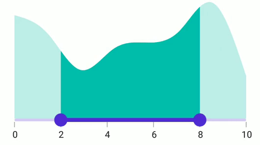
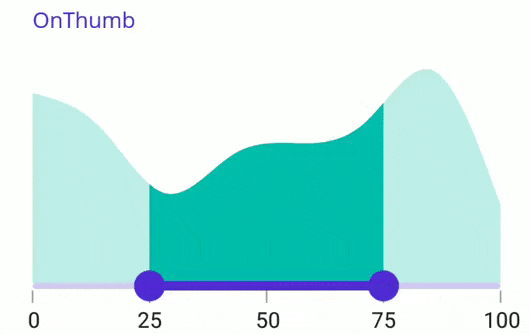

# Range Selection in .NET MAUI Range Selector (SfRangeSelector)

This section provides insight into range selection within the Range Selector.

## Discrete Selection

Use the [`StepSize`](https://help.syncfusion.com/cr/maui/Syncfusion.Maui.Sliders.INumericElement.html#Syncfusion_Maui_Sliders_INumericElement_StepSize) property to move the thumb discretely for numeric values in the Range Selector.





<ContentPage 
             ...
             xmlns:sliders="clr-namespace:Syncfusion.Maui.Sliders;assembly=Syncfusion.Maui.Sliders"
             xmlns:charts="clr-namespace:Syncfusion.Maui.Charts;assembly=Syncfusion.Maui.Charts">

    <sliders:SfRangeSelector Minimum="0" 
                             Maximum="10"                                
                             RangeStart="2" 
                             RangeEnd="8"
                             Interval="2"
                             StepSize="2" 
                             ShowLabels="True" 
                             ShowTicks="True" 
                             ShowDividers="True">
        
        <charts:SfCartesianChart>
            ...
        </charts:SfCartesianChart>
    
    </sliders:SfRangeSelector>
</ContentPage>





SfRangeSelector rangeSelector = new SfRangeSelector();
rangeSelector.StepSize = 2;
rangeSelector.Minimum = 0;
rangeSelector.Maximum = 10;
rangeSelector.RangeStart = 2;
rangeSelector.RangeEnd = 8;
rangeSelector.Interval = 2;
rangeSelector.StepSize = 2;
rangeSelector.ShowLabels = true;
rangeSelector.ShowTicks = true;
rangeSelector.ShowDividers = true;
SfCartesianChart chart = new SfCartesianChart();
rangeSelector.Content = chart;
         




## Interval Selection

This selection mode moves both thumbs to the selected interval when the [`EnableIntervalSelection`](https://help.syncfusion.com/cr/maui/Syncfusion.Maui.Sliders.RangeSliderBase-1.html#Syncfusion_Maui_Sliders_RangeSliderBase_1_EnableIntervalSelection) property is set to `true`. Otherwise, the nearest thumb moves to the touch position.





<ContentPage 
             ...
             xmlns:sliders="clr-namespace:Syncfusion.Maui.Sliders;assembly=Syncfusion.Maui.Sliders"
             xmlns:charts="clr-namespace:Syncfusion.Maui.Charts;assembly=Syncfusion.Maui.Charts">
    
    <sliders:SfRangeSelector Minimum="0" 
                             Maximum="10"
                             RangeStart="2"
                             RangeEnd="8"
                             Interval="2" 
                             ShowTicks="True"
                             ShowLabels="True"
                             EnableIntervalSelection="True">

        <charts:SfCartesianChart>
            ...
        </charts:SfCartesianChart>
    
    </sliders:SfRangeSelector>
</ContentPage>





SfRangeSelector rangeSelector = new SfRangeSelector();
rangeSelector.Minimum = 0;
rangeSelector.Maximum = 0;
rangeSelector.RangeStart = 2; 
rangeSelector.RangeEnd = 8;        
rangeSelector.ShowLabels = true;
rangeSelector.ShowTicks = true;    
rangeSelector.EnableIntervalSelection = true;
SfCartesianChart chart = new SfCartesianChart();
rangeSelector.Content = chart;
         




## Drag Behavior

### OnThumb

With [DragBehavior](https://help.syncfusion.com/cr/maui/Syncfusion.Maui.Sliders.RangeSliderBase-1.html#Syncfusion_Maui_Sliders_RangeSliderBase_1_DragBehavior) set to [OnThumb](https://help.syncfusion.com/cr/maui/Syncfusion.Maui.Sliders.SliderDragBehavior.html#Syncfusion_Maui_Sliders_SliderDragBehavior_OnThumb), you can move each thumb individually by dragging. This is the default drag behavior.





<ContentPage 
             ...
             xmlns:sliders="clr-namespace:Syncfusion.Maui.Sliders;assembly=Syncfusion.Maui.Sliders"
             xmlns:charts="clr-namespace:Syncfusion.Maui.Charts;assembly=Syncfusion.Maui.Charts">

    <sliders:SfRangeSelector Minimum="0"
                             Maximum="100"
                             RangeStart="25"
                             RangeEnd="75"
                             Interval="25"
                             ShowTicks="True"
                             ShowLabels="True"
                             EdgeLabelsPlacement="Inside"
                             DragBehavior="OnThumb">

        <charts:SfCartesianChart>
            ...
        </charts:SfCartesianChart>

    </sliders:SfRangeSelector>
</ContentPage>





SfRangeSelector rangeSelector = new SfRangeSelector();
rangeSelector.Minimum = 0;
rangeSelector.Maximum = 100;
rangeSelector.RangeStart = 25;
rangeSelector.RangeEnd = 75;
rangeSelector.Interval = 25; 
rangeSelector.ShowTicks = true;
rangeSelector.ShowLabels = true;  
rangeSelector.EdgeLabelsPlacement = SliderEdgeLabelsPlacement.Inside;
rangeSelector.DragBehavior = SliderDragBehavior.OnThumb;
SfCartesianChart chart = new SfCartesianChart();
rangeSelector.Content = chart;





### BetweenThumbs

When the [DragBehavior](https://help.syncfusion.com/cr/maui/Syncfusion.Maui.Sliders.RangeSliderBase-1.html#Syncfusion_Maui_Sliders_RangeSliderBase_1_DragBehavior) is set to [BetweenThumbs](https://help.syncfusion.com/cr/maui/Syncfusion.Maui.Sliders.SliderDragBehavior.html#Syncfusion_Maui_Sliders_SliderDragBehavior_BetweenThumbs), both thumbs move together without altering the range between them. Individual thumb movement isn't possible with this setting.





<ContentPage 
             ...
             xmlns:sliders="clr-namespace:Syncfusion.Maui.Sliders;assembly=Syncfusion.Maui.Sliders"
             xmlns:charts="clr-namespace:Syncfusion.Maui.Charts;assembly=Syncfusion.Maui.Charts">

    <sliders:SfRangeSelector Minimum="0" 
                             Maximum="100"
                             RangeStart="25"
                             RangeEnd="75"
                             Interval="25" 
                             ShowTicks="True"
                             ShowLabels="True"
                             EdgeLabelsPlacement="Inside"
                             DragBehavior="BetweenThumbs">

        <charts:SfCartesianChart>
            ...
        </charts:SfCartesianChart>

    </sliders:SfRangeSelector>
</ContentPage>





SfRangeSelector rangeSelector = new SfRangeSelector();
rangeSelector.Minimum = 0;
rangeSelector.Maximum = 100;
rangeSelector.RangeStart = 25;
rangeSelector.RangeEnd = 75;
rangeSelector.Interval = 25; 
rangeSelector.ShowTicks = true;
rangeSelector.ShowLabels = true;   
rangeSelector.EdgeLabelsPlacement = SliderEdgeLabelsPlacement.Inside;
rangeSelector.DragBehavior = SliderDragBehavior.BetweenThumbs;
SfCartesianChart chart = new SfCartesianChart();
rangeSelector.Content = chart;





### Both

Setting the [DragBehavior](https://help.syncfusion.com/cr/maui/Syncfusion.Maui.Sliders.RangeSliderBase-1.html#Syncfusion_Maui_Sliders_RangeSliderBase_1_DragBehavior) to [Both](https://help.syncfusion.com/cr/maui/Syncfusion.Maui.Sliders.SliderDragBehavior.html#Syncfusion_Maui_Sliders_SliderDragBehavior_Both) allows both individual thumb movement and simultaneous thumb movement without changing the range between them.





<ContentPage 
             ...
             xmlns:sliders="clr-namespace:Syncfusion.Maui.Sliders;assembly=Syncfusion.Maui.Sliders"
             xmlns:charts="clr-namespace:Syncfusion.Maui.Charts;assembly=Syncfusion.Maui.Charts">

    <sliders:SfRangeSelector Minimum="0" 
                             Maximum="100"
                             RangeStart="25"
                             RangeEnd="75"
                             Interval="25" 
                             ShowTicks="True"
                             ShowLabels="True"
                             EdgeLabelsPlacement="Inside"
                             DragBehavior="Both">

        <charts:SfCartesianChart>
            ...
        </charts:SfCartesianChart>

    </sliders:SfRangeSelector>
</ContentPage>





SfRangeSelector rangeSelector = new SfRangeSelector();
rangeSelector.Minimum = 0;
rangeSelector.Maximum = 100;
rangeSelector.RangeStart = 25;
rangeSelector.RangeEnd = 75;
rangeSelector.Interval = 25; 
rangeSelector.ShowTicks = true; 
rangeSelector.ShowLabels = true;  
rangeSelector.EdgeLabelsPlacement = SliderEdgeLabelsPlacement.Inside;
rangeSelector.DragBehavior = SliderDragBehavior.Both;
SfCartesianChart chart = new SfCartesianChart();
rangeSelector.Content = chart;





## Deferred Update

Control when dependent components are updated while thumbs are continuously dragged by setting the `EnableDeferredUpdate` property. The delay can be configured via the `DeferredUpdateDelay` property. Its default is `500` milliseconds.

This triggers the `ValueChanging` event when thumbs are dragged and held for the specified delay duration, but values update immediately upon touch-up action.





<ContentPage 
             ...
             xmlns:sliders="clr-namespace:Syncfusion.Maui.Sliders;assembly=Syncfusion.Maui.Sliders"
             xmlns:charts="clr-namespace:Syncfusion.Maui.Charts;assembly=Syncfusion.Maui.Charts">
    
    <sliders:SfRangeSelector Minimum="0" 
                             Maximum="10"
                             RangeStart="2"
                             RangeEnd="8"
                             Interval="2" 
                             ShowTicks="True"
                             ShowLabels="True"
                             EnableDeferredUpdate="True"
                             DeferredUpdateDelay="1000">

        <charts:SfCartesianChart>
            ...
        </charts:SfCartesianChart>
    
    </sliders:SfRangeSelector>
</ContentPage>





SfRangeSelector rangeSelector = new SfRangeSelector();
rangeSelector.Minimum = 0;
rangeSelector.Maximum = 0;
rangeSelector.RangeStart = 2; 
rangeSelector.RangeEnd = 8;        
rangeSelector.ShowLabels = true;
rangeSelector.ShowTicks = true;
rangeSelector.EnableDeferredUpdate = true;
rangeSelector.DeferredUpdateDelay = 1000;    
SfCartesianChart chart = new SfCartesianChart();
rangeSelector.Content = chart;
         


