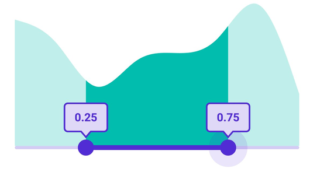

# Tooltip in .NET MAUI Range Selector (SfRangeSelector)

This section helps to learn about how to add tooltip in the Range Selector.

## Enable tooltip

Enable tooltip for the thumb by setting the [`Tooltip`](https://help.syncfusion.com/cr/maui/Syncfusion.Maui.Sliders.RangeView-1.html#Syncfusion_Maui_Sliders_RangeView_1_Tooltip) property to [`SliderTooltip`](https://help.syncfusion.com/cr/maui/Syncfusion.Maui.Sliders.SliderTooltip.html). It is used to clearly indicate the current selection of the value during interaction. By default, tooltip text is formatted with either numberFormat. The default value of the [`Tooltip`](https://help.syncfusion.com/cr/maui/Syncfusion.Maui.Sliders.RangeView-1.html#Syncfusion_Maui_Sliders_RangeView_1_Tooltip) property is `null`. 





<ContentPage 
             ...
             xmlns:sliders="clr-namespace:Syncfusion.Maui.Sliders;assembly=Syncfusion.Maui.Sliders"
             xmlns:charts="clr-namespace:Syncfusion.Maui.Charts;assembly=Syncfusion.Maui.Charts">
    
    <sliders:SfRangeSelector>
         
         <sliders:SfRangeSelector.Tooltip>
            <sliders:SliderTooltip />
         </sliders:SfRangeSelector.Tooltip>
     
     <charts:SfCartesianChart>
         ...
     </charts:SfCartesianChart>
    
    </sliders:SfRangeSelector>
</ContentPage>





SfRangeSelector rangeSelector = new SfRangeSelector();
rangeSelector.Tooltip = new SliderTooltip();
SfCartesianChart chart = new SfCartesianChart();
rangeSelector.Content = chart;





## Show always

Always shows a tooltip with and without the thumb interaction by setting the [`SliderTooltip.ShowAlways`](https://help.syncfusion.com/cr/maui/Syncfusion.Maui.Sliders.SliderTooltip.html#Syncfusion_Maui_Sliders_SliderTooltip_ShowAlways) property. The default value of the [`SliderTooltip.ShowAlways`](https://help.syncfusion.com/cr/maui/Syncfusion.Maui.Sliders.SliderTooltip.html#Syncfusion_Maui_Sliders_SliderTooltip_ShowAlways) property is `False`.





<ContentPage 
             ...
             xmlns:sliders="clr-namespace:Syncfusion.Maui.Sliders;assembly=Syncfusion.Maui.Sliders"
             xmlns:charts="clr-namespace:Syncfusion.Maui.Charts;assembly=Syncfusion.Maui.Charts">
    
    <sliders:SfRangeSelector>
         
         <sliders:SfRangeSelector.Tooltip>
            <sliders:SliderTooltip ShowAlways="True" />
         </sliders:SfRangeSelector.Tooltip>
     
     <charts:SfCartesianChart>
         ...
     </charts:SfCartesianChart>
    
    </sliders:SfRangeSelector>
</ContentPage>





SfRangeSelector rangeSelector = new SfRangeSelector();
rangeSelector.Tooltip = new SliderTooltip();
rangeSelector.Tooltip.ShowAlways = true;
SfCartesianChart chart = new SfCartesianChart();
rangeSelector.Content = chart;





N> Refer [here](https://help.syncfusion.com/maui/range-selector/events-and-commands#tooltip-text-format) to customize the tooltip text through the [`SliderTooltip`](https://help.syncfusion.com/cr/maui/Syncfusion.Maui.Sliders.SliderTooltip.html) events.

## Tooltip label style

Change the appearance of the tooltip using the [`Fill`](https://help.syncfusion.com/cr/maui/Syncfusion.Maui.Sliders.SliderTooltip.html#Syncfusion_Maui_Sliders_SliderTooltip_Fill), [`Stroke`](https://help.syncfusion.com/cr/maui/Syncfusion.Maui.Sliders.SliderTooltip.html#Syncfusion_Maui_Sliders_SliderTooltip_Stroke), [`StrokeThickness`](https://help.syncfusion.com/cr/maui/Syncfusion.Maui.Sliders.SliderTooltip.html#Syncfusion_Maui_Sliders_SliderTooltip_StrokeThickness), and [`Position`](https://help.syncfusion.com/cr/maui/Syncfusion.Maui.Sliders.SliderTooltip.html#Syncfusion_Maui_Sliders_SliderTooltip_Position) properties. Also, customize the tooltip text using the [`TextColor`](https://help.syncfusion.com/cr/maui/Syncfusion.Maui.Sliders.SliderTooltip.html#Syncfusion_Maui_Sliders_SliderTooltip_TextColor), [`FontSize`](https://help.syncfusion.com/cr/maui/Syncfusion.Maui.Sliders.SliderTooltip.html#Syncfusion_Maui_Sliders_SliderTooltip_FontSize), [`FontAttributes`](https://help.syncfusion.com/cr/maui/Syncfusion.Maui.Sliders.SliderTooltip.html#Syncfusion_Maui_Sliders_SliderTooltip_FontAttributes), [`FontFamily`](https://help.syncfusion.com/cr/maui/Syncfusion.Maui.Sliders.SliderTooltip.html#Syncfusion_Maui_Sliders_SliderTooltip_FontFamily), [`Padding`](https://help.syncfusion.com/cr/maui/Syncfusion.Maui.Sliders.SliderTooltip.html#Syncfusion_Maui_Sliders_SliderTooltip_Padding), and [`NumberFormat`](https://help.syncfusion.com/cr/maui/Syncfusion.Maui.Sliders.SliderTooltip.html#Syncfusion_Maui_Sliders_SliderTooltip_NumberFormat) properties of the [`SliderTooltip`](https://help.syncfusion.com/cr/maui/Syncfusion.Maui.Sliders.SliderTooltip.html) class.





<ContentPage 
             ...
             xmlns:sliders="clr-namespace:Syncfusion.Maui.Sliders;assembly=Syncfusion.Maui.Sliders"
             xmlns:charts="clr-namespace:Syncfusion.Maui.Charts;assembly=Syncfusion.Maui.Charts">

    <sliders:SfRangeSelector>

        <sliders:SfRangeSelector.Tooltip>
            <sliders:SliderTooltip Fill="#DFD8F7"
                                   Stroke="#512BD4"
                                   StrokeThickness="2"
                                   TextColor="#512BD4"
                                   FontSize="14"
                                   FontAttributes="Bold"
                                   Padding="12,12" />
        </sliders:SfRangeSelector.Tooltip>

        <charts:SfCartesianChart>
            ...
        </charts:SfCartesianChart>

    </sliders:SfRangeSelector>
</ContentPage>





SfRangeSelector rangeSelector = new SfRangeSelector();
rangeSelector.Tooltip.Fill = new SolidColorBrush(Color.FromArgb("#DFD8F7"));
rangeSelector.Tooltip.Stroke = new SolidColorBrush(Color.FromArgb("#512BD4"));
rangeSelector.Tooltip.StrokeThickness = 2;
rangeSelector.Tooltip.TextColor = Color.FromArgb("#512BD4");
rangeSelector.Tooltip.FontSize = 14;
rangeSelector.Tooltip.FontAttributes = FontAttributes.Bold;
rangeSelector.Tooltip.Padding = new Thickness(12, 12);
SfCartesianChart chart = new SfCartesianChart();
rangeSelector.Content = chart;





