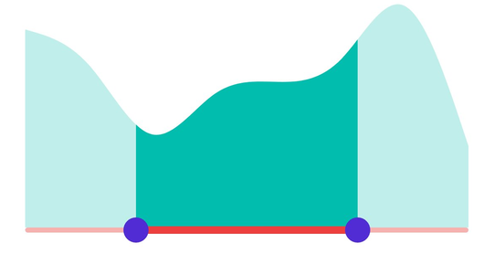
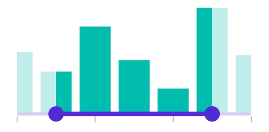
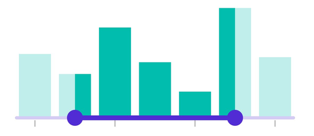

# Track in .NET MAUI Range Selector (SfRangeSelector)

This section helps to learn about how to customize the track in the Range Selector.

## Minimum

The minimum value that the user can select. The default value of the [`Minimum`](https://help.syncfusion.com/cr/maui/Syncfusion.Maui.Sliders.RangeView-1.html#Syncfusion_Maui_Sliders_RangeView_1_Minimum) property is `0` and it must be less than the [`Maximum`](https://help.syncfusion.com/cr/maui/Syncfusion.Maui.Sliders.RangeView-1.html#Syncfusion_Maui_Sliders_RangeView_1_Maximum) value.

## Maximum

The maximum value that the user can select. The default value of the [`Maximum`](https://help.syncfusion.com/cr/maui/Syncfusion.Maui.Sliders.RangeView-1.html#Syncfusion_Maui_Sliders_RangeView_1_Maximum) property is `1` and it must be greater than the [`Minimum`](https://help.syncfusion.com/cr/maui/Syncfusion.Maui.Sliders.RangeView-1.html#Syncfusion_Maui_Sliders_RangeView_1_Minimum) value.

## Range values

It represents the values currently selected in the Range Selector. The Range Selector’s thumb is drawn corresponding to this [`RangeStart`](https://help.syncfusion.com/cr/maui/Syncfusion.Maui.Sliders.RangeSliderBase-1.html#Syncfusion_Maui_Sliders_RangeSliderBase_1_RangeStart) and [`RangeEnd`](https://help.syncfusion.com/cr/maui/Syncfusion.Maui.Sliders.RangeSliderBase-1.html#Syncfusion_Maui_Sliders_RangeSliderBase_1_RangeEnd) values.





<ContentPage 
             ...
             xmlns:sliders="clr-namespace:Syncfusion.Maui.Sliders;assembly=Syncfusion.Maui.Sliders"
             xmlns:charts="clr-namespace:Syncfusion.Maui.Charts;assembly=Syncfusion.Maui.Charts">

    <sliders:SfRangeSelector Minimum="10"
                             Maximum="20"
                             RangeStart="13"
                             RangeEnd="17"
                             ShowLabels="True">

        <charts:SfCartesianChart>
            ...
        </charts:SfCartesianChart>

    </sliders:SfRangeSelector>
</ContentPage>
 




SfRangeSelector rangeSelector = new SfRangeSelector();
rangeSelector.Minimum = 10;
rangeSelector.Maximum = 20;
rangeSelector.RangeStart = 13;
rangeSelector.RangeEnd = 17;
rangeSelector.ShowLabels = true;
SfCartesianChart chart = new SfCartesianChart();
rangeSelector.Content = chart;





## Track color

Change the active and inactive track color of the Range Selector using the [`ActiveFill`](https://help.syncfusion.com/cr/maui/Syncfusion.Maui.Sliders.SliderTrackStyle.html#Syncfusion_Maui_Sliders_SliderTrackStyle_ActiveFill) and [`InactiveFill`](https://help.syncfusion.com/cr/maui/Syncfusion.Maui.Sliders.SliderTrackStyle.html#Syncfusion_Maui_Sliders_SliderTrackStyle_InactiveFill) properties of the [`TrackStyle`](https://help.syncfusion.com/cr/maui/Syncfusion.Maui.Sliders.RangeView-1.html#Syncfusion_Maui_Sliders_RangeView_1_TrackStyle) class.

The active side of the Range Selector is between the start and end thumbs.

The inactive side of the Range Selector is between the [`Minimum`](https://help.syncfusion.com/cr/maui/Syncfusion.Maui.Sliders.RangeView-1.html#Syncfusion_Maui_Sliders_RangeView_1_Minimum) value and the left thumb, and the right thumb and the [`Maximum`](https://help.syncfusion.com/cr/maui/Syncfusion.Maui.Sliders.RangeView-1.html#Syncfusion_Maui_Sliders_RangeView_1_Maximum) value.





<ContentPage 
             ...
             xmlns:sliders="clr-namespace:Syncfusion.Maui.Sliders;assembly=Syncfusion.Maui.Sliders"
             xmlns:charts="clr-namespace:Syncfusion.Maui.Charts;assembly=Syncfusion.Maui.Charts">
    
    <sliders:SfRangeSelector>
        
        <sliders:SfRangeSelector.TrackStyle>
            <sliders:SliderTrackStyle ActiveFill="#EE3F3F" InactiveFill="#F7B1AE" />
        </sliders:SfRangeSelector.TrackStyle>
        
        <charts:SfCartesianChart>
            ...
        </charts:SfCartesianChart>
    
    </sliders:SfRangeSelector>
</ContentPage>





SfRangeSelector rangeSelector = new SfRangeSelector();
rangeSelector.TrackStyle.ActiveFill = new SolidColorBrush(Color.FromArgb("#EE3F3F"));
rangeSelector.TrackStyle.InactiveFill = new SolidColorBrush(Color.FromArgb("#F7B1AE"));
SfCartesianChart chart = new SfCartesianChart();
rangeSelector.Content = chart;





## Track height

Change the active and inactive track height of the Range Selector using the [`ActiveSize`](https://help.syncfusion.com/cr/maui/Syncfusion.Maui.Sliders.SliderTrackStyle.html#Syncfusion_Maui_Sliders_SliderTrackStyle_ActiveSize) and [`InactiveSize`](https://help.syncfusion.com/cr/maui/Syncfusion.Maui.Sliders.SliderTrackStyle.html#Syncfusion_Maui_Sliders_SliderTrackStyle_InactiveSize) properties of the [`TrackStyle`](https://help.syncfusion.com/cr/maui/Syncfusion.Maui.Sliders.RangeView-1.html#Syncfusion_Maui_Sliders_RangeView_1_TrackStyle) class. The default value of the [`ActiveSize`](https://help.syncfusion.com/cr/maui/Syncfusion.Maui.Sliders.SliderTrackStyle.html#Syncfusion_Maui_Sliders_SliderTrackStyle_ActiveSize) and the [`InactiveSize`](https://help.syncfusion.com/cr/maui/Syncfusion.Maui.Sliders.SliderTrackStyle.html#Syncfusion_Maui_Sliders_SliderTrackStyle_InactiveSize) properties are `8.0` and `6.0` respectively.





<ContentPage 
             ...
             xmlns:sliders="clr-namespace:Syncfusion.Maui.Sliders;assembly=Syncfusion.Maui.Sliders"
             xmlns:charts="clr-namespace:Syncfusion.Maui.Charts;assembly=Syncfusion.Maui.Charts">
    
    <sliders:SfRangeSelector>
        
        <sliders:SfRangeSelector.TrackStyle>
            <sliders:SliderTrackStyle ActiveSize="10" InactiveSize="8" />
        </sliders:SfRangeSelector.TrackStyle>
        
        <charts:SfCartesianChart>
            ...
        </charts:SfCartesianChart>
    
    </sliders:SfRangeSelector>
</ContentPage>





SfRangeSelector rangeSelector = new SfRangeSelector();
rangeSelector.TrackStyle.ActiveSize = 10;
rangeSelector.TrackStyle.InactiveSize = 8;
SfCartesianChart chart = new SfCartesianChart();
rangeSelector.Content = chart;





## Track extent

Extend the track at the edges using the [`TrackExtent`](https://help.syncfusion.com/cr/maui/Syncfusion.Maui.Sliders.RangeView-1.html#Syncfusion_Maui_Sliders_RangeView_1_TrackExtent) property. The default value is `0` and it should be in pixels.





<ContentPage 
             ...
             xmlns:sliders="clr-namespace:Syncfusion.Maui.Sliders;assembly=Syncfusion.Maui.Sliders"
             xmlns:charts="clr-namespace:Syncfusion.Maui.Charts;assembly=Syncfusion.Maui.Charts">

    <sliders:SfRangeSelector Minimum="1"
                             Maximum="7"
                             RangeStart="2"
                             RangeEnd="6"
                             Interval="2"
                             TrackExtent="25"
                             ShowTicks="True">

        <charts:SfCartesianChart>
            ...
        </charts:SfCartesianChart>

    </sliders:SfRangeSelector>
</ContentPage>





SfRangeSelector rangeSelector = new SfRangeSelector();
rangeSelector.Minimum = 1;
rangeSelector.Maximum = 7;
rangeSelector.RangeStart = 2;
rangeSelector.RangeEnd = 6;
rangeSelector.Interval = 2;
rangeSelector.ShowTicks = true;
rangeSelector.TrackExtent = 25;
SfCartesianChart chart = new SfCartesianChart();
rangeSelector.Content = chart;





**Without track extent**

**With track extent**

