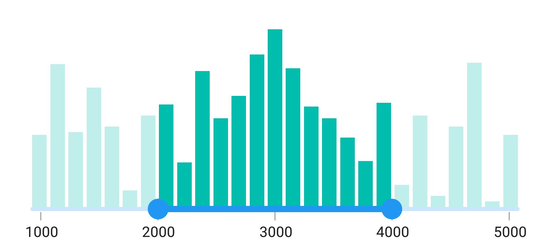

# Track in .NET MAUI Range Selector (SfRangeSelector)

This section helps to learn about how to customize the track in the Range Selector.

## Track color

You can change the active and inactive track color of the Range Selector using the [`ActiveFill`](https://help.syncfusion.com/cr/maui/Syncfusion.Maui.Sliders.SliderTrackStyle.html#Syncfusion_Maui_Sliders_SliderTrackStyle_ActiveFill) and [`InactiveFill`](https://help.syncfusion.com/cr/maui/Syncfusion.Maui.Sliders.SliderTrackStyle.html#Syncfusion_Maui_Sliders_SliderTrackStyle_InactiveFill) properties of the [`TrackStyle`](https://help.syncfusion.com/cr/maui/Syncfusion.Maui.Sliders.SliderBase.html#Syncfusion_Maui_Sliders_SliderBase_TrackStyle) class.

The active side of the Range Selector is between start and end thumbs.

The inactive side of the Range Selector is between the [`Minimum`](https://help.syncfusion.com/cr/maui/Syncfusion.Maui.Sliders.NumericRangeSliderBase.html#Syncfusion_Maui_Sliders_NumericRangeSliderBase_Minimum) value and the left thumb, and the right thumb and the [`Maximum`](https://help.syncfusion.com/cr/maui/Syncfusion.Maui.Sliders.NumericRangeSliderBase.html#Syncfusion_Maui_Sliders_NumericRangeSliderBase_Maximum) value.





<ContentPage 
             ...
             xmlns:sliders="clr-namespace:Syncfusion.Maui.Sliders;assembly=Syncfusion.Maui.Sliders"
             xmlns:charts="clr-namespace:Syncfusion.Maui.Charts;assembly=Syncfusion.Maui.Charts">
    
    <sliders:SfRangeSelector>
        
        <sliders:SfRangeSelector.TrackStyle>
            <sliders:SliderTrackStyle ActiveFill="#EE3F3F" InactiveFill="#F7B1AE" />
        </sliders:SfRangeSelector.TrackStyle>
        
        <charts:SfCartesianChart>
            ...
        </charts:SfCartesianChart>
    
    </sliders:SfRangeSelector>
</ContentPage>





SfRangeSelector rangeSelector = new SfRangeSelector();
rangeSelector.TrackStyle.ActiveFill = new SolidColorBrush(Color.FromArgb("#EE3F3F"));
rangeSelector.TrackStyle.InactiveFill = new SolidColorBrush(Color.FromArgb("#F7B1AE"));
SfCartesianChart chart = new SfCartesianChart();
rangeSelector.Content = chart;





## Track height

You can change the active and inactive track height of the Range Selector using the [`ActiveSize`](https://help.syncfusion.com/cr/maui/Syncfusion.Maui.Sliders.SliderTrackStyle.html#Syncfusion_Maui_Sliders_SliderTrackStyle_ActiveSize) and [`InactiveSize`](https://help.syncfusion.com/cr/maui/Syncfusion.Maui.Sliders.SliderTrackStyle.html#Syncfusion_Maui_Sliders_SliderTrackStyle_InactiveSize) properties of the [`TrackStyle`](https://help.syncfusion.com/cr/maui/Syncfusion.Maui.Sliders.SliderBase.html#Syncfusion_Maui_Sliders_SliderBase_TrackStyle) class. The default value of the [`ActiveSize`](https://help.syncfusion.com/cr/maui/Syncfusion.Maui.Sliders.SliderTrackStyle.html#Syncfusion_Maui_Sliders_SliderTrackStyle_ActiveSize) and the [`InactiveSize`](https://help.syncfusion.com/cr/maui/Syncfusion.Maui.Sliders.SliderTrackStyle.html#Syncfusion_Maui_Sliders_SliderTrackStyle_InactiveSize) properties are `8.0` and `6.0` respectively.





<ContentPage 
             ...
             xmlns:sliders="clr-namespace:Syncfusion.Maui.Sliders;assembly=Syncfusion.Maui.Sliders"
             xmlns:charts="clr-namespace:Syncfusion.Maui.Charts;assembly=Syncfusion.Maui.Charts">
    
    <sliders:SfRangeSelector>
        
        <sliders:SfRangeSelector.TrackStyle>
            <sliders:SliderTrackStyle ActiveSize="10" InactiveSize="8" />
        </sliders:SfRangeSelector.TrackStyle>
        
        <charts:SfCartesianChart>
            ...
        </charts:SfCartesianChart>
    
    </sliders:SfRangeSelector>
</ContentPage>





SfRangeSelector rangeSelector = new SfRangeSelector();
rangeSelector.TrackStyle.ActiveSize = 10;
rangeSelector.TrackStyle.InactiveSize = 8;
SfCartesianChart chart = new SfCartesianChart();
rangeSelector.Content = chart;





## Track extent

You can extend the track at edges using the `TrackExtent` property. The default value is `0.0` and it should be in pixels.





<ContentPage 
             ...
             xmlns:sliders="clr-namespace:Syncfusion.Maui.Sliders;assembly=Syncfusion.Maui.Sliders"
             xmlns:charts="clr-namespace:Syncfusion.Maui.Charts;assembly=Syncfusion.Maui.Charts">

    <sliders:SfDateTimeRangeSelector Minimum="2019-12-01"
                                     Maximum="2019-12-16"
                                     RangeStart="2019-12-04"
                                     RangeEnd="2019-12-13"
                                     Interval="3"
                                     IntervalType="Days"
                                     ShowTicks="True"
                                     ShowLabels="True"
                                     DateFormat="MMM d"
                                     TrackExtent="10">

        <charts:SfCartesianChart>
            ...
        </charts:SfCartesianChart>

    </sliders:SfDateTimeRangeSelector>
</ContentPage>





SfDateTimeRangeSelector rangeSelector = new SfDateTimeRangeSelector();
rangeSelector.Minimum = new DateTime(2019, 12, 01);
rangeSelector.Maximum = new DateTime(2019, 12, 16);
rangeSelector.RangeStart = new DateTime(2009, 12, 04);
rangeSelector.RangeEnd = new DateTime(2000, 12, 13);
rangeSelector.Interval = 3;
rangeSelector.IntervalType = SliderDateIntervalType.Days;
rangeSelector.DateFormat = "MMM d";
rangeSelector.ShowLabels = true;
rangeSelector.ShowTicks = true;
rangeSelector.TrackExtent = 10;
SfCartesianChart chart = new SfCartesianChart();
rangeSelector.Content = chart;





