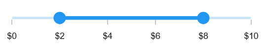
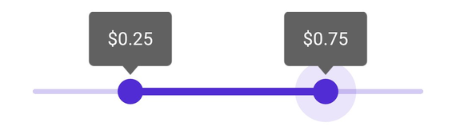

# Events and Commands in .NET MAUI Range Slider (SfRangeSlider)

This section explains how to add events and commands to the range slider.

## Events

### Handle Callbacks

- [`ValueChangeStart`](https://help.syncfusion.com/cr/maui/Syncfusion.Maui.Sliders.RangeView-1.html#Syncfusion_Maui_Sliders_RangeView_1_ValueChangeStart) - Triggered when the user begins selecting a new value for the slider by tapping or mouse down on the thumb.
- [`ValueChanging`](https://help.syncfusion.com/cr/maui/Syncfusion.Maui.Sliders.SfRangeSlider.html#Syncfusion_Maui_Sliders_SfRangeSlider_ValueChanging) - Triggered when the user is selecting a new value for the slider by dragging the thumb.
- [`ValueChanged`](https://help.syncfusion.com/cr/maui/Syncfusion.Maui.Sliders.SfRangeSlider.html#Syncfusion_Maui_Sliders_SfRangeSlider_ValueChanged) - Triggered when the user completes selecting a new value.
- [`ValueChangeEnd`](https://help.syncfusion.com/cr/maui/Syncfusion.Maui.Sliders.RangeView-1.html#Syncfusion_Maui_Sliders_RangeView_1_ValueChangeEnd) - Triggered when the user stops interacting with the slider by tapping or mouse up on the thumb.





 <sliders:SfRangeSlider ValueChangeStart="OnValueChangeStart" 
                        ValueChanging="OnValueChanging" 
                        ValueChanged="OnValueChanged" 
                        ValueChangeEnd="OnValueChangeEnd">
</sliders:SfRangeSlider>





{
   SfRangeSlider rangeSlider = new SfRangeSlider();
   rangeSlider.ValueChangeStart += OnValueChangeStart;
   rangeSlider.ValueChanging += OnValueChanging;
   rangeSlider.ValueChanged += OnValueChanged;
   rangeSlider.ValueChangeEnd += OnValueChangeEnd;
}

private void OnValueChangeStart(object sender, EventArgs e)
{
}

private void OnValueChanging(object sender, RangeSliderValueChangingEventArgs e)
{
}

private void OnValueChanged(object sender, RangeSliderValueChangedEventArgs e)
{
}

private void OnValueChangeEnd(object sender, EventArgs e)
{
}





### Customize Label Text

Format or change the label text using the [`LabelCreated`](https://help.syncfusion.com/cr/maui/Syncfusion.Maui.Sliders.RangeView-1.html#Syncfusion_Maui_Sliders_RangeView_1_LabelCreated) event, which offers parameters through [`SliderLabelCreatedEventArgs`](https://help.syncfusion.com/cr/maui/Syncfusion.Maui.Sliders.SliderLabelCreatedEventArgs.html):

- **Text**: Customize the label text using the [`Text`](https://help.syncfusion.com/cr/maui/Syncfusion.Maui.Sliders.SliderLabelCreatedEventArgs.html#Syncfusion_Maui_Sliders_SliderLabelCreatedEventArgs_Text) parameter.
- **Style**: Format text properties such as color, font size, and font family using the [`Style`](https://help.syncfusion.com/cr/maui/Syncfusion.Maui.Sliders.SliderLabelCreatedEventArgs.html#Syncfusion_Maui_Sliders_SliderLabelCreatedEventArgs_Style).





<sliders:SfRangeSlider Minimum="2"
                       Maximum="10"
                       RangeStart="4"
                       RangeEnd="8"
                       Interval="2"
                       ShowLabels="True"
                       ShowTicks="True"
                       LabelCreated="OnLabelCreated" />





{
    SfRangeSlider rangeSlider = new SfRangeSlider()
    {
        Minimum = 2,
        Maximum = 10,
        RangeStart = 4,
        RangeEnd = 8,
        Interval = 2,
        ShowLabels = true,
        ShowTicks = true,
    };
    rangeSlider.LabelCreated += OnLabelCreated;
}

private void OnLabelCreated(object sender, SliderLabelCreatedEventArgs e)
{
	e.Text = "$" + e.Text;
}





### Tooltip Text Format

By default, it is formatted based on the [`SliderTooltip.NumberFormat`](https://help.syncfusion.com/cr/maui/Syncfusion.Maui.Sliders.SliderTooltip.html#Syncfusion_Maui_Sliders_SliderTooltip_NumberFormat)  property.

Format or change the whole tooltip label text using the [`TooltipLabelCreated`](https://help.syncfusion.com/cr/maui/Syncfusion.Maui.Sliders.SliderTooltip.html#Syncfusion_Maui_Sliders_SliderTooltip_TooltipLabelCreated) event. The [`SliderTooltipLabelCreatedEventArgs`](https://help.syncfusion.com/cr/maui/Syncfusion.Maui.Sliders.SliderTooltipLabelCreatedEventArgs.html) contains the following parameters,

* Text – Change the tooltip text using the [`Text`](https://help.syncfusion.com/cr/maui/Syncfusion.Maui.Sliders.SliderTooltipLabelCreatedEventArgs.html#Syncfusion_Maui_Sliders_SliderTooltipLabelCreatedEventArgs_Text) property.
* Color – Change the color of the tooltip text using the [`TextColor`](https://help.syncfusion.com/cr/maui/Syncfusion.Maui.Sliders.SliderTooltipLabelCreatedEventArgs.html#Syncfusion_Maui_Sliders_SliderTooltipLabelCreatedEventArgs_TextColor) property.
* Font Size – Change the font size of the tooltip text using the [`FontSize`](https://help.syncfusion.com/cr/maui/Syncfusion.Maui.Sliders.SliderTooltipLabelCreatedEventArgs.html#Syncfusion_Maui_Sliders_SliderTooltipLabelCreatedEventArgs_FontSize) property.
* Font Family – Change the font family of the tooltip text using the [`FontFamily`](https://help.syncfusion.com/cr/maui/Syncfusion.Maui.Sliders.SliderTooltipLabelCreatedEventArgs.html#Syncfusion_Maui_Sliders_SliderTooltipLabelCreatedEventArgs_FontFamily) property.
* Font Attributes – Change the font attributes of the tooltip text using the [`FontAttributes`](https://help.syncfusion.com/cr/maui/Syncfusion.Maui.Sliders.SliderTooltipLabelCreatedEventArgs.html#Syncfusion_Maui_Sliders_SliderTooltipLabelCreatedEventArgs_FontAttributes) property.





<sliders:SfRangeSlider>

   <sliders:SfRangeSlider.Tooltip>
      <sliders:SliderTooltip TooltipLabelCreated="OnTooltipLabelCreated"/>
   </sliders:SfRangeSlider.Tooltip>

</sliders:SfRangeSlider>




{
    SfRangeSlider rangeSlider = new SfRangeSlider();
    rangeSlider.TooltipLabelCreated += OnTooltipLabelCreated;
 }
 private void OnTooltipLabelCreated(object sender, SliderTooltipLabelCreatedEventArgs e)
 {
     e.Text = "$" + e.Text;
 }





## Commands and Their Parameters

### Drag started command

The [`DragStartedCommand`](https://help.syncfusion.com/cr/maui/Syncfusion.Maui.Sliders.RangeView-1.html#Syncfusion_Maui_Sliders_RangeView_1_DragStartedCommand) is executed when the user begins moving the thumb.





<ContentPage.BindingContext>
    <local:ViewModel x:Name="viewModel" />
</ContentPage.BindingContext>

<ContentPage.Content>
    <sliders:SfRangeSlider DragStartedCommand="{Binding DragStartedCommand}" />
</ContentPage.Content>





SfRangeSlider rangeSlider = new SfRangeSlider()
{
    DragStartedCommand = viewModel.DragStartedCommand
};

public class ViewModel
{
    public ICommand DragStartedCommand { get; }

    public ViewModel()
    {
        DragStartedCommand = new Command(OnDragStarted);
    }

    private void OnDragStarted(object obj)
    {
    }
}





### Drag Started Command Parameter

The [`DragStartedCommandParameter`](https://help.syncfusion.com/cr/maui/Syncfusion.Maui.Sliders.RangeView-1.html#Syncfusion_Maui_Sliders_RangeView_1_DragStartedCommandParameter) is executed with a specified parameter when the user starts moving the thumb.





<ContentPage.BindingContext>
    <local:ViewModel x:Name="viewModel" />
</ContentPage.BindingContext>

<ContentPage.Content>
    <sliders:SfRangeSlider DragStartedCommand="{Binding DragStartedCommand}"
                           DragStartedCommandParameter="1" />
</ContentPage.Content>





SfRangeSlider rangeSlider = new SfRangeSlider()
{
    DragStartedCommand = viewModel.DragStartedCommand,
    DragStartedCommandParameter = "1"
};

public class ViewModel
{
    public ICommand DragStartedCommand { get; }

    public ViewModel()
    {
        DragStartedCommand = new Command(OnDragStarted);
    }

    private void OnDragStarted(object obj)
    {
    }
}





### Drag Completed Command

The [`DragCompletedCommand`](https://help.syncfusion.com/cr/maui/Syncfusion.Maui.Sliders.RangeView-1.html#Syncfusion_Maui_Sliders_RangeView_1_DragCompletedCommand) is executed when the user stops moving the thumb.





<ContentPage.BindingContext>
    <local:ViewModel x:Name="viewModel" />
</ContentPage.BindingContext>

<ContentPage.Content>
    <sliders:SfRangeSlider DragCompletedCommand="{Binding DragCompletedCommand}" />
</ContentPage.Content>





SfRangeSlider rangeSlider = new SfRangeSlider()
{
    DragCompletedCommand = viewModel.DragCompletedCommand
};

public class ViewModel
{
    public ICommand DragCompletedCommand { get; }

    public ViewModel()
    {
        DragCompletedCommand = new Command(OnDragCompleted);
    }

    private void OnDragCompleted(object obj)
    {
    }
}





### Drag Completed Command Parameter

The [`DragCompletedCommandParameter`](https://help.syncfusion.com/cr/maui/Syncfusion.Maui.Sliders.RangeView-1.html#Syncfusion_Maui_Sliders_RangeView_1_DragCompletedCommandParameter) is executed with a specified parameter when the user completes moving the thumb.





<ContentPage.BindingContext>
    <local:ViewModel x:Name="viewModel" />
</ContentPage.BindingContext>

<ContentPage.Content>
    <sliders:SfRangeSlider DragCompletedCommand="{Binding DragCompletedCommand}"
                           DragCompletedCommandParameter="1" />
</ContentPage.Content>





SfRangeSlider rangeSlider = new SfRangeSlider()
{
    DragCompletedCommand = viewModel.DragCompletedCommand,
    DragCompletedCommandParameter = "1"
};

public class ViewModel
{
    public ICommand DragCompletedCommand { get; }

    public ViewModel()
    {
        DragCompletedCommand = new Command(OnDragCompleted);
    }

    private void OnDragCompleted(object obj)
    {
    }
}



