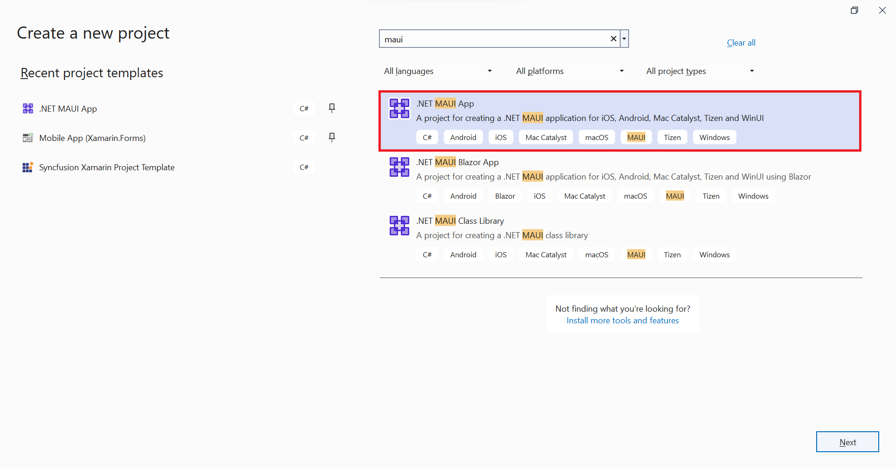
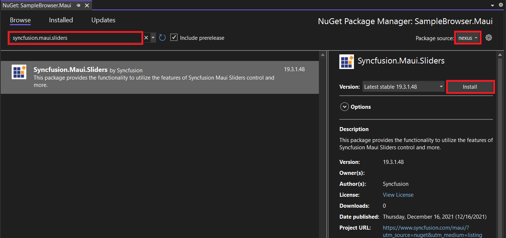

# Getting Started with .NET MAUI Range Slider

This section explains the steps required to add the range slider control and its elements such as track, ticks, labels and tooltip. This section covers only basic features needed to know to get started with Syncfusion Range Slider.

To get start quickly with .NET MAUI Range Slider, you can check the below video.



## Creating an application with .NET MAUI

Create a new .NET MAUI application in Visual Studio.

 

## Adding SfRangeSlider reference

The Syncfusion .NET MAUI components are available in [nuget.org](https://www.nuget.org/). To add the SfRangeSlider to your project, open the NuGet package manager in the Visual Studio, search for the Syncfusion.Maui.Sliders, and install it.

 

## Handler registration

In the MauiProgram.cs file, register the handler for the Syncfusion core.



using Microsoft.Maui;
using Microsoft.Maui.Hosting;
using Microsoft.Maui.Controls.Compatibility;
using Microsoft.Maui.Controls.Hosting;
using Microsoft.Maui.Controls.Xaml;
using Syncfusion.Maui.Core.Hosting;

namespace Slider
{
    public static class MauiProgram
    {
        public static MauiApp CreateMauiApp()
        {
            var builder = MauiApp.CreateBuilder();
            builder
            .UseMauiApp<App>()
            .ConfigureSyncfusionCore()
            .ConfigureFonts(fonts =>
            {
                fonts.AddFont("OpenSans-Regular.ttf", "OpenSansRegular");
            });

            return builder.Build();
        }
    }
}



## Initialize range slider

Import the [`SfRangeSlider`](https://help.syncfusion.com/cr/maui/Syncfusion.Maui.Sliders.SfRangeSlider.html) namespace and initialize the range slider as shown below.





<ContentPage
    . . .
    xmlns:sliders="clr-namespace:Syncfusion.Maui.Sliders;assembly=Syncfusion.Maui.Sliders">
    <sliders:SfRangeSlider />
</ContentPage>





using Syncfusion.Maui.Sliders;

namespace RangeSlider
{
    public partial class MainPage : ContentPage
    {
        public MainPage()
        {
            InitializeComponent();
            SfRangeSlider rangeSlider = new SfRangeSlider();
            this.content = rangeSlider;
        }
    }
}





## Enable labels

The [`ShowLabels`](https://help.syncfusion.com/cr/maui/Syncfusion.Maui.Sliders.RangeView-1.html#Syncfusion_Maui_Sliders_RangeView_1_ShowLabels) property enables the labels which renders on given interval.





<sliders:SfRangeSlider Minimum="0"
                       Maximum="10"
                       RangeStart="2"
                       RangeEnd="8"
                       Interval="2"
                       ShowLabels="True" />





SfRangeSlider rangeSlider = new SfRangeSlider();
rangeSlider.Minimum = 0;
rangeSlider.Maximum = 10;
rangeSlider.RangeStart = 2;
rangeSlider.RangeEnd = 8;
rangeSlider.ShowLabels = true;
rangeSlider.Interval = 2;





## Enable ticks

The [`ShowTicks`](https://help.syncfusion.com/cr/maui/Syncfusion.Maui.Sliders.RangeView-1.html#Syncfusion_Maui_Sliders_RangeView_1_ShowTicks) property enables the ticks in the range selector, while the [`MinorTicksPerInterval`](https://help.syncfusion.com/cr/maui/Syncfusion.Maui.Sliders.RangeView-1.html#Syncfusion_Maui_Sliders_RangeView_1_MinorTicksPerInterval) property enables the minor ticks between the major ticks.





<sliders:SfRangeSlider Minimum="0"
                       Maximum="10"
                       RangeStart="2"
                       RangeEnd="8"
                       Interval="2"
                       ShowLabels="True"
                       ShowTicks="True"
                       MinorTicksPerInterval="1" />





SfRangeSlider rangeSlider = new SfRangeSlider();
rangeSlider.Minimum = 0;
rangeSlider.Maximum = 10;
rangeSlider.RangeStart = 2;
rangeSlider.RangeEnd = 8;
rangeSlider.ShowLabels = true;
rangeSlider.ShowTicks = true;
rangeSlider.Interval = 2;
rangeSlider.MinorTicksPerInterval = 1;





## Orientation

The [`Orientation`](https://help.syncfusion.com/cr/maui/Syncfusion.Maui.Sliders.SfRangeSlider.html#Syncfusion_Maui_Sliders_SfRangeSlider_Orientation) property allows you to show the range slider in both horizontal and vertical directions. The default value of the [`Orientation`](https://help.syncfusion.com/cr/maui/Syncfusion.Maui.Sliders.SfRangeSlider.html#Syncfusion_Maui_Sliders_SfRangeSlider_Orientation) property is `Horizontal`.





<sliders:SfRangeSlider Minimum="0"
                       Maximum="10"
                       RangeStart="2"
                       RangeEnd="8"
                       ShowTicks="True"
                       ShowLabels="True"
                       Interval="2"
                       MinorTicksPerInterval="1"
                       Orientation="Vertical" />





SfRangeSlider rangeSlider = new SfRangeSlider();
rangeSlider.Orientation = SliderOrientation.Vertical;
rangeSlider.Minimum = 0;
rangeSlider.Maximum = 10;
rangeSlider.RangeStart = 2;
rangeSlider.RangeEnd = 8;
rangeSlider.ShowLabels = true;
rangeSlider.ShowTicks = true;
rangeSlider.Interval = 2;
rangeSlider.MinorTicksPerInterval = 1;





## Inverse the slider

Invert the range slider using the [`IsInversed`](https://help.syncfusion.com/cr/maui/Syncfusion.Maui.Sliders.RangeView-1.html#Syncfusion_Maui_Sliders_RangeView_1_IsInversed) property. The default value of the [`IsInversed`](https://help.syncfusion.com/cr/maui/Syncfusion.Maui.Sliders.RangeView-1.html#Syncfusion_Maui_Sliders_RangeView_1_IsInversed) property is `False`.





<sliders:SfRangeSlider Minimum="0"
                       Maximum="10"
                       RangeStart="2"
                       RangeEnd="8"
                       Interval="2"
                       ShowTicks="True"
                       ShowLabels="True"
                       MinorTicksPerInterval="1"
                       IsInversed="True" />





SfRangeSlider rangeSlider = new SfRangeSlider();
rangeSlider.Minimum = 0;
rangeSlider.Maximum = 10;
rangeSlider.RangeStart = 2;
rangeSlider.RangeEnd = 8;
rangeSlider.Interval = 2;
rangeSlider.ShowLabels = true;
rangeSlider.ShowTicks = true;
rangeSlider.MinorTicksPerInterval = 1;
rangeSlider.IsInversed = true;





## Formatting labels

Add prefix or suffix to the labels using the [`NumberFormat`](https://help.syncfusion.com/cr/maui/Syncfusion.Maui.Sliders.INumericElement.html#Syncfusion_Maui_Sliders_INumericElement_NumberFormat) property.





<sliders:SfRangeSlider Minimum="20"
                       Maximum="100"
                       RangeStart="40"
                       RangeEnd="80"
                       Interval="20"
                       ShowLabels="True"
                       NumberFormat="$#"
                       ShowTicks="True" />





SfRangeSlider rangeSlider = new SfRangeSlider();
rangeSlider.Minimum = 20;
rangeSlider.Maximum = 100;
rangeSlider.RangeStart = 40;
rangeSlider.RangeEnd = 80;
rangeSlider.Interval = 20;
rangeSlider.ShowLabels = true;
rangeSlider.NumberFormat = "$##";
rangeSlider.ShowTicks = true;





