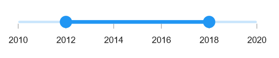

# Getting Started with .NET MAUI Range Slider

This section explains the steps required to add the range slider control and its elements such as numeric and date values, ticks, labels and tooltip. This section covers only basic features needed to know to get started with Syncfusion Range Slider.

## Creating an application with .NET MAUI

1. Create a new .NET MAUI application in Visual Studio.

 

2. Syncfusion .NET MAUI components are available in [nuget.org](https://www.nuget.org/). To add SfRangeSlider to your project, open the NuGet package manager in Visual Studio, search for Syncfusion.Maui.Sliders and then install it.

 

## Register the handler

Syncfusion.Maui.Core nuget is a dependent package for all Syncfusion controls of .NET MAUI. In the MauiProgram.cs file, register the handler for Syncfusion core.



using Microsoft.Maui;
using Microsoft.Maui.Hosting;
using Microsoft.Maui.Controls.Compatibility;
using Microsoft.Maui.Controls.Hosting;
using Microsoft.Maui.Controls.Xaml;
using Syncfusion.Maui.Core.Hosting;

namespace Slider
{
    public static class MauiProgram
    {
        public static MauiApp CreateMauiApp()
        {
            var builder = MauiApp.CreateBuilder();
            builder
            .UseMauiApp<App>()
            .ConfigureSyncfusionCore()
            .ConfigureFonts(fonts =>
            {
                fonts.AddFont("OpenSans-Regular.ttf", "OpenSansRegular");
            });

            return builder.Build();
        }
    }
}



## Import the Range Slider namespace.





    xmlns:rangeslider="clr-namespace:Syncfusion.Maui.Sliders;assembly=Syncfusion.Maui.Sliders">





using Syncfusion.Maui.Sliders;





## Initialize range slider

Import the `SfRangeSlider` namespace and initialize the range slider as shown below.





<ContentPage
    . . .
    xmlns:rangeslider="clr-namespace:Syncfusion.Maui.Sliders;assembly=Syncfusion.Maui.Sliders">
    <Grid>
        <rangeslider:SfRangeSlider />
    </Grid>
</ContentPage>





using Syncfusion.Maui.Sliders;

namespace SliderGettingStarted
{
    public partial class MainPage : ContentPage
    {
        public MainPage()
        {
            InitializeComponent();
            SfRangeSlider rangeSlider = new SfRangeSlider();
            this.content = rangeSlider;
        }
    }
}





## Enable ticks

The `ShowTicks` property enables ticks in the range slider, while the `MinorTicksPerInterval` property enables minor ticks between the major ticks.





<rangeslider:SfRangeSlider  Minimum="2010-01-01" 
                        Maximum="2020-01-01" 
                        RangeStart="2012-01-01" 
                        RangeEnd="2018-01-01" 
                        ShowTicks="True" 
                        Interval="2" 
                        MinorTicksPerInterval="1">
</rangeslider:SfRangeSlider>





SfRangeSlider rangeSlider = new SfRangeSlider();
rangeSlider.Minimum = new DateTime(2010, 01, 01);
rangeSlider.Maximum = new DateTime(2020, 01, 01);
rangeSlider.RangeStart = new DateTime(2012, 01, 01);
rangeSlider.RangeEnd = new DateTime(2018, 01, 01);
rangeSlider.ShowTicks = true;
rangeSlider.Interval = 2;
rangeSlider.MinorTicksPerInterval = 1;





## Set date value

Set the 'DateTime' values to the `Minimum`, `Maximum`, and `Value` properties to display date labels in the range slider.





<rangeslider:SfRangeSlider Minimum="2010-01-01"
                       Maximum="2020-01-01" 
                       RangeStart="2012-01-01" 
                       RangeEnd="2018-01-01" 
                       ShowLabels="True">
</rangeslider:SfRangeSlider>





SfRangeSlider rangeSlider = new SfRangeSlider();
rangeSlider.Minimum = new DateTime(2010, 01, 01);
rangeSlider.Maximum = new DateTime(2020, 01, 01);
rangeSlider.RangeStart = new DateTime(2012, 01, 01);
rangeSlider.RangeEnd = new DateTime(2018, 01, 01);
rangeSlider.ShowLabels = true;





## Orientation

The `Orientation` property allows you to show the range slider in both horizontal and vertical directions. The default value of the `Orientation` property is `Horizontal`.





<rangeslider:SfRangeSlider Orientation="Vertical" />





SfRangeSlider rangeSlider = new SfRangeSlider();
rangeSlider.Orientation = SliderOrientation.Vertical;





## Inverse the slider

You can invert the range slider using the `IsInversed` property. The default value of the `IsInversed` property is `False`.





<rangeslider:SfRangeSlider IsInversed="True"/>





SfRangeSlider rangeSlider = new SfRangeSlider();
rangeSlider.IsInversed = true;





## Formatting labels

You can add prefix or suffix to the labels using the `NumberFormat` or `DateFormat` properties.

N> The format type (numeric or date) of the range slider is determined based on the values specified in `Minimum`, `Maximum` properties.





<rangeslider:SfRangeSlider Minimum="0" 
                       Maximum="100" 
                       RangeStart="20" 
                       RangeEnd="80"
                       NumberFormat="$##" 
                       ShowLabels="True" 
                       ShowTicks="True" 
                       Interval="20">
</rangeslider:SfRangeSlider>





SfRangeSlider rangeSlider = new SfRangeSlider();
rangeSlider.Minimum = 0;
rangeSlider.Maximum = 100;
rangeSlider.RangeStart = 20;
rangeSlider.RangeEnd = 80;
rangeSlider.ShowLabels = true;
rangeSlider.ShowTicks = true;
rangeSlider.Interval = 20;
rangeSlider.NumberFormat = "$##";





