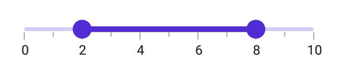
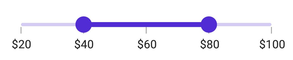

# Getting Started with .NET MAUI Range Slider

This section explains the steps required to add the [RangeSlider](https://help.syncfusion.com/cr/maui/Syncfusion.Maui.Sliders.SfRangeSlider.html) control and its elements such as track, ticks, labels and tooltip. This section covers only basic features needed to know to get started with Syncfusion Range Slider.

To get start quickly with .NET MAUI Range Slider, you can check the below video.



## Prerequisites

Before proceeding, ensure the following are in place:

1.Install [.NET 7 SDK](https://dotnet.microsoft.com/en-us/download/dotnet/7.0) or later.
2.Set up a .NET MAUI environment with Visual Studio 2022 (v17.3 or later) or VS Code. For VS Code users, ensure that the .NET MAUI workload is installed and configured as described [here](https://github.com/dotnet/maui/wiki/VS-Code-setup).

## Step 1: Create a New MAUI Project

### Visual Studio
1.Go to **File > New > Project** and choose the **.NET MAUI App** template.
2.Name the project and choose a location, then click **Next**.
3.Select the .NET framework version and click **Create**.

### Visual Studio Code
1.Open the command palette by pressing `Ctrl+Shift+P` and type **.NET:New Project** and enter.
2.Choose the **.NET MAUI** App template.
3.Select the project location, type the project name and press enter.
4.Then choose **Create project.

## Step 2: Install the Syncfusion MAUI Sliders NuGet Package

1.In **Solution Explorer**, right-click the project and choose **Manage NuGet Packages**.
2.Search for [Syncfusion.Maui.Sliders](https://www.nuget.org/packages/Syncfusion.Maui.Sliders) and install the latest version.
3.Ensure the necessary dependencies are installed correctly, and the project is restored.

## Step 3: Register the Handler

[Syncfusion.Maui.Core](https://www.nuget.org/packages/Syncfusion.Maui.Core) nuget is a dependent package for all Syncfusion controls of .NET MAUI. In the **MauiProgram.cs file**, register the handler for Syncfusion core.



using Microsoft.Maui;
using Microsoft.Maui.Hosting;
using Microsoft.Maui.Controls.Compatibility;
using Microsoft.Maui.Controls.Hosting;
using Microsoft.Maui.Controls.Xaml;
using Syncfusion.Maui.Core.Hosting;

namespace Slider
{
    public static class MauiProgram
    {
        public static MauiApp CreateMauiApp()
        {
            var builder = MauiApp.CreateBuilder();
            builder
            .UseMauiApp<App>()
            .ConfigureSyncfusionCore()
            .ConfigureFonts(fonts =>
            {
                fonts.AddFont("OpenSans-Regular.ttf", "OpenSansRegular");
            });

            return builder.Build();
        }
    }
}



## Step 4:  Add a Basic RangeSlider

Step 1: Add the NuGet to the project as discussed in the above reference section. 

Step 2: Add the namespace, as shown in the following code sample:





	<xmlns:rating="clr-namespace:Syncfusion.Maui.Sliders;assembly=Syncfusion.Maui.Sliders"/>





	using Syncfusion.Maui.Sliders;





## Initialize RangeSlider

Import the [SfRangeSlider](https://help.syncfusion.com/cr/maui/Syncfusion.Maui.Sliders.SfRangeSlider.html) namespace and initialize the range slider as shown below.





<ContentPage
    . . .
    xmlns:sliders="clr-namespace:Syncfusion.Maui.Sliders;assembly=Syncfusion.Maui.Sliders">
    <sliders:SfRangeSlider />
</ContentPage>





using Syncfusion.Maui.Sliders;

namespace RangeSlider
{
    public partial class MainPage : ContentPage
    {
        public MainPage()
        {
            InitializeComponent();
            SfRangeSlider rangeSlider = new SfRangeSlider();
            this.content = rangeSlider;
        }
    }
}





## Enable labels

The [ShowLabels](https://help.syncfusion.com/cr/maui/Syncfusion.Maui.Sliders.RangeView-1.html#Syncfusion_Maui_Sliders_RangeView_1_ShowLabels) property enables the labels which renders on given interval.





<sliders:SfRangeSlider Minimum="0"
                       Maximum="10"
                       RangeStart="2"
                       RangeEnd="8"
                       Interval="2"
                       ShowLabels="True" />





SfRangeSlider rangeSlider = new SfRangeSlider();
rangeSlider.Minimum = 0;
rangeSlider.Maximum = 10;
rangeSlider.RangeStart = 2;
rangeSlider.RangeEnd = 8;
rangeSlider.ShowLabels = true;
rangeSlider.Interval = 2;





## Enable ticks

The [ShowTicks](https://help.syncfusion.com/cr/maui/Syncfusion.Maui.Sliders.RangeView-1.html#Syncfusion_Maui_Sliders_RangeView_1_ShowTicks) property enables the ticks in the range selector, while the [MinorTicksPerInterval](https://help.syncfusion.com/cr/maui/Syncfusion.Maui.Sliders.RangeView-1.html#Syncfusion_Maui_Sliders_RangeView_1_MinorTicksPerInterval) property enables the minor ticks between the major ticks.





<sliders:SfRangeSlider Minimum="0"
                       Maximum="10"
                       RangeStart="2"
                       RangeEnd="8"
                       Interval="2"
                       ShowLabels="True"
                       ShowTicks="True"
                       MinorTicksPerInterval="1" />





SfRangeSlider rangeSlider = new SfRangeSlider();
rangeSlider.Minimum = 0;
rangeSlider.Maximum = 10;
rangeSlider.RangeStart = 2;
rangeSlider.RangeEnd = 8;
rangeSlider.ShowLabels = true;
rangeSlider.ShowTicks = true;
rangeSlider.Interval = 2;
rangeSlider.MinorTicksPerInterval = 1;





## Orientation

The [Orientation](https://help.syncfusion.com/cr/maui/Syncfusion.Maui.Sliders.SfRangeSlider.html#Syncfusion_Maui_Sliders_SfRangeSlider_Orientation) property allows you to show the range slider in both horizontal and vertical directions. The default value of the [Orientation](https://help.syncfusion.com/cr/maui/Syncfusion.Maui.Sliders.SfRangeSlider.html#Syncfusion_Maui_Sliders_SfRangeSlider_Orientation) property is **Horizontal**.





<sliders:SfRangeSlider Minimum="0"
                       Maximum="10"
                       RangeStart="2"
                       RangeEnd="8"
                       ShowTicks="True"
                       ShowLabels="True"
                       Interval="2"
                       MinorTicksPerInterval="1"
                       Orientation="Vertical" />





SfRangeSlider rangeSlider = new SfRangeSlider();
rangeSlider.Orientation = SliderOrientation.Vertical;
rangeSlider.Minimum = 0;
rangeSlider.Maximum = 10;
rangeSlider.RangeStart = 2;
rangeSlider.RangeEnd = 8;
rangeSlider.ShowLabels = true;
rangeSlider.ShowTicks = true;
rangeSlider.Interval = 2;
rangeSlider.MinorTicksPerInterval = 1;





## Inverse the slider

Invert the range slider using the [IsInversed](https://help.syncfusion.com/cr/maui/Syncfusion.Maui.Sliders.RangeView-1.html#Syncfusion_Maui_Sliders_RangeView_1_IsInversed) property. The default value of the IsInversed property is **False**.





<sliders:SfRangeSlider Minimum="0"
                       Maximum="10"
                       RangeStart="2"
                       RangeEnd="8"
                       Interval="2"
                       ShowTicks="True"
                       ShowLabels="True"
                       MinorTicksPerInterval="1"
                       IsInversed="True" />





SfRangeSlider rangeSlider = new SfRangeSlider();
rangeSlider.Minimum = 0;
rangeSlider.Maximum = 10;
rangeSlider.RangeStart = 2;
rangeSlider.RangeEnd = 8;
rangeSlider.Interval = 2;
rangeSlider.ShowLabels = true;
rangeSlider.ShowTicks = true;
rangeSlider.MinorTicksPerInterval = 1;
rangeSlider.IsInversed = true;





## Formatting labels

Add prefix or suffix to the labels using the [NumberFormat](https://help.syncfusion.com/cr/maui/Syncfusion.Maui.Sliders.INumericElement.html#Syncfusion_Maui_Sliders_INumericElement_NumberFormat) property.





<sliders:SfRangeSlider Minimum="20"
                       Maximum="100"
                       RangeStart="40"
                       RangeEnd="80"
                       Interval="20"
                       ShowLabels="True"
                       NumberFormat="$#"
                       ShowTicks="True" />





SfRangeSlider rangeSlider = new SfRangeSlider();
rangeSlider.Minimum = 20;
rangeSlider.Maximum = 100;
rangeSlider.RangeStart = 40;
rangeSlider.RangeEnd = 80;
rangeSlider.Interval = 20;
rangeSlider.ShowLabels = true;
rangeSlider.NumberFormat = "$##";
rangeSlider.ShowTicks = true;





N> You can refer to our [.NET MAUI Range Slider](https://www.syncfusion.com/maui-controls/maui-range-slider) feature tour page for its groundbreaking feature representations. You can also explore our [.NET MAUI Range Slider Example](https://github.com/syncfusion/maui-demos/tree/master/MAUI/Sliders/SampleBrowser.Maui.Sliders/Samples/RangeSlider) that shows you how to render the Range Slider in .NET MAUI.
