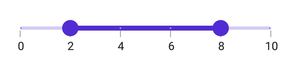

# Interval in .NET MAUI Range Slider (SfRangeSlider)

This section explains how to add the interval for numeric range slider.

## Numeric interval

Range Slider elements like labels, ticks and dividers are rendered based on the [`Interval`](https://help.syncfusion.com/cr/maui/Syncfusion.Maui.Sliders.RangeView-1.html#Syncfusion_Maui_Sliders_RangeView_1_Interval), [`Minimum`](https://help.syncfusion.com/cr/maui/Syncfusion.Maui.Sliders.RangeView-1.html#Syncfusion_Maui_Sliders_RangeView_1_Minimum) and [`Maximum`](https://help.syncfusion.com/cr/maui/Syncfusion.Maui.Sliders.RangeView-1.html#Syncfusion_Maui_Sliders_RangeView_1_Maximum) properties. The default value is `0`.

For example, if the [`Minimum`](https://help.syncfusion.com/cr/maui/Syncfusion.Maui.Sliders.RangeView-1.html#Syncfusion_Maui_Sliders_RangeView_1_Minimum) is 0.0, the [`Maximum`](https://help.syncfusion.com/cr/maui/Syncfusion.Maui.Sliders.RangeView-1.html#Syncfusion_Maui_Sliders_RangeView_1_Maximum) is 10.0, and [`Interval`](https://help.syncfusion.com/cr/maui/Syncfusion.Maui.Sliders.RangeView-1.html#Syncfusion_Maui_Sliders_RangeView_1_Interval) is 2.0, the range slider will render the labels, major ticks, and dividers at 0.0, 2.0, 4.0, and so on.





<sliders:SfRangeSlider Minimum="0"
                       Maximum="10"
                       RangeStart="2"
                       RangeEnd="8"
                       Interval="2"
                       ShowLabels="True"
                       ShowTicks="True"
                       ShowDividers="True" />





SfRangeSlider rangeSlider = new SfRangeSlider();
rangeSlider.Minimum = 0;
rangeSlider.Maximum = 10;
rangeSlider.RangeStart = 2;
rangeSlider.RangeEnd = 8;
rangeSlider.Interval = 2;
rangeSlider.ShowLabels = true;
rangeSlider.ShowTicks = true;
rangeSlider.ShowDividers = true;
         




## Auto interval

If the [`ShowTicks`](https://help.syncfusion.com/cr/maui/Syncfusion.Maui.Sliders.RangeView-1.html#Syncfusion_Maui_Sliders_RangeView_1_ShowTicks) or [`ShowLabels`](https://help.syncfusion.com/cr/maui/Syncfusion.Maui.Sliders.RangeView-1.html#Syncfusion_Maui_Sliders_RangeView_1_ShowLabels), or [`ShowDividers`](https://help.syncfusion.com/cr/maui/Syncfusion.Maui.Sliders.RangeView-1.html#Syncfusion_Maui_Sliders_RangeView_1_ShowDividers) properties are `True`, but the [`Interval`](https://help.syncfusion.com/cr/maui/Syncfusion.Maui.Sliders.RangeView-1.html#Syncfusion_Maui_Sliders_RangeView_1_Interval) is `0`, the [`Interval`](https://help.syncfusion.com/cr/maui/Syncfusion.Maui.Sliders.RangeView-1.html#Syncfusion_Maui_Sliders_RangeView_1_Interval) will be calculated from the available size.

For example, if the [`Minimum`](https://help.syncfusion.com/cr/maui/Syncfusion.Maui.Sliders.RangeView-1.html#Syncfusion_Maui_Sliders_RangeView_1_Minimum) is 0, the [`Maximum`](https://help.syncfusion.com/cr/maui/Syncfusion.Maui.Sliders.RangeView-1.html#Syncfusion_Maui_Sliders_RangeView_1_Maximum) is 10.0, [`Interval`](https://help.syncfusion.com/cr/maui/Syncfusion.Maui.Sliders.RangeView-1.html#Syncfusion_Maui_Sliders_RangeView_1_Interval) is 0.0, and consider the screen size as 350, the Range Selector will render the labels, major ticks, and dividers at 0.0, 2.0, 4.0, 6.0, 8.0, and 10.0.





<sliders:SfRangeSlider Minimum="0"
                       Maximum="10"
                       RangeStart="2"
                       RangeEnd="8"
                       ShowLabels="True"
                       ShowTicks="True"
                       ShowDividers="True" />





SfRangeSlider rangeSlider = new SfRangeSlider();
rangeSlider.Minimum = 0;
rangeSlider.Maximum = 10;
rangeSlider.RangeStart = 2;
rangeSlider.RangeEnd = 8;
rangeSlider.ShowLabels = true;
rangeSlider.ShowTicks = true;
rangeSlider.ShowDividers = true;
         



