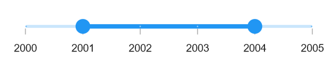
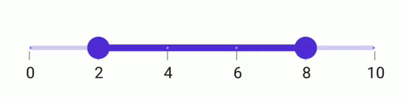
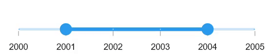
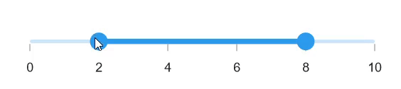

# Interval in .NET MAUI Range Slider (SfRangeSlider)

This section explains about how to add the interval for numeric and date range slider.

## Numeric interval

Range Slider elements like labels, ticks and dividers are rendered based on the [`Interval`](https://help.syncfusion.com/cr/maui/Syncfusion.Maui.Sliders.SliderBase.html#Syncfusion_Maui_Sliders_SliderBase_Interval), [`Minimum`](https://help.syncfusion.com/cr/maui/Syncfusion.Maui.Sliders.NumericRangeSliderBase.html#Syncfusion_Maui_Sliders_NumericRangeSliderBase_Minimum) and [`Maximum`](https://help.syncfusion.com/cr/maui/Syncfusion.Maui.Sliders.NumericRangeSliderBase.html#Syncfusion_Maui_Sliders_NumericRangeSliderBase_Maximum) properties. The default value is `Zero`.

For example, if [`Minimum`](https://help.syncfusion.com/cr/maui/Syncfusion.Maui.Sliders.NumericRangeSliderBase.html#Syncfusion_Maui_Sliders_NumericRangeSliderBase_Minimum) is 0.0 and [`Maximum`](https://help.syncfusion.com/cr/maui/Syncfusion.Maui.Sliders.NumericRangeSliderBase.html#Syncfusion_Maui_Sliders_NumericRangeSliderBase_Maximum) is 10.0 and [`Interval`](https://help.syncfusion.com/cr/maui/Syncfusion.Maui.Sliders.SliderBase.html#Syncfusion_Maui_Sliders_SliderBase_Interval) is 2.0, the range slider will render the labels, major ticks, and dividers at 0.0, 2.0, 4.0 and so on.





<sliders:SfRangeSlider Minimum="0" 
                       Maximum="10" 
                       RangeStart="2" 
                       RangeEnd="8"
                       Interval="2" 
                       ShowLabels="True" 
                       ShowTicks="True" 
                       ShowDividers="True">
</sliders:SfRangeSlider>





SfRangeSlider rangeSlider = new SfRangeSlider();
rangeSlider.Minimum = 0;
rangeSlider.Maximum = 10;
rangeSlider.RangeStart = 2;
rangeSlider.RangeEnd = 8;
rangeSlider.Interval = 2;
rangeSlider.ShowLabels = true;
rangeSlider.ShowTicks = true;
rangeSlider.ShowDividers = true;
         




## Date interval

The type of date interval. It can be years to seconds. It is mandatory for date [`SfDateTimeRangeSlider`](https://help.syncfusion.com/cr/maui/Syncfusion.Maui.Sliders.SfDateTimeRangeSlider.html). The default value of [`IntervalType`](https://help.syncfusion.com/cr/maui/Syncfusion.Maui.Sliders.DateTimeRangeSliderBase.html#Syncfusion_Maui_Sliders_DateTimeRangeSliderBase_IntervalType) property is `DateTime.Year`.

For date values, the range slider does not have auto interval support. So, it is mandatory to set [`Interval`](https://help.syncfusion.com/cr/maui/Syncfusion.Maui.Sliders.SliderBase.html#Syncfusion_Maui_Sliders_SliderBase_Interval), [`IntervalType`](https://help.syncfusion.com/cr/maui/Syncfusion.Maui.Sliders.DateTimeRangeSliderBase.html#Syncfusion_Maui_Sliders_DateTimeRangeSliderBase_IntervalType), and [`DateFormat`](https://help.syncfusion.com/cr/maui/Syncfusion.Maui.Sliders.SliderBase.html#Syncfusion_Maui_Sliders_SliderBase_DateFormat) for date values.

For example, if [`Minimum`](https://help.syncfusion.com/cr/maui/Syncfusion.Maui.Sliders.DateTimeRangeSliderBase.html#Syncfusion_Maui_Sliders_DateTimeRangeSliderBase_Minimum) is `DateTime(2000, 01, 01)` and [`Maximum`](https://help.syncfusion.com/cr/maui/Syncfusion.Maui.Sliders.DateTimeRangeSliderBase.html#Syncfusion_Maui_Sliders_DateTimeRangeSliderBase_Maximum) is `DateTime(2005, 01, 01)` and [`Interval`](https://help.syncfusion.com/cr/maui/Syncfusion.Maui.Sliders.SliderBase.html#Syncfusion_Maui_Sliders_SliderBase_Interval) is `1`, [`IntervalType`](https://help.syncfusion.com/cr/maui/Syncfusion.Maui.Sliders.DateTimeRangeSliderBase.html#Syncfusion_Maui_Sliders_DateTimeRangeSliderBase_IntervalType) is [`SliderDateIntervalType.years`](https://help.syncfusion.com/cr/maui/Syncfusion.Maui.Sliders.SliderDateIntervalType.html#Syncfusion_Maui_Sliders_SliderDateIntervalType_Years), [`DateFormat`](https://help.syncfusion.com/cr/maui/Syncfusion.Maui.Sliders.DateTimeRangeSliderBase.html#Syncfusion_Maui_Sliders_DateTimeRangeSliderBase_DateFormat) is `yyyy` then the range slider will render the labels, major ticks, and dividers at 2000, 2001, 2002 and so on.





<sliders:SfDateTimeRangeSlider Minimum="2000-01-01" 
                               Maximum="2005-01-01" 
                               RangeStart="2001-01-01" 
                               RangeEnd="2004-01-01"
                               Interval="1" 
                               IntervalType="Years"
                               DateFormat="yyyy" 
                               ShowLabels="True" 
                               ShowTicks="True" 
                               ShowDividers="True">
</sliders:SfDateTimeRangeSlider>





SfRangeSlider rangeSlider = new SfRangeSlider();
rangeSlider.Minimum = new DateTime(2000, 01, 01);
rangeSlider.Maximum = new DateTime(2005, 01, 01);
rangeSlider.RangeStart = new DateTime(2001, 01, 01); 
rangeSlider.RangeEnd = new DateTime(2004, 01, 01);            
rangeSlider.Interval = 1;
rangeSlider.IntervalType = SliderDateIntervalType.Years;
rangeSlider.DateFormat = "yyyy";
rangeSlider.ShowLabels = true;
rangeSlider.ShowTicks = true;
rangeSlider.ShowDividers = true;
        




## Discrete selection for numeric values

You can move the thumb in discrete manner for numeric values using the [`StepSize`](https://help.syncfusion.com/cr/maui/Syncfusion.Maui.Sliders.NumericRangeSliderBase.html#Syncfusion_Maui_Sliders_NumericRangeSliderBase_StepSize) property in the range slider.





 <sliders:SfRangeSlider Minimum="0" 
                        Maximum="10" 
                        RangeStart="2" 
                        RangeEnd="8"
                        Interval="2"
                        StepSize="2" 
                        ShowLabels="True" 
                        ShowTicks="True" 
                        ShowDividers="True"> 
</sliders:SfRangeSlider>





SfRangeSlider rangeSlider = new SfRangeSlider();
rangeSlider.StepSize = 2;
rangeSlider.Minimum = 0;
rangeSlider.Maximum = 10;
rangeSlider.RangeStart = 2;
rangeSlider.RangeEnd = 8;
rangeSlider.Interval = 2;
rangeSlider.ShowLabels = true;
rangeSlider.ShowTicks = true;
rangeSlider.ShowDividers = true;
         




## Discrete selection for date values

You can move the thumb in discrete manner for date values using the [`StepDuration`](https://help.syncfusion.com/cr/maui/Syncfusion.Maui.Sliders.DateTimeRangeSliderBase.html#Syncfusion_Maui_Sliders_DateTimeRangeSliderBase_StepDuration) property in the range slider.

For example, if [`Minimum`](https://help.syncfusion.com/cr/maui/Syncfusion.Maui.Sliders.DateTimeRangeSliderBase.html#Syncfusion_Maui_Sliders_DateTimeRangeSliderBase_Minimum) is DateTime(2015, 01, 01) and [`Maximum`](https://help.syncfusion.com/cr/maui/Syncfusion.Maui.Sliders.DateTimeRangeSliderBase.html#Syncfusion_Maui_Sliders_DateTimeRangeSliderBase_Maximum) is DateTime(2020, 01, 01) and [`StepDuration`](https://help.syncfusion.com/cr/maui/Syncfusion.Maui.Sliders.DateTimeRangeSliderBase.html#Syncfusion_Maui_Sliders_DateTimeRangeSliderBase_StepDuration) is `1`, the range slider will move the thumbs at DateTime(2015, 01, 01), DateTime(2016, 01, 01), DateTime(2017, 01, 01),and DateTime(2018, 01, 01).





<sliders:SfDateTimeRangeSlider Minimum="2000-01-01" 
                               Maximum="2005-01-01" 
                               RangeStart="2001-01-01"
                               RangeEnd="2004-01-01"  
                               StepDuration="1"
                               ShowLabels="True" 
                               ShowTicks="True" 
                               ShowDividers="True" >
</sliders:SfDateTimeRangeSlider>





SfDateTimeRangeSlider rangeSlider = new SfDateTimeRangeSlider();
rangeSlider.Minimum = new DateTime(2000, 01, 01);
rangeSlider.Maximum = new DateTime(2005, 01, 01);
rangeSlider.RangeStart = new DateTime(2001, 01, 01); 
rangeSlider.RangeEnd = new DateTime(2004, 01, 01);     
rangeSlider.ShowLables = true;
rangeSlider.ShowTicks = true;      
rangeSlider.ShowDividers = true;    
rangeSlider.StepDuration = new SliderStepDuration(years: 1);
         




## Interval Selection

You can drag thumbs only in interval when [EnableIntervalSelection](https://help.syncfusion.com/cr/maui/Syncfusion.Maui.Sliders.RangeSliderBase.html#Syncfusion_Maui_Sliders_RangeSliderBase_EnableIntervalSelection) is true.
If true, both the thumbs can be only moved on the slider Interval.





<sliders:SfRangeSlider Minimum="0" 
                       Maximum="10"
                       RangeStart="2"
                       RangeEnd="8"
                       Interval="2"
                       ShowTicks="True"
                       ShowLabels="True"
                       EnableIntervalSelection="True" >
</sliders:SfRangeSlider>





SfRangeSlider rangeSlider = new SfRangeSlider();
rangeSlider.Minimum = 0;
rangeSlider.Maximum = 10;
rangeSlider.RangeStart = 2; 
rangeSlider.RangeEnd = 8;
rangeSlider.Interval = 2;        
rangeSlider.ShowLables = true;
rangeSlider.ShowTicks = true;    
rangeSlider.EnableIntervalSelection = true;
         




