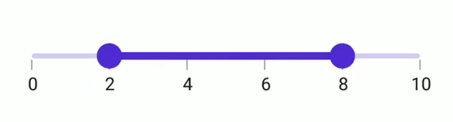

# Interval in .NET MAUI Range Slider (SfRangeSlider)

This section explains about how to add the interval for numeric range slider.

## Numeric interval

Range Slider elements like labels, ticks and dividers are rendered based on the [`Interval`](https://help.syncfusion.com/cr/maui/Syncfusion.Maui.Sliders.SliderBase.html#Syncfusion_Maui_Sliders_SliderBase_Interval), [`Minimum`](https://help.syncfusion.com/cr/maui/Syncfusion.Maui.Sliders.NumericRangeSliderBase.html#Syncfusion_Maui_Sliders_NumericRangeSliderBase_Minimum) and [`Maximum`](https://help.syncfusion.com/cr/maui/Syncfusion.Maui.Sliders.NumericRangeSliderBase.html#Syncfusion_Maui_Sliders_NumericRangeSliderBase_Maximum) properties. The default value is `Zero`.

For example, if [`Minimum`](https://help.syncfusion.com/cr/maui/Syncfusion.Maui.Sliders.NumericRangeSliderBase.html#Syncfusion_Maui_Sliders_NumericRangeSliderBase_Minimum) is 0.0 and [`Maximum`](https://help.syncfusion.com/cr/maui/Syncfusion.Maui.Sliders.NumericRangeSliderBase.html#Syncfusion_Maui_Sliders_NumericRangeSliderBase_Maximum) is 10.0 and [`Interval`](https://help.syncfusion.com/cr/maui/Syncfusion.Maui.Sliders.SliderBase.html#Syncfusion_Maui_Sliders_SliderBase_Interval) is 2.0, the range slider will render the labels, major ticks, and dividers at 0.0, 2.0, 4.0 and so on.





<sliders:SfRangeSlider Minimum="0" 
                       Maximum="10" 
                       RangeStart="2" 
                       RangeEnd="8"
                       Interval="2" 
                       ShowLabels="True" 
                       ShowTicks="True" 
                       ShowDividers="True">
</sliders:SfRangeSlider>





SfRangeSlider rangeSlider = new SfRangeSlider();
rangeSlider.Minimum = 0;
rangeSlider.Maximum = 10;
rangeSlider.RangeStart = 2;
rangeSlider.RangeEnd = 8;
rangeSlider.Interval = 2;
rangeSlider.ShowLabels = true;
rangeSlider.ShowTicks = true;
rangeSlider.ShowDividers = true;
         




## Discrete selection for numeric values

You can move the thumb in discrete manner for numeric values using the [`StepSize`](https://help.syncfusion.com/cr/maui/Syncfusion.Maui.Sliders.NumericRangeSliderBase.html#Syncfusion_Maui_Sliders_NumericRangeSliderBase_StepSize) property in the range slider.





 <sliders:SfRangeSlider Minimum="0" 
                        Maximum="10" 
                        RangeStart="2" 
                        RangeEnd="8"
                        Interval="2"
                        StepSize="2" 
                        ShowLabels="True" 
                        ShowTicks="True" 
                        ShowDividers="True"> 
</sliders:SfRangeSlider>





SfRangeSlider rangeSlider = new SfRangeSlider();
rangeSlider.StepSize = 2;
rangeSlider.Minimum = 0;
rangeSlider.Maximum = 10;
rangeSlider.RangeStart = 2;
rangeSlider.RangeEnd = 8;
rangeSlider.Interval = 2;
rangeSlider.ShowLabels = true;
rangeSlider.ShowTicks = true;
rangeSlider.ShowDividers = true;
         




## Interval Selection

You can drag thumbs only in interval when [EnableIntervalSelection](https://help.syncfusion.com/cr/maui/Syncfusion.Maui.Sliders.RangeSliderBase.html#Syncfusion_Maui_Sliders_RangeSliderBase_EnableIntervalSelection) is true.
If true, both the thumbs can be only moved on the slider Interval.





<sliders:SfRangeSlider Minimum="0" 
                       Maximum="10"
                       RangeStart="2"
                       RangeEnd="8"
                       Interval="2"
                       ShowTicks="True"
                       ShowLabels="True"
                       EnableIntervalSelection="True" >
</sliders:SfRangeSlider>





SfRangeSlider rangeSlider = new SfRangeSlider();
rangeSlider.Minimum = 0;
rangeSlider.Maximum = 10;
rangeSlider.RangeStart = 2; 
rangeSlider.RangeEnd = 8;
rangeSlider.Interval = 2;        
rangeSlider.ShowLables = true;
rangeSlider.ShowTicks = true;    
rangeSlider.EnableIntervalSelection = true;
         




