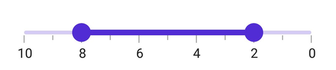
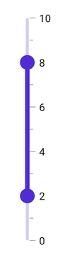

# Inverse and Orientation

## Inverse the slider

Invert the range slider using the [IsInversed](https://help.syncfusion.com/cr/maui/Syncfusion.Maui.Sliders.RangeView-1.html#Syncfusion_Maui_Sliders_RangeView_1_IsInversed) property. The default value of the IsInversed property is **False**.





<sliders:SfRangeSlider Minimum="0"
                       Maximum="10"
                       RangeStart="2"
                       RangeEnd="8"
                       Interval="2"
                       ShowTicks="True"
                       ShowLabels="True"
                       MinorTicksPerInterval="1"
                       IsInversed="True" />





SfRangeSlider rangeSlider = new SfRangeSlider();
rangeSlider.Minimum = 0;
rangeSlider.Maximum = 10;
rangeSlider.RangeStart = 2;
rangeSlider.RangeEnd = 8;
rangeSlider.Interval = 2;
rangeSlider.ShowLabels = true;
rangeSlider.ShowTicks = true;
rangeSlider.MinorTicksPerInterval = 1;
rangeSlider.IsInversed = true;





## Orientation

The [Orientation](https://help.syncfusion.com/cr/maui/Syncfusion.Maui.Sliders.SfRangeSlider.html#Syncfusion_Maui_Sliders_SfRangeSlider_Orientation) property allows you to show the range slider in both horizontal and vertical directions. The default value of the [Orientation](https://help.syncfusion.com/cr/maui/Syncfusion.Maui.Sliders.SfRangeSlider.html#Syncfusion_Maui_Sliders_SfRangeSlider_Orientation) property is **Horizontal**.





<sliders:SfRangeSlider Minimum="0"
                       Maximum="10"
                       RangeStart="2"
                       RangeEnd="8"
                       ShowTicks="True"
                       ShowLabels="True"
                       Interval="2"
                       MinorTicksPerInterval="1"
                       Orientation="Vertical" />





SfRangeSlider rangeSlider = new SfRangeSlider();
rangeSlider.Orientation = SliderOrientation.Vertical;
rangeSlider.Minimum = 0;
rangeSlider.Maximum = 10;
rangeSlider.RangeStart = 2;
rangeSlider.RangeEnd = 8;
rangeSlider.ShowLabels = true;
rangeSlider.ShowTicks = true;
rangeSlider.Interval = 2;
rangeSlider.MinorTicksPerInterval = 1;





