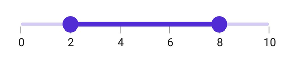

# Labels and Dividers in .NET MAUI Range Slider (SfRangeSlider)

This section explains about how to add the labels and dividers in the range slider.

## Show labels

The `ShowLabels` property is used to render the labels on given interval. The default value of `ShowLabels property is `False`.





<rangeslider:SfRangeSlider Minimum="0" 
                           Maximum="10" 
                           Interval="2" 
                           ShowLabels="True">
</rangeslider:SfRangeSlider>





SfRangeSlider rangeSlider = new SfRangeSlider();
rangeSlider.Minimum = 0;
rangeSlider.Maximum = 10;
rangeSlider.Interval = 2;
rangeSlider.ShowLabels = true;





## Number format

The `NumberFormat` property is used to format the numeric labels. The default value of `NumberFormat` property is `0.##`.





<rangeslider:SfRangeSlider Minimum="0" 
                           Maximum="10" 
                           Interval="2" 
                           NumberFormat="$##" 
                           ShowLabels="True">
</rangeslider:SfRangeSlider>





SfRangeSlider rangeSlider = new SfRangeSlider();
rangeSlider.Minimum = 0;
rangeSlider.Maximum = 10;
rangeSlider.Interval = 2;
rangeSlider.NumberFormat = "$##";
rangeSlider.ShowLabels = true;





## Date format

The `DateFormat` property is used to format the date labels. It is mandatory for date `SfRangeSlider`. For date values, the slider does not have auto interval support. So, it is mandatory to set `Interval`, `DateIntervalType`, and `DateFormat` for date values. The default value of `DateFormat` property is `yyyy`.





<rangeslider:SfRangeSlider Minimum="2000-01-01T09:00:00" 
                           Maximum="2000-01-01T17:00:00" 
                           RangeStart="2000-01-01T11:00:00" 
                           RangeEnd="2000-01-01T15:00:00" 
                           ShowLabels="True" 
                           ShowTicks="True" 
                           DateIntervalType="Hours" 
                           Interval="2" 
                           DateFormat="h tt">
</rangeslider:SfRangeSlider>





SfRangeSlider rangeSlider = new SfRangeSlider();
rangeSlider.Minimum = new DateTime(2000, 01, 01, 09, 00, 00);
rangeSlider.Maximum = new DateTime(2000, 01, 01, 17, 00, 00);
rangeSlider.RangeStart = new DateTime(2000, 01, 01, 11, 00, 00);
rangeSlider.RangeEnd = new DateTime(2000, 01, 01, 15, 00, 00);
rangeSlider.Interval = 2;
rangeSlider.DateIntervalType = SliderDateIntervalType.Hours;
rangeSlider.DateFormat = "h tt";
rangeSlider.ShowLabels = true;





## Label placement

The `LabelsPlacement` property is used to place the labels either between the major ticks or on the major ticks. The default value of the `LabelsPlacement` property is `SliderLabelsPlacement.OnTicks`.





<rangeslider:SfRangeSlider Minimum="0" 
                           Maximum="10" 
                           Interval="2" 
                           LabelsPlacement="BetweenTicks"  
                           ShowLabels="True" 
                           ShowTicks="True">
</rangeslider:SfRangeSlider>





SfRangeSlider rangeSlider = new SfRangeSlider();
rangeSlider.Minimum = 0;
rangeSlider.Maximum = 10;
rangeSlider.Interval = 2;
rangeSlider.LabelsPlacement = SliderLabelsPlacement.BetweenTicks;
rangeSlider.ShowLabels = true;
rangeSlider.ShowTicks = true;





## Customize label text

You can format or change the whole numeric or date label text using the `LabelCreated` event. The `SliderLabelCreatedEventArgs` contains the following parameters,

* Text – Customize the text color using the `Text` parameter.
* Style – Formats the text color, font size, font family, offset using the `Style` parameter.





<rangeslider:SfRangeSlider Minimum="0" 
                           Maximum="10" 
                           Interval="2" 
                           RangeStart="2" 
                           RangeEnd="8"
                           LabelCreated="OnLabelCreated"   
                           ShowLabels="True" 
                           ShowTicks="True">
</rangeslider:SfRangeSlider>




{
   SfRangeSlider rangeSlider = new SfRangeSlider();
   rangeSlider.Minimum = 0;
   rangeSlider.Maximum = 10;
   rangeSlider.RangeStart = 2;
   rangeSlider.RangeEnd = 8;
   rangeSlider.Interval = 2;
   rangeSlider.ShowLabels = true;
   rangeSlider.ShowTicks = true;
   rangeSlider.LabelCreated += OnLabelCreated;
}
private void OnLabelCreated(object sender, SliderLabelCreatedEventArgs e)
{
	e.Text = "$" + e.Text;
}





## Label style

You can change the active and inactive label appearance of the range slider using the `ActiveTextColor`, `ActiveFontSize`, `ActiveFontFamily`, `ActiveFontAttributes`, `InactiveTextColor`, `InactiveFontSize`, `InactiveFontFamily`, `InactiveFontAttributes` and `Offset`  properties of the `LabelStyle` class.

The active side of the range slider is between start and end thumbs.

The inactive side of the range slider is between the `Minimum` value and the left thumb, and the right thumb and the `Maximum` value.





<rangeslider:SfRangeSlider Minimum="2" 
                           Maximum="10" 
                           Interval="2" 
                           RangeStart="2" 
                           RangeEnd="6" 
                           ShowLabels="True" 
                           ShowTicks="True">
<rangeslider:SfRangeSlider.LabelStyle>
    <rangeslider:SliderLabelStyle ActiveTextColor="#EE3F3F" 
                                  InactiveTextColor="#F7B1AE" 
                                  ActiveFontAttributes="Italic" 
                                  InactiveFontAttributes="Italic" 
                                  ActiveFontSize="16" 
                                  InactiveFontSize="16" />
     </rangeslider:SfRangeSlider.LabelStyle>
</rangeslider:SfRangeSlider>





SfRangeSlider rangeSlider = new SfRangeSlider();
rangeSlider.Minimum = 0;
rangeSlider.Maximum = 10;
rangeSlider.RangeStart = 2;
rangeSlider.RangeEnd = 6;
rangeSlider.Interval = 2;
rangeSlider.ShowLabels = true;
rangeSlider.ShowTicks = true;
rangeSlider.LabelStyle.ActiveTextColor = Color.FromArgb("#EE3F3F");
rangeSlider.LabelStyle.InactiveTextColor = Color.FromArgb("#F7B1AE");
rangeSlider.LabelStyle.ActiveFontSize = 16;
rangeSlider.LabelStyle.InactiveFontSize = 16;
rangeSlider.LabelStyle.ActiveFontAttributes = FontAttributes.Italic;
rangeSlider.LabelStyle.InactiveFontAttributes = FontAttributes.Italic;





## Label offset

You can adjust the space between ticks and labels of the range slider using the `Offset` property. The default value of the `Offset` property is 5.0 when `ShowTicks` enabled, otherwise it is `15.0` by default.





<rangeslider:SfRangeSlider Minimum="0"
                           Maximum="10"
                           Interval="2" 
                           ShowLabels="True" 
                           ShowTicks="True">
  <rangeslider:SfRangeSlider.LabelStyle>
    <rangeslider:SliderLabelStyle Offset="10" />
  </rangeslider:SfRangeSlider.LabelStyle>
</rangeslider:SfRangeSlider>





SfRangeSlider rangeSlider = new SfRangeSlider();
rangeSlider.Minimum = 0;
rangeSlider.Maximum = 10;
rangeSlider.Interval = 2;
rangeSlider.ShowLabels = true;
rangeSlider.ShowTicks = true;
rangeSlider.LabelStyle.Offset = 10;





## Show dividers

The `ShowDividers` property is used to render the dividers on the track. The default value of the `ShowDividers` property is `False`. It is a shape which is used to represent the major interval points of the track.

For example, if `Minimum` is 0.0 and `Maximum` is 10.0 and `Interval` is 2.0, the range slider will render the dividers at 0.0, 2.0, 4.0 and so on.





<rangeslider:SfRangeSlider Interval="0.2" 
                           ShowDividers="True">
</rangeslider:SfRangeSlider>





SfRangeSlider rangeSlider = new SfRangeSlider();
rangeSlider.Interval = 0.2;
rangeSlider.ShowDividers = true;





## Divider radius

You can change the active and inactive divider radius of the range slider using the `ActiveRadius` and the `InactiveRadius` properties of the `DividerStyle` class.





<rangeslider:SfRangeSlider Interval="0.2" 
                           ShowDividers="True">
   <rangeslider:SfRangeSlider.DividerStyle>
      <rangeslider:SliderDividerStyle ActiveRadius="7" InactiveRadius="7" />
   </rangeslider:SfRangeSlider.DividerStyle>
</rangeslider:SfRangeSlider>





SfRangeSlider rangeSlider = new SfRangeSlider();
rangeSlider.Interval = 0.2;
rangeSlider.ShowDividers = true;
rangeSlider.DividerStyle.ActiveRadius = 7;
rangeSlider.DividerStyle.InactiveRadius = 7;





## Divider stroke width and stroke color

You can change the active and inactive divider stroke width of the range slider using the `ActiveStrokeWidth` and the `InactiveStrokeWidth` properties of the `DividerStyle` class.

Also, you can change the active and inactive divider stroke color of the range slider using the `ActiveStrokeColor` and the `InactiveStrokeColor` properties of the `DividerStyle` class.





<rangeslider:SfRangeSlider Interval="0.2" 
                           ShowDividers="True">
   <rangeslider:SfRangeSlider.DividerStyle>
        <rangeslider:SliderDividerStyle ActiveRadius="7" 
                                        InactiveRadius="7" 
                                        ActiveStrokeWidth="2" 
                                        InactiveStrokeWidth="2" 
                                        ActiveStrokeColor="#EE3F3F" 
                                        InactiveStrokeColor="#F7B1AE"/>
   </rangeslider:SfRangeSlider.DividerStyle>
</rangeslider:SfRangeSlider>





SfRangeSlider rangeSlider = new SfRangeSlider();
rangeSlider.Interval = 0.2;
rangeSlider.ShowDividers = true;
rangeSlider.DividerStyle.ActiveRadius = 7;
rangeSlider.DividerStyle.InactiveRadius = 7;
rangeSlider.DividerStyle.ActiveStrokeColor = new SolidColorBrush(Color.FromArgb("#EE3F3F"));
rangeSlider.DividerStyle.InactiveStrokeColor = new SolidColorBrush(Color.FromArgb("#F7B1AE"));
rangeSlider.DividerStyle.ActiveStrokeWidth = 2;
rangeSlider.DividerStyle.InactiveStrokeWidth = 2;





## Divider color

You can change the active and inactive divider color of the range slider using the `ActiveColor` and `InactiveColor` properties of the `DividerStyle` class.





<rangeslider:SfRangeSlider Interval="0.2" 
                           ShowDividers="True">
    <rangeslider:SfRangeSlider.DividerStyle>
        <rangeslider:SliderDividerStyle ActiveRadius="7" 
                                        InactiveRadius="7" 
                                        ActiveColor="#EE3F3F" 
                                        InactiveColor="#F7B1AE"/>
     </rangeslider:SfRangeSlider.DividerStyle>
</rangeslider:SfRangeSlider>





SfRangeSlider rangeSlider = new SfRangeSlider();
rangeSlider.Interval = 0.2;
rangeSlider.ShowDividers = true;
rangeSlider.DividerStyle.ActiveRadius = 7;
rangeSlider.DividerStyle.InactiveRadius = 7;
rangeSlider.DividerStyle.ActiveColor = new SolidColorBrush(Color.FromArgb("#EE3F3F"));
rangeSlider.DividerStyle.InactiveColor = new SolidColorBrush(Color.FromArgb("#F7B1AE"));





