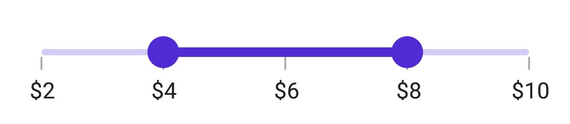
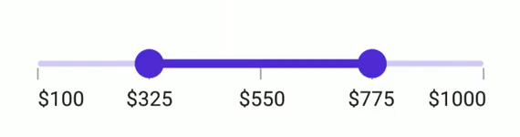

# Labels in .NET MAUI Range Slider (SfRangeSlider)

This section explains how to add labels to the range slider.

## Show Labels

The [`ShowLabels`](https://help.syncfusion.com/cr/maui/Syncfusion.Maui.Sliders.RangeView-1.html#Syncfusion_Maui_Sliders_RangeView_1_ShowLabels) property is used to render labels at specified intervals. The default value of `ShowLabels` is `False`.





<sliders:SfRangeSlider Minimum="0"
                       Maximum="10"
                       RangeStart="2"
                       RangeEnd="8"
                       Interval="2"
                       ShowLabels="True"
                       ShowTicks="True" />





SfRangeSlider rangeSlider = new SfRangeSlider();
rangeSlider.Minimum = 0;
rangeSlider.Maximum = 10;
rangeSlider.RangeStart = 2;
rangeSlider.RangeEnd = 8;
rangeSlider.Interval = 2;
rangeSlider.ShowLabels = true;
rangeSlider.ShowTicks = true;





## Number Format

Use the [`NumberFormat`](https://help.syncfusion.com/cr/maui/Syncfusion.Maui.Sliders.INumericElement.html#Syncfusion_Maui_Sliders_INumericElement_NumberFormat) property to format numeric labels. The default value is `0.##`.





<sliders:SfRangeSlider Minimum="2"
                       Maximum="10"
                       RangeStart="4"
                       RangeEnd="8"
                       Interval="2"
                       NumberFormat="$#"
                       ShowLabels="True"
                       ShowTicks="True" />





SfRangeSlider rangeSlider = new SfRangeSlider();
rangeSlider.Minimum = 2;
rangeSlider.Maximum = 10;
rangeSlider.RangeStart = 4;
rangeSlider.RangeEnd = 8;
rangeSlider.Interval = 2;
rangeSlider.NumberFormat = "$#";
rangeSlider.ShowLabels = true;
rangeSlider.ShowTicks = true;





## Label Placement

The [`LabelsPlacement`](https://help.syncfusion.com/cr/maui/Syncfusion.Maui.Sliders.RangeView-1.html#Syncfusion_Maui_Sliders_RangeView_1_LabelsPlacement) property specifies label placement relative to ticks. The default value is [`SliderLabelsPlacement.OnTicks`](https://help.syncfusion.com/cr/maui/Syncfusion.Maui.Sliders.SliderLabelsPlacement.html#Syncfusion_Maui_Sliders_SliderLabelsPlacement_OnTicks).





<sliders:SfRangeSlider Minimum="0"
                       Maximum="10"
                       RangeStart="2"
                       RangeEnd="8"
                       Interval="2"
                       LabelsPlacement="BetweenTicks"
                       ShowLabels="True"
                       ShowTicks="True" />





SfRangeSlider rangeSlider = new SfRangeSlider();
rangeSlider.Minimum = 0;
rangeSlider.Maximum = 10;
rangeSlider.RangeStart = 2;
rangeSlider.RangeEnd = 8;
rangeSlider.Interval = 2;
rangeSlider.LabelsPlacement = SliderLabelsPlacement.BetweenTicks;
rangeSlider.ShowLabels = true;
rangeSlider.ShowTicks = true;





> Note: Refer [here](https://help.syncfusion.com/maui/range-slider/events) to customize label text format through range slider events.

## Edge Labels Placement

The [`EdgeLabelsPlacement`](https://help.syncfusion.com/cr/maui/Syncfusion.Maui.Sliders.RangeView-1.html#Syncfusion_Maui_Sliders_RangeView_1_EdgeLabelsPlacement) property determines the placement of the first and last labels relative to the track bounds or intervals. The default value is [`SliderEdgeLabelPlacement.Default`](https://help.syncfusion.com/cr/maui/Syncfusion.Maui.Sliders.SliderEdgeLabelsPlacement.html#Syncfusion_Maui_Sliders_SliderEdgeLabelsPlacement_Default).

If the [`TrackExtent`](https://help.syncfusion.com/cr/maui/Syncfusion.Maui.Sliders.RangeView-1.html#Syncfusion_Maui_Sliders_RangeView_1_TrackExtent) is greater than `0` and `EdgeLabelsPlacement` is set to [`SliderEdgeLabelsPlacement.Inside`](https://help.syncfusion.com/cr/maui/Syncfusion.Maui.Sliders.SliderEdgeLabelsPlacement.html#Syncfusion_Maui_Sliders_SliderEdgeLabelsPlacement_Inside), labels are placed inside the extended track edges.





<sliders:SfRangeSlider Minimum="100"
                       Maximum="1000"
                       Interval="225"
                       RangeStart="325"
                       RangeEnd="775"
                       NumberFormat="$##.#"
                       ShowLabels="True"
                       ShowTicks="True"
                       EdgeLabelsPlacement="Inside" />





SfRangeSlider rangeSlider = new SfRangeSlider();
rangeSlider.Minimum = 100;
rangeSlider.Maximum = 1000;
rangeSlider.RangeStart = 325;
rangeSlider.RangeEnd = 775;
rangeSlider.Interval = 225;
rangeSlider.NumberFormat = "$##.#";
rangeSlider.EdgeLabelsPlacement = SliderEdgeLabelsPlacement.Inside;
rangeSlider.ShowLabels = true;
rangeSlider.ShowTicks = true;





## Label Style

Change the active and inactive label appearance of the range slider using the [`ActiveTextColor`](https://help.syncfusion.com/cr/maui/Syncfusion.Maui.Sliders.SliderLabelStyle.html#Syncfusion_Maui_Sliders_SliderLabelStyle_ActiveTextColor), [`ActiveFontSize`](https://help.syncfusion.com/cr/maui/Syncfusion.Maui.Sliders.SliderLabelStyle.html#Syncfusion_Maui_Sliders_SliderLabelStyle_ActiveFontSize), [`ActiveFontFamily`](https://help.syncfusion.com/cr/maui/Syncfusion.Maui.Sliders.SliderLabelStyle.html#Syncfusion_Maui_Sliders_SliderLabelStyle_ActiveFontFamily), [`ActiveFontAttributes`](https://help.syncfusion.com/cr/maui/Syncfusion.Maui.Sliders.SliderLabelStyle.html#Syncfusion_Maui_Sliders_SliderLabelStyle_ActiveFontAttributes), [`InactiveTextColor`](https://help.syncfusion.com/cr/maui/Syncfusion.Maui.Sliders.SliderLabelStyle.html#Syncfusion_Maui_Sliders_SliderLabelStyle_InactiveTextColor), [`InactiveFontSize`](https://help.syncfusion.com/cr/maui/Syncfusion.Maui.Sliders.SliderLabelStyle.html#Syncfusion_Maui_Sliders_SliderLabelStyle_InactiveFontSize), [`InactiveFontFamily`](https://help.syncfusion.com/cr/maui/Syncfusion.Maui.Sliders.SliderLabelStyle.html#Syncfusion_Maui_Sliders_SliderLabelStyle_InactiveFontFamily), [`InactiveFontAttributes`](https://help.syncfusion.com/cr/maui/Syncfusion.Maui.Sliders.SliderLabelStyle.html#Syncfusion_Maui_Sliders_SliderLabelStyle_InactiveFontAttributes) and [`Offset`](https://help.syncfusion.com/cr/maui/Syncfusion.Maui.Sliders.SliderLabelStyle.html#Syncfusion_Maui_Sliders_SliderLabelStyle_Offset)  properties of the [`LabelStyle`](https://help.syncfusion.com/cr/maui/Syncfusion.Maui.Sliders.SliderLabelStyle.html) class.

The active side of the range slider is between the start and end thumbs.

The inactive side of the range slider is between the [`Minimum`](https://help.syncfusion.com/cr/maui/Syncfusion.Maui.Sliders.RangeView-1.html#Syncfusion_Maui_Sliders_RangeView_1_Minimum) value and the left thumb, and the right thumb and the [`Maximum`](https://help.syncfusion.com/cr/maui/Syncfusion.Maui.Sliders.RangeView-1.html#Syncfusion_Maui_Sliders_RangeView_1_Maximum) value.





<sliders:SfRangeSlider Minimum="0"
                       Maximum="10"
                       Interval="2"
                       RangeStart="2"
                       RangeEnd="8"
                       ShowLabels="True"
                       ShowTicks="True">

    <sliders:SfRangeSlider.LabelStyle>
        <sliders:SliderLabelStyle ActiveTextColor="#EE3F3F"
                                  InactiveTextColor="#F7B1AE"
                                  ActiveFontAttributes="Italic"
                                  InactiveFontAttributes="Italic"
                                  ActiveFontSize="16"
                                  InactiveFontSize="16" />
    </sliders:SfRangeSlider.LabelStyle>

</sliders:SfRangeSlider>





SfRangeSlider rangeSlider = new SfRangeSlider();
rangeSlider.Minimum = 0;
rangeSlider.Maximum = 10;
rangeSlider.RangeStart = 2;
rangeSlider.RangeEnd = 8;
rangeSlider.Interval = 2;
rangeSlider.ShowLabels = true;
rangeSlider.ShowTicks = true;
rangeSlider.LabelStyle.ActiveTextColor = Color.FromArgb("#EE3F3F");
rangeSlider.LabelStyle.InactiveTextColor = Color.FromArgb("#F7B1AE");
rangeSlider.LabelStyle.ActiveFontSize = 16;
rangeSlider.LabelStyle.InactiveFontSize = 16;
rangeSlider.LabelStyle.ActiveFontAttributes = FontAttributes.Italic;
rangeSlider.LabelStyle.InactiveFontAttributes = FontAttributes.Italic;





## Label Offset

Adjust the space between ticks and labels of the range slider using the [`Offset`](https://help.syncfusion.com/cr/maui/Syncfusion.Maui.Sliders.SliderLabelStyle.html#Syncfusion_Maui_Sliders_SliderLabelStyle_OffsetProperty) property. The default value of the [`Offset`](https://help.syncfusion.com/cr/maui/Syncfusion.Maui.Sliders.SliderLabelStyle.html#Syncfusion_Maui_Sliders_SliderLabelStyle_Offset) property is 5.0 when [`ShowTicks`](https://help.syncfusion.com/cr/maui/Syncfusion.Maui.Sliders.RangeView-1.html#Syncfusion_Maui_Sliders_RangeView_1_ShowTicks) enabled, otherwise it is `15.0` by default.





<sliders:SfRangeSlider Minimum="0"
                       Maximum="10"
                       RangeStart="2"
                       RangeEnd="8"
                       Interval="2" 
                       ShowLabels="True" 
                       ShowTicks="True">
  
  <sliders:SfRangeSlider.LabelStyle>
    <sliders:SliderLabelStyle Offset="10" />
  </sliders:SfRangeSlider.LabelStyle>

</sliders:SfRangeSlider>





SfRangeSlider rangeSlider = new SfRangeSlider();
rangeSlider.Minimum = 0;
rangeSlider.Maximum = 10;
rangeSlider.RangeStart = 2;
rangeSlider.RangeEnd = 8;
rangeSlider.Interval = 2;
rangeSlider.ShowLabels = true;
rangeSlider.ShowTicks = true;
rangeSlider.LabelStyle.Offset = 10;





## Disabled Labels

To disable the range slider, set the `IsEnabled` property to `false`. Customize label properties using the Visual State Manager (VSM) based on visual states such as enabled (default) and disabled.




<ContentPage.Resources>
    
</ContentPage.Resources>

<ContentPage.Content>
    <VerticalStackLayout>
        <Label Text="Enabled"
               Padding="24,10" />
        <sliders:SfRangeSlider />
        <Label Text="Disabled"
               Padding="24,10" />
        <sliders:SfRangeSlider IsEnabled="False" />
    </VerticalStackLayout>
</ContentPage.Content>





VerticalStackLayout stackLayout = new VerticalStackLayout();
SfRangeSlider defaultRangeSlider = new()
{
    Interval = 0.25,
    ShowTicks = true,
    ShowLabels = true
};
SfRangeSlider disabledRangeSlider = new()
{
    IsEnabled = false,
    Interval = 0.25,
    ShowTicks = true,
    ShowLabels = true
};

VisualStateGroupList visualStateGroupList = new VisualStateGroupList();
VisualStateGroup commonStateGroup = new VisualStateGroup();
// Default State.
VisualState defaultState = new VisualState { Name = "Default" };
defaultState.Setters.Add(new Setter
{
    Property = SfRangeSlider.LabelStyleProperty,
    Value = new SliderLabelStyle
    {
        ActiveFontSize = 16,
        InactiveFontSize = 14,
        ActiveTextColor = Color.FromArgb("#EE3F3F"),
        InactiveTextColor = Color.FromArgb("#F7B1AE"),
        ActiveFontAttributes = FontAttributes.Bold,
        InactiveFontAttributes = FontAttributes.Italic,
    }
});
// Disabled State.
VisualState disabledState = new VisualState { Name = "Disabled" };
disabledState.Setters.Add(new Setter
{
    Property = SfRangeSlider.LabelStyleProperty,
    Value = new SliderLabelStyle
    {
        ActiveFontSize = 14,
        InactiveFontSize = 16,
        ActiveTextColor = Colors.Gray,
        InactiveTextColor = Colors.LightGray,
        ActiveFontAttributes = FontAttributes.Italic,
        InactiveFontAttributes = FontAttributes.Bold,
    }
});
disabledState.Setters.Add(new Setter
{
    Property = SfRangeSlider.ThumbStyleProperty,
    Value = new SliderThumbStyle
    {
        Fill = Colors.Gray,
    }
});
disabledState.Setters.Add(new Setter
{
    Property = SfRangeSlider.TrackStyleProperty,
    Value = new SliderTrackStyle
    {
        ActiveFill = Colors.Gray,
        InactiveFill = Colors.LightGray,
    }
});

commonStateGroup.States.Add(defaultState);
commonStateGroup.States.Add(disabledState);
visualStateGroupList.Add(commonStateGroup);
VisualStateManager.SetVisualStateGroups(defaultRangeSlider, visualStateGroupList);
VisualStateManager.SetVisualStateGroups(disabledRangeSlider, visualStateGroupList);

stackLayout.Children.Add(new Label() { Text = "Enabled", Padding = new Thickness(24, 10) });
stackLayout.Children.Add(defaultRangeSlider);
stackLayout.Children.Add(new Label() { Text = "Disabled", Padding = new Thickness(24, 10) });
stackLayout.Children.Add(disabledRangeSlider);
this.Content = stackLayout;





