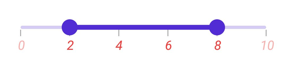

# Labels in .NET MAUI Range Slider (SfRangeSlider)

This section explains about how to add the labels in the range slider.

## Show labels

The [`ShowLabels`](https://help.syncfusion.com/cr/maui/Syncfusion.Maui.Sliders.SliderBase.html#Syncfusion_Maui_Sliders_SliderBase_ShowLabels) property is used to render the labels on given interval. The default value of [`ShowLabels`](https://help.syncfusion.com/cr/maui/Syncfusion.Maui.Sliders.SliderBase.html#Syncfusion_Maui_Sliders_SliderBase_ShowLabels) property is `False`.





<rangeslider:SfRangeSlider Minimum="0" 
                           Maximum="10"
                           RangeStart="2"
                           RangeEnd="8" 
                           Interval="2" 
                           ShowLabels="True"
                           ShowTicks="True">
</rangeslider:SfRangeSlider>





SfRangeSlider rangeSlider = new SfRangeSlider();
rangeSlider.Minimum = 0;
rangeSlider.Maximum = 10;
rangeSlider.RangeStart = 2;
rangeSlider.RangeEnd = 8;
rangeSlider.Interval = 2;
rangeSlider.ShowLabels = true;
rangeSlider.ShowTicks = true;





## Number format

The [`NumberFormat`](https://help.syncfusion.com/cr/maui/Syncfusion.Maui.Sliders.SliderBase.html#Syncfusion_Maui_Sliders_SliderBase_NumberFormat) property is used to format the numeric labels. The default value of [`NumberFormat`](https://help.syncfusion.com/cr/maui/Syncfusion.Maui.Sliders.SliderBase.html#Syncfusion_Maui_Sliders_SliderBase_NumberFormat) property is `0.##`.





<rangeslider:SfRangeSlider Minimum="0" 
                           Maximum="10"
                           RangeStart="2"
                           RangeEnd="8" 
                           Interval="2" 
                           NumberFormat="$##" 
                           ShowLabels="True"
                           ShowTicks="True">
</rangeslider:SfRangeSlider>





SfRangeSlider rangeSlider = new SfRangeSlider();
rangeSlider.Minimum = 0;
rangeSlider.Maximum = 10;
rangeSlider.RangeStart = 2;
rangeSlider.RangeEnd = 8;
rangeSlider.Interval = 2;
rangeSlider.NumberFormat = "$##";
rangeSlider.ShowLabels = true;
rangeSlider.ShowTicks = true;





## Date format

The [`DateFormat`](https://help.syncfusion.com/cr/maui/Syncfusion.Maui.Sliders.SliderBase.html#Syncfusion_Maui_Sliders_SliderBase_DateFormat) property is used to format the date labels. It is mandatory for date [`SfDateTimeRangeSlider`](https://help.syncfusion.com/cr/maui/Syncfusion.Maui.Sliders.SfRangeSlider.html). For date values, the slider does not have auto interval support. So, it is mandatory to set [`Interval`](https://help.syncfusion.com/cr/maui/Syncfusion.Maui.Sliders.SliderBase.html#Syncfusion_Maui_Sliders_SliderBase_Interval), [`IntervalType`](https://help.syncfusion.com/cr/maui/Syncfusion.Maui.Sliders.SliderBase.html#Syncfusion_Maui_Sliders_SliderBase_DateIntervalType), and [`DateFormat`](https://help.syncfusion.com/cr/maui/Syncfusion.Maui.Sliders.SliderBase.html#Syncfusion_Maui_Sliders_SliderBase_DateFormat) for date values. The default value of [`DateFormat`](https://help.syncfusion.com/cr/maui/Syncfusion.Maui.Sliders.SliderBase.html#Syncfusion_Maui_Sliders_SliderBase_DateFormat) property is `yyyy`.





<rangeslider:SfDateTimeRangeSlider Minimum="2000-01-01T09:00:00" 
                                   Maximum="2000-01-01T17:00:00" 
                                   RangeStart="2000-01-01T11:00:00" 
                                   RangeEnd="2000-01-01T15:00:00" 
                                   ShowLabels="True"
                                   IntervalType="Hours" 
                                   Interval="2" 
                                   DateFormat="h tt"
                                   ShowTicks="True">
</rangeslider:SfDateTimeRangeSlider>





SfDateTimeRangeSlider rangeSlider = new SfDateTimeRangeSlider();
rangeSlider.Minimum = new DateTime(2000, 01, 01, 09, 00, 00);
rangeSlider.Maximum = new DateTime(2000, 01, 01, 17, 00, 00);
rangeSlider.RangeStart = new DateTime(2000, 01, 01, 11, 00, 00);
rangeSlider.RangeEnd = new DateTime(2000, 01, 01, 15, 00, 00);
rangeSlider.Interval = 2;
rangeSlider.DateIntervalType = SliderDateIntervalType.Hours;
rangeSlider.DateFormat = "h tt";
rangeSlider.ShowLabels = true;
rangeSlider.ShowTicks = true;





## Label placement

The [`LabelsPlacement`](https://help.syncfusion.com/cr/maui/Syncfusion.Maui.Sliders.SliderBase.html#Syncfusion_Maui_Sliders_SliderBase_LabelsPlacement) property is used to place the labels either between the major ticks or on the major ticks. The default value of the [`LabelsPlacement`](https://help.syncfusion.com/cr/maui/Syncfusion.Maui.Sliders.SliderBase.html#Syncfusion_Maui_Sliders_SliderBase_LabelsPlacement) property is [`SliderLabelsPlacement.OnTicks`](https://help.syncfusion.com/cr/maui/Syncfusion.Maui.Sliders.SliderLabelsPlacement.html#Syncfusion_Maui_Sliders_SliderLabelsPlacement_OnTicks).





<rangeslider:SfRangeSlider Minimum="0" 
                           Maximum="10"
                           RangeStart="2"
                           RangeEnd="8" 
                           Interval="2" 
                           LabelsPlacement="BetweenTicks"  
                           ShowLabels="True" 
                           ShowTicks="True">
</rangeslider:SfRangeSlider>





SfRangeSlider rangeSlider = new SfRangeSlider();
rangeSlider.Minimum = 0;
rangeSlider.Maximum = 10;
rangeSlider.RangeStart = 2;
rangeSlider.RangeEnd = 8;
rangeSlider.Interval = 2;
rangeSlider.LabelsPlacement = SliderLabelsPlacement.BetweenTicks;
rangeSlider.ShowLabels = true;
rangeSlider.ShowTicks = true;





N> Refer [here](https://help.syncfusion.com/maui/range-slider/events) to customize label text format through range slider events.

## Label style

You can change the active and inactive label appearance of the range slider using the [`ActiveTextColor`](https://help.syncfusion.com/cr/maui/Syncfusion.Maui.Sliders.SliderLabelStyle.html#Syncfusion_Maui_Sliders_SliderLabelStyle_ActiveTextColor), [`ActiveFontSize`](https://help.syncfusion.com/cr/maui/Syncfusion.Maui.Sliders.SliderLabelStyle.html#Syncfusion_Maui_Sliders_SliderLabelStyle_ActiveFontSize), [`ActiveFontFamily`](https://help.syncfusion.com/cr/maui/Syncfusion.Maui.Sliders.SliderLabelStyle.html#Syncfusion_Maui_Sliders_SliderLabelStyle_ActiveFontFamily), [`ActiveFontAttributes`](https://help.syncfusion.com/cr/maui/Syncfusion.Maui.Sliders.SliderLabelStyle.html#Syncfusion_Maui_Sliders_SliderLabelStyle_ActiveFontAttributes), [`InactiveTextColor`](https://help.syncfusion.com/cr/maui/Syncfusion.Maui.Sliders.SliderLabelStyle.html#Syncfusion_Maui_Sliders_SliderLabelStyle_InactiveTextColor), [`InactiveFontSize`](https://help.syncfusion.com/cr/maui/Syncfusion.Maui.Sliders.SliderLabelStyle.html#Syncfusion_Maui_Sliders_SliderLabelStyle_InactiveFontSize), [`InactiveFontFamily`](https://help.syncfusion.com/cr/maui/Syncfusion.Maui.Sliders.SliderLabelStyle.html#Syncfusion_Maui_Sliders_SliderLabelStyle_InactiveFontFamily), [`InactiveFontAttributes`](https://help.syncfusion.com/cr/maui/Syncfusion.Maui.Sliders.SliderLabelStyle.html#Syncfusion_Maui_Sliders_SliderLabelStyle_InactiveFontAttributes) and [`Offset`](https://help.syncfusion.com/cr/maui/Syncfusion.Maui.Sliders.SliderLabelStyle.html#Syncfusion_Maui_Sliders_SliderLabelStyle_Offset)  properties of the [`LabelStyle`](https://help.syncfusion.com/cr/maui/Syncfusion.Maui.Sliders.SliderLabelStyle.html) class.

The active side of the range slider is between start and end thumbs.

The inactive side of the range slider is between the [`Minimum`](https://help.syncfusion.com/cr/maui/Syncfusion.Maui.Sliders.SliderBase.html#Syncfusion_Maui_Sliders_SliderBase_Minimum) value and the left thumb, and the right thumb and the [`Maximum`](https://help.syncfusion.com/cr/maui/Syncfusion.Maui.Sliders.SliderBase.html#Syncfusion_Maui_Sliders_SliderBase_Maximum) value.





<rangeslider:SfRangeSlider Minimum="2" 
                           Maximum="10" 
                           Interval="2" 
                           RangeStart="2" 
                           RangeEnd="6" 
                           ShowLabels="True" 
                           ShowTicks="True">
<rangeslider:SfRangeSlider.LabelStyle>
    <rangeslider:SliderLabelStyle ActiveTextColor="#EE3F3F" 
                                  InactiveTextColor="#F7B1AE" 
                                  ActiveFontAttributes="Italic" 
                                  InactiveFontAttributes="Italic" 
                                  ActiveFontSize="16" 
                                  InactiveFontSize="16" />
     </rangeslider:SfRangeSlider.LabelStyle>
</rangeslider:SfRangeSlider>





SfRangeSlider rangeSlider = new SfRangeSlider();
rangeSlider.Minimum = 0;
rangeSlider.Maximum = 10;
rangeSlider.RangeStart = 2;
rangeSlider.RangeEnd = 6;
rangeSlider.Interval = 2;
rangeSlider.ShowLabels = true;
rangeSlider.ShowTicks = true;
rangeSlider.LabelStyle.ActiveTextColor = Color.FromArgb("#EE3F3F");
rangeSlider.LabelStyle.InactiveTextColor = Color.FromArgb("#F7B1AE");
rangeSlider.LabelStyle.ActiveFontSize = 16;
rangeSlider.LabelStyle.InactiveFontSize = 16;
rangeSlider.LabelStyle.ActiveFontAttributes = FontAttributes.Italic;
rangeSlider.LabelStyle.InactiveFontAttributes = FontAttributes.Italic;





## Label offset

You can adjust the space between ticks and labels of the range slider using the [`Offset`](https://help.syncfusion.com/cr/maui/Syncfusion.Maui.Sliders.SliderLabelStyle.html#Syncfusion_Maui_Sliders_SliderLabelStyle_OffsetProperty) property. The default value of the [`Offset`](https://help.syncfusion.com/cr/maui/Syncfusion.Maui.Sliders.SliderLabelStyle.html#Syncfusion_Maui_Sliders_SliderLabelStyle_Offset) property is 5.0 when [`ShowTicks`](https://help.syncfusion.com/cr/maui/Syncfusion.Maui.Sliders.SliderBase.html#Syncfusion_Maui_Sliders_SliderBase_ShowTicks) enabled, otherwise it is `15.0` by default.





<rangeslider:SfRangeSlider Minimum="0"
                           Maximum="10"
                           RangeStart="2"
                           RangeEnd="8"
                           Interval="2" 
                           ShowLabels="True" 
                           ShowTicks="True">
  <rangeslider:SfRangeSlider.LabelStyle>
    <rangeslider:SliderLabelStyle Offset="10" />
  </rangeslider:SfRangeSlider.LabelStyle>
</rangeslider:SfRangeSlider>





SfRangeSlider rangeSlider = new SfRangeSlider();
rangeSlider.Minimum = 0;
rangeSlider.Maximum = 10;
rangeSlider.RangeStart = 2;
rangeSlider.RangeEnd = 8;
rangeSlider.Interval = 2;
rangeSlider.ShowLabels = true;
rangeSlider.ShowTicks = true;
rangeSlider.LabelStyle.Offset = 10;





## Disabled labels

You can change the state of the range slider to disabled by setting `false` to the `IsEnabled` property. Using the Visual State Manager (VSM), You can customize the range slider labels properties based on the visual states. The applicable visual states are enabled(default) and disabled.





<ContentPage.Resources>
    
</ContentPage.Resources>

<ContentPage.Content>
    <VerticalStackLayout>
        <Label Text="Enabled Range Slider" Padding="0,10"/>
        <sliders:SfRangeSlider/>
        <Label Text="Disabled Range Slider" Padding="0,10"/>
        <sliders:SfRangeSlider IsEnabled="False"/>
    </VerticalStackLayout>
</ContentPage.Content>





VerticalStackLayout stackLayout = new VerticalStackLayout();
SfRangeSlider defaultRangeSlider = new SfRangeSlider { Interval = 0.25, ShowTicks = true, ShowLabels = true };
SfRangeSlider disabledRangeSlider = new SfRangeSlider { IsEnabled = false, Interval = 0.25, ShowTicks = true, ShowLabels = true };

VisualStateGroupList visualStateGroupList = new VisualStateGroupList();
VisualStateGroup commonStateGroup = new VisualStateGroup();
// Default State.
VisualState defaultState = new VisualState { Name = "Default" };
defaultState.Setters.Add(new Setter
{
    Property = SfRangeSlider.LabelStyleProperty,
    Value = new SliderLabelStyle
    {
        ActiveFontSize = 16,
        InactiveFontSize = 14,
        ActiveTextColor = Color.FromArgb("#EE3F3F"),
        InactiveTextColor = Color.FromArgb("#F7B1AE"),
        ActiveFontAttributes = FontAttributes.Bold,
    }
});
// Disabled State.
VisualState disabledState = new VisualState { Name = "Disabled" };
disabledState.Setters.Add(new Setter
{
    Property = SfRangeSlider.LabelStyleProperty,
    Value = new SliderLabelStyle
    {
        ActiveFontSize = 16,
        InactiveFontSize = 14,
        ActiveTextColor = Color.FromArgb("#EE3F3F"),
        InactiveTextColor = Color.FromArgb("#F7B1AE"),
        ActiveFontAttributes = FontAttributes.Bold,
    }
});

commonStateGroup.States.Add(defaultState);
commonStateGroup.States.Add(disabledState);
visualStateGroupList.Add(commonStateGroup);
VisualStateManager.SetVisualStateGroups(defaultRangeSlider, visualStateGroupList);
VisualStateManager.SetVisualStateGroups(disabledRangeSlider, visualStateGroupList);

stackLayout.Children.Add(new Label() { Text = "Default Range Slider", Padding = new Thickness(0, 10) });
stackLayout.Children.Add(defaultRangeSlider);
stackLayout.Children.Add(new Label() { Text = "Disabled Range Slider", Padding = new Thickness(0, 10) });
stackLayout.Children.Add(disabledRangeSlider);
this.Content = stackLayout;





