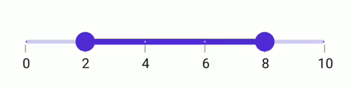
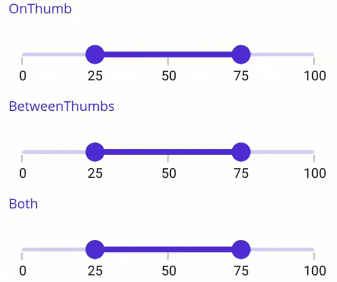

# Range selection in .NET MAUI Range Slider (SfRangeSlider)

This section helps to learn about the range selection in the Range Slider.

## Discrete selection

Move the thumb in discrete manner for numeric values using the [`StepSize`](https://help.syncfusion.com/cr/maui/Syncfusion.Maui.Sliders.INumericElement.html#Syncfusion_Maui_Sliders_INumericElement_StepSize) property in the range slider.





<sliders:SfRangeSlider Minimum="0"
                       Maximum="10"
                       RangeStart="2"
                       RangeEnd="8"
                       Interval="2"
                       StepSize="2"
                       ShowLabels="True"
                       ShowTicks="True"
                       ShowDividers="True" />





SfRangeSlider rangeSlider = new SfRangeSlider();
rangeSlider.StepSize = 2;
rangeSlider.Minimum = 0;
rangeSlider.Maximum = 10;
rangeSlider.RangeStart = 2;
rangeSlider.RangeEnd = 8;
rangeSlider.Interval = 2;
rangeSlider.ShowLabels = true;
rangeSlider.ShowTicks = true;
rangeSlider.ShowDividers = true;
         




## Interval Selection

Both the thumbs are moved to the selected interval if the [EnableIntervalSelection](https://help.syncfusion.com/cr/maui/Syncfusion.Maui.Sliders.RangeSliderBase-1.html#Syncfusion_Maui_Sliders_RangeSliderBase_1_EnableIntervalSelection) property is true, otherwise the nearest thumb is moved to the touch position.





<sliders:SfRangeSlider Minimum="0" 
                       Maximum="10"
                       RangeStart="2"
                       RangeEnd="8"
                       Interval="2"
                       ShowTicks="True"
                       ShowLabels="True"
                       EnableIntervalSelection="True" />





SfRangeSlider rangeSlider = new SfRangeSlider();
rangeSlider.Minimum = 0;
rangeSlider.Maximum = 10;
rangeSlider.RangeStart = 2; 
rangeSlider.RangeEnd = 8;
rangeSlider.Interval = 2;        
rangeSlider.ShowLabels = true;
rangeSlider.ShowTicks = true;    
rangeSlider.EnableIntervalSelection = true;
         




## DragBehavior

### OnThumb

When the [DragBehavior](https://help.syncfusion.com/cr/maui/Syncfusion.Maui.Sliders.RangeSliderBase-1.html#Syncfusion_Maui_Sliders_RangeSliderBase_1_DragBehavior) is set to [OnThumb](https://help.syncfusion.com/cr/maui/Syncfusion.Maui.Sliders.SliderDragBehavior.html#Syncfusion_Maui_Sliders_SliderDragBehavior_OnThumb), the individual thumb can be moved based on the dragging. By default, the [OnThumb](https://help.syncfusion.com/cr/maui/Syncfusion.Maui.Sliders.SliderDragBehavior.html#Syncfusion_Maui_Sliders_SliderDragBehavior_OnThumb) is used as drag behavior.





<sliders:SfRangeSlider Minimum="0" 
                       Maximum="100"
                       RangeStart="25"
                       RangeEnd="75"
                       Interval="25" 
                       ShowTicks="True"
                       ShowLabels="True"
                       DragBehavior="OnThumb" />





SfRangeSlider rangeSlider = new SfRangeSlider();
rangeSlider.Minimum = 0;
rangeSlider.Maximum = 100;
rangeSlider.RangeStart = 25;
rangeSlider.RangeEnd = 75;
rangeSlider.Interval = 25; 
rangeSlider.ShowTicks = true;
rangeSlider.ShowLabels = true;  
rangeSlider.DragBehavior = SliderDragBehavior.OnThumb;





### BetweenThumbs

When the [DragBehavior](https://help.syncfusion.com/cr/maui/Syncfusion.Maui.Sliders.RangeSliderBase-1.html#Syncfusion_Maui_Sliders_RangeSliderBase_1_DragBehavior) is set to [BetweenThumbs](https://help.syncfusion.com/cr/maui/Syncfusion.Maui.Sliders.SliderDragBehavior.html#Syncfusion_Maui_Sliders_SliderDragBehavior_BetweenThumbs), both the thumbs can be moved at same time without changing the range between the start and end thumbs. We had considered this behavior without the range slider thumb radius. Its not possible to move the individual thumb when setting this behavior.





<sliders:SfRangeSlider Minimum="0" 
                       Maximum="100"
                       RangeStart="25"
                       RangeEnd="75"
                       Interval="25" 
                       ShowTicks="True"
                       ShowLabels="True"
                       DragBehavior="BetweenThumbs" />





SfRangeSlider rangeSlider = new SfRangeSlider();
rangeSlider.Minimum = 0;
rangeSlider.Maximum = 100;
rangeSlider.RangeStart = 25;
rangeSlider.RangeEnd = 75;
rangeSlider.Interval = 25; 
rangeSlider.ShowTicks = true;
rangeSlider.ShowLabels = true;   
rangeSlider.DragBehavior = SliderDragBehavior.BetweenThumbs;





### Both

When the  [DragBehavior](https://help.syncfusion.com/cr/maui/Syncfusion.Maui.Sliders.RangeSliderBase-1.html#Syncfusion_Maui_Sliders_RangeSliderBase_1_DragBehavior) is set to [Both](https://help.syncfusion.com/cr/maui/Syncfusion.Maui.Sliders.SliderDragBehavior.html#Syncfusion_Maui_Sliders_SliderDragBehavior_Both), the individual thumb can be moved, and also both the thumbs can be moved at the same time without changing the range between the start and end thumbs.





<sliders:SfRangeSlider Minimum="0" 
                       Maximum="100"
                       RangeStart="25"
                       RangeEnd="75"
                       Interval="25" 
                       ShowTicks="True"
                       ShowLabels="True"
                       DragBehavior="Both" />





SfRangeSlider rangeSlider = new SfRangeSlider();
rangeSlider.Minimum = 0;
rangeSlider.Maximum = 100;
rangeSlider.RangeStart = 25;
rangeSlider.RangeEnd = 75;
rangeSlider.Interval = 25; 
rangeSlider.ShowTicks = true; 
rangeSlider.ShowLabels = true;  
rangeSlider.DragBehavior = SliderDragBehavior.Both;





## Deferred update

You can control when the dependent components are updated while thumbs are being dragged continuously. It can be achieved by setting the `EnableDeferredUpdate` property and the delay in the update can be achieved by setting the `DeferredUpdateDelay` property. The default value of the `DeferredUpdateDelay` property is `500` milliseconds.

It invokes the `ValueChanging` event when the thumb is dragged and held for the duration specified in the `DeferredUpdateDelay`. However, the values are immediately updated in touch-up action.





<sliders:SfRangeSlider Minimum="0" 
                       Maximum="10"
                       RangeStart="2"
                       RangeEnd="8"
                       Interval="2"
                       ShowTicks="True"
                       ShowLabels="True"
                       EnableDeferredUpdate="True"
                       DeferredUpdateDelay="1000" />





SfRangeSlider rangeSlider = new SfRangeSlider();
rangeSlider.Minimum = 0;
rangeSlider.Maximum = 10;
rangeSlider.RangeStart = 2; 
rangeSlider.RangeEnd = 8;
rangeSlider.Interval = 2;        
rangeSlider.ShowLabels = true;
rangeSlider.ShowTicks = true;    
rangeSlider.EnableDeferredUpdate = true;
rangeSlider.DeferredUpdateDelay = 1000;
         


