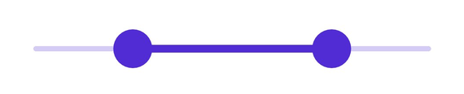
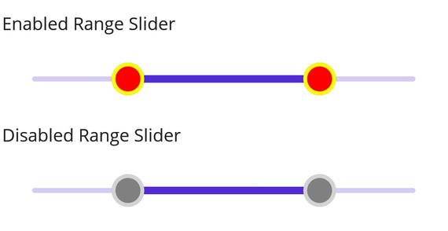

# Thumb and Overlay in .NET MAUI Range Slider (SfRangeSlider)

This section helps to learn about how to customize the thumb and thumb overlay in the range slider.

* Thumb - It is one of the elements of slider which can be used to drag and change the selected value of the range slider.
* Thumb overlay - It is rendered around the thumb while interacting with them.

## Thumb size

Change the size of the thumb in the range slider using the [`Radius`](https://help.syncfusion.com/cr/maui/Syncfusion.Maui.Sliders.SliderThumbStyle.html#Syncfusion_Maui_Sliders_SliderThumbStyle_Radius)  property of the [`ThumbStyle`](https://help.syncfusion.com/cr/maui/Syncfusion.Maui.Sliders.SliderThumbStyle.html) class. The default value of the [`Radius`](https://help.syncfusion.com/cr/maui/Syncfusion.Maui.Sliders.SliderThumbStyle.html#Syncfusion_Maui_Sliders_SliderThumbStyle_Radius) property is `10.0`.





<sliders:SfRangeSlider>
    <sliders:SfRangeSlider.ThumbStyle>
        <sliders:SliderThumbStyle Radius="15" />
    </sliders:SfRangeSlider.ThumbStyle>
</sliders:SfRangeSlider>





SfRangeSlider rangeSlider = new SfRangeSlider();
rangeSlider.ThumbStyle.Radius = 15;
        




## Thumb color

Change the color of the thumb in the range slider using the [`Fill`](https://help.syncfusion.com/cr/maui/Syncfusion.Maui.Sliders.SliderThumbStyle.html#Syncfusion_Maui_Sliders_SliderThumbStyle_Fill) property of the [`ThumbStyle`](https://help.syncfusion.com/cr/maui/Syncfusion.Maui.Sliders.SliderThumbStyle.html) class.





<sliders:SfRangeSlider>
   <sliders:SfRangeSlider.ThumbStyle>
       <sliders:SliderThumbStyle Fill="#EE3F3F" />
   </sliders:SfRangeSlider.ThumbStyle>
</sliders:SfRangeSlider>





SfRangeSlider rangeSlider = new SfRangeSlider();
rangeSlider.ThumbStyle.Fill = new SolidColorBrush(Color.FromArgb("#EE3F3F"));
        




## Thumb stroke thickness and stroke

Change the thumb stroke width using the [`StrokeThickness`](https://help.syncfusion.com/cr/maui/Syncfusion.Maui.Sliders.SliderThumbStyle.html#Syncfusion_Maui_Sliders_SliderThumbStyle_StrokeThickness) property and thumb stroke color using the [`Stroke`](https://help.syncfusion.com/cr/maui/Syncfusion.Maui.Sliders.SliderThumbStyle.html#Syncfusion_Maui_Sliders_SliderThumbStyle_Stroke) property of the [`ThumbStyle`](https://help.syncfusion.com/cr/maui/Syncfusion.Maui.Sliders.SliderThumbStyle.html) class.





<sliders:SfRangeSlider>
    <sliders:SfRangeSlider.ThumbStyle>
        <sliders:SliderThumbStyle StrokeThickness="2"
                                  Stroke="#EE3F3F" />
    </sliders:SfRangeSlider.ThumbStyle>
</sliders:SfRangeSlider>





SfRangeSlider rangeSlider = new SfRangeSlider();
rangeSlider.ThumbStyle.Stroke = new SolidColorBrush(Color.FromArgb("#EE3F3F"));
rangeSlider.ThumbStyle.StrokeThickness = 2;
        




## Thumb overlapping stroke color

Change the thumb stroke color while two thumbs are overlapping in the range slider using the [`OverlapStroke`](https://help.syncfusion.com/cr/maui/Syncfusion.Maui.Sliders.SliderThumbStyle.html#Syncfusion_Maui_Sliders_SliderThumbStyle_OverlapStroke) property of the [`ThumbStyle`](https://help.syncfusion.com/cr/maui/Syncfusion.Maui.Sliders.SliderThumbStyle.html) class.





<sliders:SfRangeSlider>
  <sliders:SfRangeSlider.ThumbStyle>
      <sliders:SliderThumbStyle OverlapStroke="#FFD700" />
  </sliders:SfRangeSlider.ThumbStyle>
</sliders:SfRangeSlider>





SfRangeSlider rangeSlider = new SfRangeSlider();
rangeSlider.ThumbStyle.OverlapStroke = new SolidColorBrush(Color.FromArgb("#FFD700"));
        




## Thumb overlay size

Change the size of the thumb overlay in the range slider using the [`Radius`](https://help.syncfusion.com/cr/maui/Syncfusion.Maui.Sliders.SliderThumbOverlayStyle.html#Syncfusion_Maui_Sliders_SliderThumbOverlayStyle_Radius) property of the [`ThumbOverlayStyle`](https://help.syncfusion.com/cr/maui/Syncfusion.Maui.Sliders.SliderThumbOverlayStyle.html) class. The default value of the [`Radius`](https://help.syncfusion.com/cr/maui/Syncfusion.Maui.Sliders.SliderThumbOverlayStyle.html#Syncfusion_Maui_Sliders_SliderThumbOverlayStyle_Radius) property is `24.0`.





<sliders:SfRangeSlider>
   <sliders:SfRangeSlider.ThumbOverlayStyle>
      <sliders:SliderThumbOverlayStyle Radius="18"/>
   </sliders:SfRangeSlider.ThumbOverlayStyle>
</sliders:SfRangeSlider>





SfRangeSlider rangeSlider = new SfRangeSlider();
rangeSlider.ThumbOverlayStyle.Radius = 18;
        




## Thumb overlay color

Change the color of the thumb overlay in the range slider using the [`Fill`](https://help.syncfusion.com/cr/maui/Syncfusion.Maui.Sliders.SliderThumbOverlayStyle.html#Syncfusion_Maui_Sliders_SliderThumbOverlayStyle_Fill) property of the [`ThumbOverlayStyle`](https://help.syncfusion.com/cr/maui/Syncfusion.Maui.Sliders.SliderThumbOverlayStyle.html) class.





<sliders:SfRangeSlider>
   <sliders:SfRangeSlider.ThumbOverlayStyle>
      <sliders:SliderThumbOverlayStyle Fill="#66FFD700"/>
   </sliders:SfRangeSlider.ThumbOverlayStyle>
</sliders:SfRangeSlider>





SfRangeSlider rangeSlider = new SfRangeSlider();
rangeSlider.ThumbOverlayStyle.Fill = new SolidColorBrush(Color.FromArgb("#66FFD700"));
        




## Disabled thumb

Change the state of the range slider to disabled by setting `false` to the `IsEnabled` property. Using the Visual State Manager (VSM), customize the range slider thumb properties based on the visual states. The applicable visual states are enabled(default) and disabled.





<ContentPage.Resources>
    
</ContentPage.Resources>

<ContentPage.Content>
    <VerticalStackLayout>
        <Label Text="Enabled"
               Padding="24,10" />
        <sliders:SfRangeSlider />
        <Label Text="Disabled"
               Padding="24,10" />
        <sliders:SfRangeSlider IsEnabled="False" />
    </VerticalStackLayout>
</ContentPage.Content>





VerticalStackLayout stackLayout = new();
SfRangeSlider defaultRangeSlider = new();
SfRangeSlider disabledRangeSlider = new() { IsEnabled = false };

VisualStateGroupList visualStateGroupList = new();
VisualStateGroup commonStateGroup = new();
// Default State.
VisualState defaultState = new() { Name = "Default" };
defaultState.Setters.Add(new Setter
{
    Property = SfRangeSlider.ThumbStyleProperty,
    Value = new SliderThumbStyle
    {
        Radius = 13,
        Fill = Colors.Red,
        Stroke = Colors.Yellow,
        StrokeThickness = 3,
    }
});
// Disabled State.
VisualState disabledState = new() { Name = "Disabled" };
disabledState.Setters.Add(new Setter
{
    Property = SfRangeSlider.ThumbStyleProperty,
    Value = new SliderThumbStyle
    {
        Radius = 13,
        Fill = Colors.Gray,
        Stroke = Colors.LightGray,
        StrokeThickness = 3,
    }
});
disabledState.Setters.Add(new Setter
{
    Property = SfRangeSlider.TrackStyleProperty,
    Value = new SliderTrackStyle
    {
        ActiveFill = Colors.Gray,
        InactiveFill = Colors.LightGray,
    }
});

commonStateGroup.States.Add(defaultState);
commonStateGroup.States.Add(disabledState);
visualStateGroupList.Add(commonStateGroup);
VisualStateManager.SetVisualStateGroups(defaultRangeSlider, visualStateGroupList);
VisualStateManager.SetVisualStateGroups(disabledRangeSlider, visualStateGroupList);

stackLayout.Children.Add(new Label() { Text = "Enabled", Padding = new Thickness(24, 10) });
stackLayout.Children.Add(defaultRangeSlider);
stackLayout.Children.Add(new Label() { Text = "Disabled", Padding = new Thickness(24, 10) });
stackLayout.Children.Add(disabledRangeSlider);
this.Content = stackLayout;





