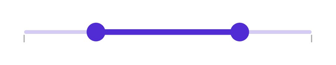

# Tick in .NET MAUI Range Slider (SfRangeSlider)

This section helps to learn about how to add major and minor ticks in the range slider.

## Show major ticks

You can enable the major ticks on the track. It is a shape which is used to represent the major interval points of the track. The default value of [`ShowTicks`](https://help.syncfusion.com/cr/maui/Syncfusion.Maui.Sliders.SliderBase.html#Syncfusion_Maui_Sliders_SliderBase_ShowTicks) property is `False`.

For example, if [`Minimum`](https://help.syncfusion.com/cr/maui/Syncfusion.Maui.Sliders.SliderBase.html#Syncfusion_Maui_Sliders_SliderBase_Minimum) is 0.0 and [`Maximum`](https://help.syncfusion.com/cr/maui/Syncfusion.Maui.Sliders.SliderBase.html#Syncfusion_Maui_Sliders_SliderBase_Maximum) is 10.0 and [`Interval`](https://help.syncfusion.com/cr/maui/Syncfusion.Maui.Sliders.SliderBase.html#Syncfusion_Maui_Sliders_SliderBase_Interval) is 2.0, the range slider will render the major ticks at 0.0, 2.0, 4.0 and so on.

### Without interval





<rangeslider:SfRangeSlider ShowTicks="True">
</rangeslider:SfRangeSlider>





SfRangeSlider rangeSlider = new SfRangeSlider();
rangeSlider.ShowTicks = true;





### With interval





<rangeslider:SfRangeSlider Interval="0.2"  
                           ShowTicks="True">
</rangeslider:SfRangeSlider>





SfRangeSlider rangeSlider = new SfRangeSlider();
rangeSlider.Interval = 0.2;
rangeSlider.ShowTicks = true;





## Show minor ticks

It is used to represent the number of smaller ticks between two major ticks. For example, if [`Minimum`](https://help.syncfusion.com/cr/maui/Syncfusion.Maui.Sliders.SliderBase.html#Syncfusion_Maui_Sliders_SliderBase_Minimum) is 0.0 and [`Maximum`](https://help.syncfusion.com/cr/maui/Syncfusion.Maui.Sliders.SliderBase.html#Syncfusion_Maui_Sliders_SliderBase_Maximum) is 10.0 and [`Interval`](https://help.syncfusion.com/cr/maui/Syncfusion.Maui.Sliders.SliderBase.html#Syncfusion_Maui_Sliders_SliderBase_Interval) is 2.0, the range slider will render the major ticks at 0.0, 2.0, 4.0 and so on. If [`MinorTicksPerInterval`](https://help.syncfusion.com/cr/maui/Syncfusion.Maui.Sliders.SliderBase.html#Syncfusion_Maui_Sliders_SliderBase_MinorTicksPerInterval) is 1, then smaller ticks will be rendered on 1.0 and 3.0 and so on. The default value of [`MinorTicksPerInterval`](https://help.syncfusion.com/cr/maui/Syncfusion.Maui.Sliders.SliderBase.html#Syncfusion_Maui_Sliders_SliderBase_MinorTicksPerInterval) property is Zero.

### Without interval





<rangeslider:SfRangeSlider MinorTicksPerInterval="3" 
                           ShowTicks="True">
</rangeslider:SfRangeSlider>





SfRangeSlider rangeSlider = new SfRangeSlider();
rangeSlider.MinorTicksPerInterval = 1;
rangeSlider.ShowTicks = true;





### With interval




<rangeslider:SfRangeSlider Interval="0.2" 
                           MinorTicksPerInterval="1" 
                           ShowTicks="True">
</rangeslider:SfRangeSlider>





SfRangeSlider rangeSlider = new SfRangeSlider();
rangeSlider.Interval = 0.2;
rangeSlider.MinorTicksPerInterval = 1;
rangeSlider.ShowTicks = true;





## Major ticks color

You can change the active and inactive major ticks color of the range slider using the [`ActiveFill`](https://help.syncfusion.com/cr/maui/Syncfusion.Maui.Sliders.SliderTickStyle.html#Syncfusion_Maui_Sliders_SliderTickStyle_ActiveFill) and [`InactiveFill`](https://help.syncfusion.com/cr/maui/Syncfusion.Maui.Sliders.SliderTickStyle.html#Syncfusion_Maui_Sliders_SliderTickStyle_InactiveFill) properties of the [`MajorTickStyle`](https://help.syncfusion.com/cr/maui/Syncfusion.Maui.Sliders.SliderBase.html#Syncfusion_Maui_Sliders_SliderBase_MajorTickStyle) class.

The active side of the range slider is between start and end thumbs.

The inactive side of the range slider is between the [`Minimum`](https://help.syncfusion.com/cr/maui/Syncfusion.Maui.Sliders.SliderBase.html#Syncfusion_Maui_Sliders_SliderBase_Minimum) value and the left thumb, and the right thumb and the [`Maximum`](https://help.syncfusion.com/cr/maui/Syncfusion.Maui.Sliders.SliderBase.html#Syncfusion_Maui_Sliders_SliderBase_Maximum) value.





<rangeslider:SfRangeSlider Interval="0.2" 
                          ShowTicks="True">
    <rangeslider:SfRangeSlider.MajorTickStyle>
         <rangeslider:SliderTickStyle ActiveFill="#EE3F3F" 
                                     InactiveFill="#F7B1AE" />
    </rangeslider:SfRangeSlider.MajorTickStyle>
</rangeslider:SfRangeSlider>





SfRangeSlider rangeSlider = new SfRangeSlider();
rangeSlider.Interval = 0.2;
rangeSlider.ShowTicks = true;
rangeSlider.MajorTickStyle.ActiveColor = new SolidColorBrush(Color.FromArgb("#EE3F3F"));
rangeSlider.MajorTickStyle.InactiveFill = new SolidColorBrush(Color.FromArgb("#F7B1AE"));





## Minor ticks color

You can change the active and inactive minor ticks color of the range slider using the [`ActiveFill`](https://help.syncfusion.com/cr/maui/Syncfusion.Maui.Sliders.SliderTickStyle.html#Syncfusion_Maui_Sliders_SliderTickStyle_ActiveFill) and [`InactiveFill`](https://help.syncfusion.com/cr/maui/Syncfusion.Maui.Sliders.SliderTickStyle.html#Syncfusion_Maui_Sliders_SliderTickStyle_InactiveFill) properties of the [`MinorTickStyle`](https://help.syncfusion.com/cr/maui/Syncfusion.Maui.Sliders.SliderBase.html#Syncfusion_Maui_Sliders_SliderBase_MinorTickStyle) class.

The active side of the range slider is between start and end thumbs.

The inactive side of the range slider is between the [`Minimum`](https://help.syncfusion.com/cr/maui/Syncfusion.Maui.Sliders.SliderBase.html#Syncfusion_Maui_Sliders_SliderBase_Minimum) value and the left thumb, and the right thumb and the [`Maximum`](https://help.syncfusion.com/cr/maui/Syncfusion.Maui.Sliders.SliderBase.html#Syncfusion_Maui_Sliders_SliderBase_Maximum)` value.





<rangeslider:SfRangeSlider Interval="0.2" 
                           ShowTicks="True" 
                           MinorTicksPerInterval="1">
    <rangeslider:SfRangeSlider.MinorTickStyle>
         <rangeslider:SliderTickStyle ActiveFill="#EE3F3F" 
                                  InactiveFill="#F7B1AE" />
     </rangeslider:SfRangeSlider.MinorTickStyle>
</rangeslider:SfRangeSlider>





SfRangeSlider rangeSlider = new SfRangeSlider();
rangeSlider.Interval = 0.2;
rangeSlider.ShowTicks = true;
rangeSlider.MinorTicksPerInterval = 1;
rangeSlider.MinorTickStyle.ActiveFill = new SolidColorBrush(Color.FromArgb("#EE3F3F"));
rangeSlider.MinorTickStyle.InactiveFill = new SolidColorBrush(Color.FromArgb("#F7B1AE"));





## Ticks size

You can change the major and minor ticks size of the range slider using the [`ActiveSize`](https://help.syncfusion.com/cr/maui/Syncfusion.Maui.Sliders.SliderTickStyle.html#Syncfusion_Maui_Sliders_SliderTickStyle_ActiveSize) and [`InactiveSize`](https://help.syncfusion.com/cr/maui/Syncfusion.Maui.Sliders.SliderTickStyle.html#Syncfusion_Maui_Sliders_SliderTickStyle_InactiveSize) property of the [`MajorTickStyle`](https://help.syncfusion.com/cr/maui/Syncfusion.Maui.Sliders.SliderBase.html#Syncfusion_Maui_Sliders_SliderBase_MajorTickStyle) and [`MinorTickStyle`](https://help.syncfusion.com/cr/maui/Syncfusion.Maui.Sliders.SliderBase.html#Syncfusion_Maui_Sliders_SliderBase_MinorTickStyle)  classes. The default value is is `Size(2.0, 8.0)`.





<rangeslider:SfRangeSlider Interval="0.2" 
                           ShowTicks="True" 
                           MinorTicksPerInterval="1">
    <rangeslider:SfRangeSlider.MinorTickStyle>
       <rangeslider:SliderTickStyle ActiveSize="2,10" InactiveSize="2, 10" />
    </rangeslider:SfRangeSlider.MinorTickStyle>
    <rangeslider:SfRangeSlider.MajorTickStyle>
        <rangeslider:SliderTickStyle ActiveSize="2,15" InactiveSize="2, 15" />
    </rangeslider:SfRangeSlider.MajorTickStyle>
</rangeslider:SfRangeSlider>





SfRangeSlider rangeSlider = new SfRangeSlider();
rangeSlider.Interval = 0.2;
rangeSlider.ShowTicks = true;
rangeSlider.MinorTicksPerInterval = 1;
rangeSlider.MinorTickStyle.ActiveSize = new Size(2, 10);
rangeSlider.MinorTickStyle.InactiveSize = new Size(2, 10);
rangeSlider.MajorTickStyle.ActiveSize = new Size(2, 15);
rangeSlider.MajorTickStyle.InactiveSize = new Size(2, 15);





## Ticks offset

You can adjust the space between track and ticks of the range slider using the [`Offset`](https://help.syncfusion.com/cr/maui/Syncfusion.Maui.Sliders.SliderTickStyle.html#Syncfusion_Maui_Sliders_SliderTickStyle_Offset) property of the [`MajorTickStyle`](https://help.syncfusion.com/cr/maui/Syncfusion.Maui.Sliders.SliderBase.html#Syncfusion_Maui_Sliders_SliderBase_MajorTickStyle) and [`MinorTickStyle`](https://help.syncfusion.com/cr/maui/Syncfusion.Maui.Sliders.SliderBase.html#Syncfusion_Maui_Sliders_SliderBase_MinorTickStyle) . The default value of the [`Offset`](https://help.syncfusion.com/cr/maui/Syncfusion.Maui.Sliders.SliderTickStyle.html#Syncfusion_Maui_Sliders_SliderTickStyle_Offset) property is `3.0`.





<rangeslider:SfRangeSlider Interval="0.2" ShowTicks="True" MinorTicksPerInterval="1">
   <rangeslider:SfRangeSlider.MinorTickStyle>
       <rangeslider:SliderTickStyle Offset="5" />
    </rangeslider:SfRangeSlider.MinorTickStyle>
    <rangeslider:SfRangeSlider.MajorTickStyle>
       <rangeslider:SliderTickStyle Offset="5" />
    </rangeslider:SfRangeSlider.MajorTickStyle>
</rangeslider:SfRangeSlider>





SfRangeSlider rangeSlider = new SfRangeSlider();
rangeSlider.Interval = 0.2;
rangeSlider.ShowTicks = true;
rangeSlider.MinorTicksPerInterval = 1;
rangeSlider.MinorTickStyle.Offset = 5;
rangeSlider.MajorTickStyle.Offset = 5;





