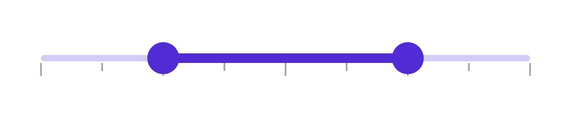

# Tick in .NET MAUI Range Slider (SfRangeSlider)

This section helps to learn about how to add major and minor ticks in the range slider.

## Show major ticks

Enable the major ticks on the track. It is a shape used to represent the major interval points of the track. The default value of the [`ShowTicks`](https://help.syncfusion.com/cr/maui/Syncfusion.Maui.Sliders.RangeView-1.html#Syncfusion_Maui_Sliders_RangeView_1_ShowTicks) property is `False`.

For example, if the [`Minimum`](https://help.syncfusion.com/cr/maui/Syncfusion.Maui.Sliders.RangeView-1.html#Syncfusion_Maui_Sliders_RangeView_1_Minimum) is 0.0, the [`Maximum`](https://help.syncfusion.com/cr/maui/Syncfusion.Maui.Sliders.RangeView-1.html#Syncfusion_Maui_Sliders_RangeView_1_Maximum) is 10.0, and [`Interval`](https://help.syncfusion.com/cr/maui/Syncfusion.Maui.Sliders.RangeView-1.html#Syncfusion_Maui_Sliders_RangeView_1_Interval) is 2.0, the range slider will render the major ticks at 0.0, 2.0, 4.0, and so on.

### Without interval





<sliders:SfRangeSlider ShowTicks="True" />





SfRangeSlider rangeSlider = new SfRangeSlider();
rangeSlider.ShowTicks = true;





### With interval





<sliders:SfRangeSlider Interval="0.2"
                       ShowTicks="True" />





SfRangeSlider rangeSlider = new SfRangeSlider();
rangeSlider.Interval = 0.2;
rangeSlider.ShowTicks = true;





## Show minor ticks

It is used to represent the number of smaller ticks between two major ticks. For example, if the [`Minimum`](https://help.syncfusion.com/cr/maui/Syncfusion.Maui.Sliders.RangeView-1.html#Syncfusion_Maui_Sliders_RangeView_1_Minimum) is 0.0, the [`Maximum`](https://help.syncfusion.com/cr/maui/Syncfusion.Maui.Sliders.RangeView-1.html#Syncfusion_Maui_Sliders_RangeView_1_Maximum) is 10.0, and [`Interval`](https://help.syncfusion.com/cr/maui/Syncfusion.Maui.Sliders.RangeView-1.html#Syncfusion_Maui_Sliders_RangeView_1_Interval) is 2.0, the range slider will render the major ticks at 0.0, 2.0, 4.0 and so on. If the [`MinorTicksPerInterval`](https://help.syncfusion.com/cr/maui/Syncfusion.Maui.Sliders.RangeView-1.html#Syncfusion_Maui_Sliders_RangeView_1_MinorTicksPerInterval) is 1, then smaller ticks will be rendered on 1.0 and 3.0 and so on. The default value of the [`MinorTicksPerInterval`](https://help.syncfusion.com/cr/maui/Syncfusion.Maui.Sliders.RangeView-1.html#Syncfusion_Maui_Sliders_RangeView_1_MinorTicksPerInterval) property is 0.

### Without interval





<sliders:SfRangeSlider MinorTicksPerInterval="2"
                       ShowTicks="True" />





SfRangeSlider rangeSlider = new SfRangeSlider();
rangeSlider.MinorTicksPerInterval = 2;
rangeSlider.ShowTicks = true;





### With interval




<sliders:SfRangeSlider Interval="0.25"
                       MinorTicksPerInterval="1"
                       ShowTicks="True" />





SfRangeSlider rangeSlider = new SfRangeSlider();
rangeSlider.Interval = 0.25;
rangeSlider.MinorTicksPerInterval = 1;
rangeSlider.ShowTicks = true;





## Major ticks color

Change the active and inactive major ticks color of the range slider using the [`ActiveFill`](https://help.syncfusion.com/cr/maui/Syncfusion.Maui.Sliders.SliderTickStyle.html#Syncfusion_Maui_Sliders_SliderTickStyle_ActiveFill) and [`InactiveFill`](https://help.syncfusion.com/cr/maui/Syncfusion.Maui.Sliders.SliderTickStyle.html#Syncfusion_Maui_Sliders_SliderTickStyle_InactiveFill) properties of the [`MajorTickStyle`](https://help.syncfusion.com/cr/maui/Syncfusion.Maui.Sliders.RangeView-1.html#Syncfusion_Maui_Sliders_RangeView_1_MajorTickStyle) class.

The active side of the range slider is between the start and end thumbs.

The inactive side of the range slider is between the [`Minimum`](https://help.syncfusion.com/cr/maui/Syncfusion.Maui.Sliders.RangeView-1.html#Syncfusion_Maui_Sliders_RangeView_1_Minimum) value and the left thumb, and the right thumb and the [`Maximum`](https://help.syncfusion.com/cr/maui/Syncfusion.Maui.Sliders.RangeView-1.html#Syncfusion_Maui_Sliders_RangeView_1_Maximum) value.





<sliders:SfRangeSlider Interval="0.2"
                       ShowTicks="True">

    <sliders:SfRangeSlider.MajorTickStyle>
        <sliders:SliderTickStyle ActiveFill="#EE3F3F"
                                 InactiveFill="#F7B1AE" />
    </sliders:SfRangeSlider.MajorTickStyle>

</sliders:SfRangeSlider>





SfRangeSlider rangeSlider = new SfRangeSlider();
rangeSlider.Interval = 0.2;
rangeSlider.ShowTicks = true;
rangeSlider.MajorTickStyle.ActiveFill = new SolidColorBrush(Color.FromArgb("#EE3F3F"));
rangeSlider.MajorTickStyle.InactiveFill = new SolidColorBrush(Color.FromArgb("#F7B1AE"));





## Minor ticks color

Change the active and inactive minor ticks color of the range slider using the [`ActiveFill`](https://help.syncfusion.com/cr/maui/Syncfusion.Maui.Sliders.SliderTickStyle.html#Syncfusion_Maui_Sliders_SliderTickStyle_ActiveFill) and [`InactiveFill`](https://help.syncfusion.com/cr/maui/Syncfusion.Maui.Sliders.SliderTickStyle.html#Syncfusion_Maui_Sliders_SliderTickStyle_InactiveFill) properties of the [`MinorTickStyle`](https://help.syncfusion.com/cr/maui/Syncfusion.Maui.Sliders.RangeView-1.html#Syncfusion_Maui_Sliders_RangeView_1_MinorTickStyle) class.

The active side of the range slider is between the start and end thumbs.

The inactive side of the range slider is between the [`Minimum`](https://help.syncfusion.com/cr/maui/Syncfusion.Maui.Sliders.RangeView-1.html#Syncfusion_Maui_Sliders_RangeView_1_Minimum) value and the left thumb, and the right thumb and the [`Maximum`](https://help.syncfusion.com/cr/maui/Syncfusion.Maui.Sliders.RangeView-1.html#Syncfusion_Maui_Sliders_RangeView_1_Maximum) value.





<sliders:SfRangeSlider Interval="0.2"
                       ShowTicks="True"
                       MinorTicksPerInterval="1">

    <sliders:SfRangeSlider.MinorTickStyle>
        <sliders:SliderTickStyle ActiveFill="#EE3F3F"
                                 InactiveFill="#F7B1AE" />
    </sliders:SfRangeSlider.MinorTickStyle>

</sliders:SfRangeSlider>





SfRangeSlider rangeSlider = new SfRangeSlider();
rangeSlider.Interval = 0.2;
rangeSlider.ShowTicks = true;
rangeSlider.MinorTicksPerInterval = 1;
rangeSlider.MinorTickStyle.ActiveFill = new SolidColorBrush(Color.FromArgb("#EE3F3F"));
rangeSlider.MinorTickStyle.InactiveFill = new SolidColorBrush(Color.FromArgb("#F7B1AE"));





## Ticks size

Change the major and minor ticks size of the range slider using the [`ActiveSize`](https://help.syncfusion.com/cr/maui/Syncfusion.Maui.Sliders.SliderTickStyle.html#Syncfusion_Maui_Sliders_SliderTickStyle_ActiveSize) and [`InactiveSize`](https://help.syncfusion.com/cr/maui/Syncfusion.Maui.Sliders.SliderTickStyle.html#Syncfusion_Maui_Sliders_SliderTickStyle_InactiveSize) property of the [`MajorTickStyle`](https://help.syncfusion.com/cr/maui/Syncfusion.Maui.Sliders.RangeView-1.html#Syncfusion_Maui_Sliders_RangeView_1_MajorTickStyle) and [`MinorTickStyle`](https://help.syncfusion.com/cr/maui/Syncfusion.Maui.Sliders.RangeView-1.html#Syncfusion_Maui_Sliders_RangeView_1_MinorTickStyle)  classes. The default value is `Size(2.0, 8.0)`.





<sliders:SfRangeSlider Interval="0.2"
                       ShowTicks="True"
                       MinorTicksPerInterval="1">

    <sliders:SfRangeSlider.MinorTickStyle>
        <sliders:SliderTickStyle ActiveSize="2,10"
                                 InactiveSize="2, 10" />
    </sliders:SfRangeSlider.MinorTickStyle>

    <sliders:SfRangeSlider.MajorTickStyle>
        <sliders:SliderTickStyle ActiveSize="2,15"
                                 InactiveSize="2, 15" />
    </sliders:SfRangeSlider.MajorTickStyle>

</sliders:SfRangeSlider>





SfRangeSlider rangeSlider = new SfRangeSlider();
rangeSlider.Interval = 0.2;
rangeSlider.ShowTicks = true;
rangeSlider.MinorTicksPerInterval = 1;
rangeSlider.MinorTickStyle.ActiveSize = new Size(2, 10);
rangeSlider.MinorTickStyle.InactiveSize = new Size(2, 10);
rangeSlider.MajorTickStyle.ActiveSize = new Size(2, 15);
rangeSlider.MajorTickStyle.InactiveSize = new Size(2, 15);





## Ticks offset

Adjust the space between track and ticks of the range slider using the [`Offset`](https://help.syncfusion.com/cr/maui/Syncfusion.Maui.Sliders.SliderTickStyle.html#Syncfusion_Maui_Sliders_SliderTickStyle_Offset) property of the [`MajorTickStyle`](https://help.syncfusion.com/cr/maui/Syncfusion.Maui.Sliders.RangeView-1.html#Syncfusion_Maui_Sliders_RangeView_1_MajorTickStyle) and [`MinorTickStyle`](https://help.syncfusion.com/cr/maui/Syncfusion.Maui.Sliders.RangeView-1.html#Syncfusion_Maui_Sliders_RangeView_1_MinorTickStyle) . The default value of the [`Offset`](https://help.syncfusion.com/cr/maui/Syncfusion.Maui.Sliders.SliderTickStyle.html#Syncfusion_Maui_Sliders_SliderTickStyle_Offset) property is `3.0`.





<sliders:SfRangeSlider Interval="0.2"
                       ShowTicks="True"
                       MinorTicksPerInterval="1">

    <sliders:SfRangeSlider.MinorTickStyle>
        <sliders:SliderTickStyle Offset="5" />
    </sliders:SfRangeSlider.MinorTickStyle>

    <sliders:SfRangeSlider.MajorTickStyle>
        <sliders:SliderTickStyle Offset="5" />
    </sliders:SfRangeSlider.MajorTickStyle>

</sliders:SfRangeSlider>





SfRangeSlider rangeSlider = new SfRangeSlider();
rangeSlider.Interval = 0.2;
rangeSlider.ShowTicks = true;
rangeSlider.MinorTicksPerInterval = 1;
rangeSlider.MinorTickStyle.Offset = 5;
rangeSlider.MajorTickStyle.Offset = 5;





## Disabled ticks

Change the state of the range slider to disabled by setting `false` to the `IsEnabled` property. Using the Visual State Manager (VSM), customize the range slider’s major and minor tick properties based on the visual states. The applicable visual states are enabled(default) and disabled.





<ContentPage.Resources>
    
</ContentPage.Resources>

<ContentPage.Content>
    <VerticalStackLayout Padding="10">
        <Label Text="Enabled"
               Padding="24,10" />
        <sliders:SfRangeSlider />
        <Label Text="Disabled"
               Padding="24,10" />
        <sliders:SfRangeSlider IsEnabled="False" />
    </VerticalStackLayout>
</ContentPage.Content>





VerticalStackLayout stackLayout = new();
SfRangeSlider defaultRangeSlider = new()
{
    Interval = 0.25,
    ShowTicks = true,
    MinorTicksPerInterval = 2
};
SfRangeSlider disabledRangeSlider = new()
{
    IsEnabled = false,
    Interval = 0.25,
    ShowTicks = true,
    MinorTicksPerInterval = 2
};

VisualStateGroupList visualStateGroupList = new();
VisualStateGroup commonStateGroup = new();
// Default State.
VisualState defaultState = new() { Name = "Default" };
defaultState.Setters.Add(new Setter
{
    Property = SfRangeSlider.MajorTickStyleProperty,
    Value = new SliderTickStyle
    {
        ActiveSize = new Size(2, 10),
        InactiveSize = new Size(2, 10),
        ActiveFill = Color.FromArgb("#EE3F3F"),
        InactiveFill = Color.FromArgb("#F7B1AE"),
    }
});
defaultState.Setters.Add(new Setter
{
    Property = SfRangeSlider.MinorTickStyleProperty,
    Value = new SliderTickStyle
    {
        ActiveSize = new Size(2, 6),
        InactiveSize = new Size(2, 6),
        ActiveFill = Color.FromArgb("#EE3F3F"),
        InactiveFill = Color.FromArgb("#F7B1AE"),
    }
});
// Disabled State.
VisualState disabledState = new() { Name = "Disabled" };
disabledState.Setters.Add(new Setter
{
    Property = SfRangeSlider.MajorTickStyleProperty,
    Value = new SliderTickStyle
    {
        ActiveSize = new Size(2, 10),
        InactiveSize = new Size(2, 10),
        ActiveFill = Colors.Gray,
        InactiveFill = Colors.LightGray,
    }
});
disabledState.Setters.Add(new Setter
{
    Property = SfRangeSlider.MinorTickStyleProperty,
    Value = new SliderTickStyle
    {
        ActiveSize = new Size(2, 6),
        InactiveSize = new Size(2, 6),
        ActiveFill = Colors.Gray,
        InactiveFill = Colors.LightGray,
    }
});
disabledState.Setters.Add(new Setter
{
    Property = SfRangeSlider.ThumbStyleProperty,
    Value = new SliderThumbStyle
    {
        Fill = Colors.Gray,
    }
});
disabledState.Setters.Add(new Setter
{
    Property = SfRangeSlider.TrackStyleProperty,
    Value = new SliderTrackStyle
    {
        ActiveFill = Colors.Gray,
        InactiveFill = Colors.LightGray,
    }
});

commonStateGroup.States.Add(defaultState);
commonStateGroup.States.Add(disabledState);
visualStateGroupList.Add(commonStateGroup);
VisualStateManager.SetVisualStateGroups(defaultRangeSlider, visualStateGroupList);
VisualStateManager.SetVisualStateGroups(disabledRangeSlider, visualStateGroupList);

stackLayout.Children.Add(new Label() { Text = "Enabled", Padding = new Thickness(24, 10) });
stackLayout.Children.Add(defaultRangeSlider);
stackLayout.Children.Add(new Label() { Text = "Disabled", Padding = new Thickness(24, 10) });
stackLayout.Children.Add(disabledRangeSlider);
this.Content = stackLayout;





