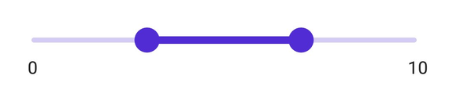
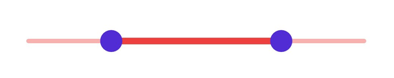
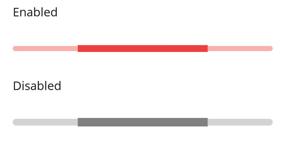

# Track in .NET MAUI Range Slider (SfRangeSlider)

This section explains how to customize the track in the range slider.

## Minimum

The minimum value that users can select. The default value of the [`Minimum`](https://help.syncfusion.com/cr/maui/Syncfusion.Maui.Sliders.RangeView-1.html#Syncfusion_Maui_Sliders_RangeView_1_Minimum) property is `0`, which should be less than the [`Maximum`](https://help.syncfusion.com/cr/maui/Syncfusion.Maui.Sliders.RangeView-1.html#Syncfusion_Maui_Sliders_RangeView_1_Maximum) value.

## Maximum

The maximum value that users can select. The default value of the [`Maximum`](https://help.syncfusion.com/cr/maui/Syncfusion.Maui.Sliders.RangeView-1.html#Syncfusion_Maui_Sliders_RangeView_1_Maximum) property is `1`, which should be greater than the [`Minimum`](https://help.syncfusion.com/cr/maui/Syncfusion.Maui.Sliders.RangeView-1.html#Syncfusion_Maui_Sliders_RangeView_1_Minimum) value.

## Range Values

These values represent the current selection in the range slider. The slider's thumb position corresponds to the [`RangeStart`](https://help.syncfusion.com/cr/maui/Syncfusion.Maui.Sliders.RangeSliderBase-1.html#Syncfusion_Maui_Sliders_RangeSliderBase_1_RangeStart) and [`RangeEnd`](https://help.syncfusion.com/cr/maui/Syncfusion.Maui.Sliders.RangeSliderBase-1.html#Syncfusion_Maui_Sliders_RangeSliderBase_1_RangeEnd) properties.





<sliders:SfRangeSlider Minimum="0"
                       Maximum="10"
                       RangeStart="3"
                       RangeEnd="7"
                       ShowLabels="True" />
 




 SfRangeSlider rangeSlider = new SfRangeSlider();
 rangeSlider.Minimum = "0";
 rangeSlider.Maximum = "10";
 rangeSlider.RangeStart = "3";
 rangeSlider.RangeEnd = "7";
 rangeSlider.ShowLabels = true;





## Track Color

Change the active and inactive track colors using the [`ActiveFill`](https://help.syncfusion.com/cr/maui/Syncfusion.Maui.Sliders.SliderTrackStyle.html#Syncfusion_Maui_Sliders_SliderTrackStyle_ActiveFill) and [`InactiveFill`](https://help.syncfusion.com/cr/maui/Syncfusion.Maui.Sliders.SliderTrackStyle.html#Syncfusion_Maui_Sliders_SliderTrackStyle_InactiveFill) properties within the [`TrackStyle`](https://help.syncfusion.com/cr/maui/Syncfusion.Maui.Sliders.RangeView-1.html#Syncfusion_Maui_Sliders_RangeView_1_TrackStyle) class.

The active side of the range slider is between the start and end thumbs. The inactive side is between the [`Minimum`](https://help.syncfusion.com/cr/maui/Syncfusion.Maui.Sliders.RangeView-1.html#Syncfusion_Maui_Sliders_RangeView_1_Minimum) value and the left thumb, and the right thumb and the [`Maximum`](https://help.syncfusion.com/cr/maui/Syncfusion.Maui.Sliders.RangeView-1.html#Syncfusion_Maui_Sliders_RangeView_1_Maximum) value.





<sliders:SfRangeSlider>
    <sliders:SfRangeSlider.TrackStyle>
        <sliders:SliderTrackStyle ActiveFill="#EE3F3F"
                                  InactiveFill="#F7B1AE" />
    </sliders:SfRangeSlider.TrackStyle>
</sliders:SfRangeSlider>





SfRangeSlider rangeSlider = new SfRangeSlider();
rangeSlider.TrackStyle.ActiveFill = new SolidColorBrush(Color.FromArgb("#EE3F3F"));
rangeSlider.TrackStyle.InactiveFill = new SolidColorBrush(Color.FromArgb("#F7B1AE"));





## Track Height

Change the active and inactive track height of the range slider using the [`ActiveSize`](https://help.syncfusion.com/cr/maui/Syncfusion.Maui.Sliders.SliderTrackStyle.html#Syncfusion_Maui_Sliders_SliderTrackStyle_ActiveSize) and [`InactiveSize`](https://help.syncfusion.com/cr/maui/Syncfusion.Maui.Sliders.SliderTrackStyle.html#Syncfusion_Maui_Sliders_SliderTrackStyle_InactiveSize) properties of the [`TrackStyle`](https://help.syncfusion.com/cr/maui/Syncfusion.Maui.Sliders.RangeView-1.html#Syncfusion_Maui_Sliders_RangeView_1_TrackStyle) class. The default value of the [`ActiveSize`](https://help.syncfusion.com/cr/maui/Syncfusion.Maui.Sliders.SliderTrackStyle.html#Syncfusion_Maui_Sliders_SliderTrackStyle_ActiveSize) and the [`InactiveSize`](https://help.syncfusion.com/cr/maui/Syncfusion.Maui.Sliders.SliderTrackStyle.html#Syncfusion_Maui_Sliders_SliderTrackStyle_InactiveSize) properties are `8.0` and `6.0` respectively.





<sliders:SfRangeSlider>
    <sliders:SfRangeSlider.TrackStyle>
        <sliders:SliderTrackStyle ActiveSize="10"
                                  InactiveSize="8" />
    </sliders:SfRangeSlider.TrackStyle>
</sliders:SfRangeSlider>





SfRangeSlider rangeSlider = new SfRangeSlider();
rangeSlider.TrackStyle.ActiveSize = 10;
rangeSlider.TrackStyle.InactiveSize = 8;





## Track Extent

Extend the track at its edges using the [`TrackExtent`](https://help.syncfusion.com/cr/maui/Syncfusion.Maui.Sliders.RangeView-1.html#Syncfusion_Maui_Sliders_RangeView_1_TrackExtent) property. The default value is `0`, measured in pixels.





<sliders:SfRangeSlider Interval="0.25"
                       ShowTicks="True"
                       TrackExtent="25" />





SfRangeSlider rangeSlider = new SfRangeSlider()
{
    Interval = 0.25,
    TrackExtent = 25,
    ShowTicks = true,
};





**Without track extent**

**With track extent**

## Disabled Track

Disable the range slider by setting `IsEnabled` property to `false`. Use the Visual State Manager (VSM) to customize track properties based on visual states. The applicable visual states are enabled (default) and disabled.





<ContentPage.Resources>
    
</ContentPage.Resources>

<ContentPage.Content>
    <VerticalStackLayout>
        <Label Text="Enabled"
               Padding="24,10" />
        <sliders:SfRangeSlider />
        <Label Text="Disabled"
               Padding="24,10" />
        <sliders:SfRangeSlider IsEnabled="False" />
    </VerticalStackLayout>
</ContentPage.Content>





VerticalStackLayout stackLayout = new();
SfRangeSlider defaultRangeSlider = new();
defaultRangeSlider.ThumbStyle.Radius = 0;
SfRangeSlider disabledRangeSlider = new() { IsEnabled = false };
disabledRangeSlider.ThumbStyle.Radius = 0;

VisualStateGroupList visualStateGroupList = new();
VisualStateGroup commonStateGroup = new();
// Default State.
VisualState defaultState = new() { Name = "Default" };
defaultState.Setters.Add(new Setter
{
    Property = SfRangeSlider.TrackStyleProperty,
    Value = new SliderTrackStyle
    {
        ActiveFill = Color.FromArgb("#EE3F3F"),
        InactiveFill = Color.FromArgb("#F7B1AE"),
        ActiveSize = 8,
        InactiveSize = 6,
    }
});
// Disabled State.
VisualState disabledState = new() { Name = "Disabled" };
disabledState.Setters.Add(new Setter
{
    Property = SfRangeSlider.TrackStyleProperty,
    Value = new SliderTrackStyle
    {
        ActiveFill = Colors.Gray,
        InactiveFill = Colors.LightGray,
        ActiveSize = 10,
        InactiveSize = 8,
    }
});

commonStateGroup.States.Add(defaultState);
commonStateGroup.States.Add(disabledState);
visualStateGroupList.Add(commonStateGroup);
VisualStateManager.SetVisualStateGroups(defaultRangeSlider, visualStateGroupList);
VisualStateManager.SetVisualStateGroups(disabledRangeSlider, visualStateGroupList);

stackLayout.Children.Add(new Label() { Text = "Enabled", Padding = new Thickness(24, 10) });
stackLayout.Children.Add(defaultRangeSlider);
stackLayout.Children.Add(new Label() { Text = "Disabled", Padding = new Thickness(24, 10) });
stackLayout.Children.Add(disabledRangeSlider);
this.Content = stackLayout;





