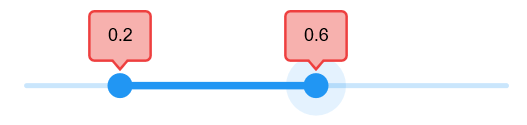

# Tooltip in .NET MAUI Range Slider (SfRangeSlider)

This section helps to learn about how to add tooltip in the range slider.

## Enable tooltip

You can enable tooltip for the thumb by setting the `ToolTipShape` property to `SliderToolTipShape.Rectangular`. It is used to clearly indicate the current selection of the value during interaction. By default, tooltip text is formatted with either numberFormat or dateFormat. The default value of the `ToolTipShape` property is `SliderToolTipShape.None`.





     <sliders:SfRangeSlider ToolTipShape="Rectangular"/>





     SfRangeSlider rangeSlider = new SfRangeSlider();
     rangeSlider.ToolTipShape = SliderToolTipShape.Rectangular;





## Tooltip text format

By default it is formatted based on `NumberFormat` property and `DateFormat` property based on whether it is date type `SfRangeSlider` or numeric `SfRangeSlider`.

You can format or change the whole tooltip label text using the `ToolTipLabelCreated` event. The `SliderLabelCreatedEventArgs` contains the following parameters,

* Text – Change the format of the tooltip text using the `Text` property.
* Style – Change the appearance of the tooltip text like color, stroke color, and padding using the `Style` property.





     <sliders:SfRangeSlider ToolTipShape="Rectangular" 
                            ToolTipLabelCreated="OnTooltipLabelCreated">
     </sliders:SfRangeSlider>




   {
    	SfRangeSlider rangeSlider = new SfRangeSlider();
     rangeSlider.ToolTipShape = SliderToolTipShape.Rectangular;
     rangeSlider.ToolTipLabelCreated += OnTooltipLabelCreated;
   }
   private void OnTooltipLabelCreated(object sender, SliderLabelCreatedEventArgs e)
   {
		e.Text = "$" + e.Text;
   }





## Tooltip label style

You can change the appearance of the tooltip text like color, stroke color, padding around the text using the `ToolTipStyle` property.





     <sliders:SfRangeSlider  ToolTipShape="Rectangular">
       <sliders:SfRangeSlider.ToolTipStyle>
          <sliders:SliderToolTipStyle Color="#F7B1AE" 
                                      StrokeColor="#EE3F3F" 
                                      StrokeWidth="2" />
       </sliders:SfRangeSlider.ToolTipStyle>
     </sliders:SfRangeSlider>





     SfRangeSlider rangeSlider = new SfRangeSlider();
     rangeSlider.ToolTipShape = SliderToolTipShape.Rectangular;
     rangeSlider.ToolTipStyle.Color = new SolidColorBrush(Color.FromArgb("#F7B1AE"));
     rangeSlider.ToolTipStyle.StrokeColor = new SolidColorBrush(Color.FromArgb("#EE3F3F"));
     rangeSlider.ToolTipStyle.StrokeWidth = 2;





