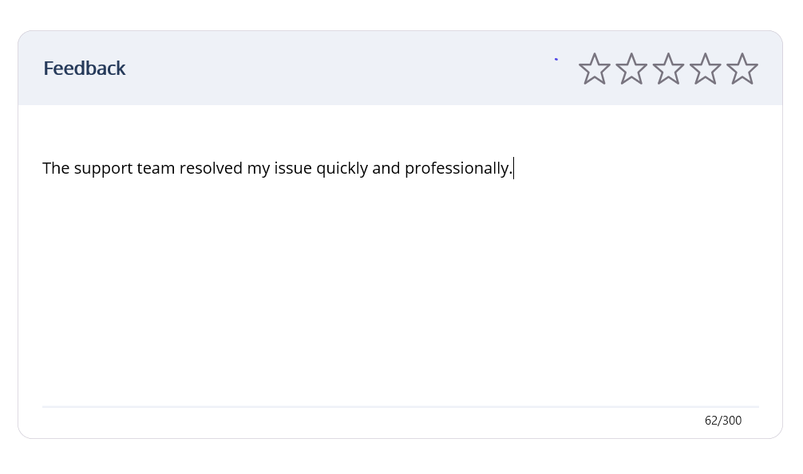

# AI-Powered Rating Feedback in .NET MAUI Rating

This document walks you through the implementation of an AI-powered rating feedback feature in the Syncfusion [.NET MAUI Rating](https://help.syncfusion.com/cr/maui/Syncfusion.Maui.Inputs.SfRating.html) control. The core concept is simple yet powerful: the user enters their feedback in an `Editor`, and the AI reads the feedback content and automatically updates the [`SfRating`](https://help.syncfusion.com/cr/maui/Syncfusion.Maui.Inputs.SfRating.html) control with an appropriate satisfaction rating based on the sentiment expressed. The example leverages Azure OpenAI for an intelligent, AI-driven rating experience.

## Integrating Azure OpenAI with your .NET MAUI App

First, ensure you have access to [Azure OpenAI](https://learn.microsoft.com/en-us/azure/ai-foundry/openai/overview) and have created a deployment in the Azure portal.

If you don't have access, please refer to the [create and deploy Azure OpenAI service](https://learn.microsoft.com/en-us/azure/ai-foundry/openai/how-to/create-resource?pivots=web-portal) guide to set up a new account.

Note down the deployment name, endpoint URL, and API key.

Use the [Azure.AI.OpenAI](https://www.nuget.org/packages/Azure.AI.OpenAI) NuGet package from the [NuGet Gallery](https://www.nuget.org/). Before getting started, install the Azure.AI.OpenAI NuGet package in your .NET MAUI app.

In the `OpenAIService` class, initialize the `AzureOpenAIClient` with your endpoint, deployment name, and API key. Replace the `DefaultEndpoint`, `DefaultDeploymentName`, and `DefaultApiKey` with the actual values from your Azure OpenAI resource.

The `TryCreateClient` helper validates the endpoint, deployment, and key strings before constructing the client. It returns `false` (instead of throwing) when the inputs are missing or malformed, so the sample degrades gracefully when credentials are not configured.




private AzureOpenAIClient? _client;
private readonly string _deploymentName;
private bool _isClientConfigured;

// Parameterless constructor — uses the built-in default Azure OpenAI credentials.
// MauiProgram registers OpenAIService with this constructor via dependency injection.
public OpenAIService()
{
    _deploymentName = DefaultDeploymentName;
    _isClientConfigured = TryCreateClient(DefaultEndpoint, DefaultDeploymentName, DefaultApiKey, out _client);
}

// Constructor that accepts custom credentials (e.g. for testing or user-supplied values).
public OpenAIService(string endpoint, string deploymentName, string apiKey)
{
    _deploymentName = deploymentName;
    _isClientConfigured = TryCreateClient(endpoint, deploymentName, apiKey, out _client);
}

/// 

/// Validates the endpoint/deployment/key strings and constructs an
/// <see cref="AzureOpenAIClient"/>. Returns <c>false</c> (instead of throwing)
/// when the inputs are missing or malformed.
/// 

private static bool TryCreateClient(
    string endpoint,
    string deploymentName,
    string apiKey,
    out AzureOpenAIClient? client)
{
    client = null;

    if (string.IsNullOrWhiteSpace(endpoint)
        || string.IsNullOrWhiteSpace(apiKey)
        || string.IsNullOrWhiteSpace(deploymentName))
    {
        return false;
    }

    if (!Uri.TryCreate(endpoint, UriKind.Absolute, out var uri)
        || (uri.Scheme != Uri.UriSchemeHttp && uri.Scheme != Uri.UriSchemeHttps))
    {
        return false;
    }

    try
    {
        client = new AzureOpenAIClient(uri, new ApiKeyCredential(apiKey));
        return true;
    }
    catch
    {
        return false;
    }
}




`OpenAIService` uses this client in the `GetSuggestedRatingAsync` method to send a prompt and receive a completion. The method constructs the prompt, sends it to the deployed model, and returns a single rating number that can be applied directly to the [`SfRating`](https://help.syncfusion.com/cr/maui/Syncfusion.Maui.Inputs.SfRating.html) control.




public async Task<double> GetSuggestedRatingAsync(string feedback, CancellationToken cancellationToken = default)
{
    if (!_isClientConfigured || _client is null)
    {
        return 0;
    }

    List<ChatMessage> messages =
    [
        new SystemChatMessage(
            """
            You are an AI assistant that analyzes customer support feedback and determines an appropriate satisfaction rating.

            Your task is to understand the customer's overall experience and assign a decimal rating from 1.0 to 5.0 based on the sentiment expressed in the feedback.

            Consider factors such as:
                - Issue resolution effectiveness
                - Response time
                - Professionalism of the support agent
                - Helpfulness of the support provided
                - Customer satisfaction or frustration
                - Ease of resolving the issue
                - Whether the customer would likely have a positive or negative impression of the support experience

            Rating Guidelines:
                0.0: Not enough information, incomplete feedback, unfinished sentences, random text, gibberish, unrelated content, or feedback that does not clearly describe a customer support experience.
                0.1 - 1.0: The customer is extremely dissatisfied. Feedback indicates a very poor experience, unresolved issues, repeated problems, strong frustration, or disappointment.
                1.1 - 2.0: The customer is dissatisfied. Feedback indicates significant delays, inadequate assistance, poor communication, or unresolved concerns.
                2.1 - 3.0: The experience is mixed or neutral. The feedback contains both positive and negative aspects, or the customer's satisfaction level is unclear.
                3.1 - 4.0: The customer is generally satisfied. The issue was resolved, but there may be minor concerns such as slightly delayed responses or small frustrations.
                4.1 - 5.0: The customer is highly satisfied. Feedback indicates excellent service, quick resolution, professionalism, clear communication, or an overall positive experience.

            Return ONLY a single number: 0.0, 1, 1.4, 2, 2.7, 3, 3.5, 4, 4.6, 5.0.
            Do not return explanations, labels, punctuation, or additional text.
            """
        ),

        new UserChatMessage(feedback)
    ];

    ChatCompletion response = await _client
            .GetChatClient(_deploymentName)
            .CompleteChatAsync(messages, cancellationToken: cancellationToken);

    string result = response.Content[0].Text.Trim();
    if (double.TryParse(result, NumberStyles.Float | NumberStyles.AllowThousands,
                        CultureInfo.InvariantCulture, out double rating))
    {
        return Math.Clamp(rating, 0.0, 5.0);
    }

    return 0.0;
}




## Implementing AI-Powered Rating Feedback in .NET MAUI Rating

### Step 1: Designing the User Interface

The UI consists of two main parts: a feedback `Editor` where the user describes their support experience, and a [`SfRating`](https://help.syncfusion.com/cr/maui/Syncfusion.Maui.Inputs.SfRating.html) control that displays the AI-determined rating. An `ActivityIndicator` shows the AI processing status, and a `Label` displays the current word count.

#### Editor - Capturing User Feedback

Use an `Editor` to collect the user's feedback. The `TextChanged` event is wired up so that every keystroke triggers the AI rating logic.




<Editor
    x:Name="FeedbackEditor"
    Margin="15,12,15,0"
    BackgroundColor="Transparent"
    FontSize="14"
    TextColor="#111827"
    Placeholder="Describe your customer support experience..."
    AutoSize="Disabled"
    HeightRequest="180"
    TextChanged="FeedbackEditor_TextChanged" />




#### ActivityIndicator and Word Count - Showing Processing Status

An `ActivityIndicator` provides visual feedback while the AI analyzes the feedback, and a `Label` displays the live word count as the user types.




<Grid
    Grid.Row="2"
    Padding="15,0"
    ColumnDefinitions="*,Auto">

    <!-- Analysis Indicator -->
    <ActivityIndicator
        x:Name="LoadingIndicator"
        HorizontalOptions="Start"
        VerticalOptions="Center"
        WidthRequest="24"
        HeightRequest="24"
        Color="#4F46E5"
        IsRunning="False"
        IsVisible="False" />

    <!-- Word Count -->
    <Label
        x:Name="WordCountLabel"
        Grid.Column="1"
        VerticalOptions="Center"
        HorizontalOptions="End"
        Text="0 / 500 words"
        FontSize="12"
        TextColor="#6B7280" />

</Grid>




#### SfRating - Displaying the AI-Generated Rating

The [`SfRating`](https://help.syncfusion.com/cr/maui/Syncfusion.Maui.Inputs.SfRating.html) control is kept read-only (`IsReadOnly="True"`) so that its value is updated only by the AI. The AI reads the feedback content and assigns a satisfaction rating from `0.0` to `5.0`, which is applied to the `Value` property.




xmlns:rating="clr-namespace:Syncfusion.Maui.Inputs;assembly=Syncfusion.Maui.Inputs"

<rating:SfRating
    x:Name="RatingControl"
    HorizontalOptions="Center"
    VerticalOptions="Center"
    ItemCount="5"
    ItemSize="46"
    BackgroundColor="Transparent"
    Value="0"
    IsReadOnly="True" />




### Step 2: Handling Feedback and Updating the Rating

In the page's code-behind, handle the `TextChanged` event of the `Editor`. Because the user types continuously, a `CancellationTokenSource` is used to debounce the AI request — each new keystroke cancels the previous in-flight request and starts a short delay before sending the feedback to Azure OpenAI. Once the AI returns a rating, the [`SfRating`](https://help.syncfusion.com/cr/maui/Syncfusion.Maui.Inputs.SfRating.html) `Value` is updated on the main thread.




private void FeedbackEditor_TextChanged(object sender, TextChangedEventArgs e)
{
    UpdateWordCount();

    // Cancel any previous in-flight request and reset the rating.
    _typingCancellationTokenSource?.Cancel();
    LoadingIndicator.IsVisible = true;
    LoadingIndicator.IsRunning = true;
    RatingControl.Value = 0;

    _typingCancellationTokenSource = new CancellationTokenSource();

    _ = ProcessFeedbackAfterDelayAsync(_typingCancellationTokenSource.Token);
}

private async Task ProcessFeedbackAfterDelayAsync(CancellationToken cancellationToken)
{
    try
    {
        // Wait for the user to stop typing before sending the request.
        await Task.Delay(500, cancellationToken);

        if (cancellationToken.IsCancellationRequested)
            return;

        string feedback = FeedbackEditor.Text?.Trim() ?? string.Empty;

        if (string.IsNullOrWhiteSpace(feedback))
        {
            MainThread.BeginInvokeOnMainThread(() => RatingControl.Value = 0);
            return;
        }

        // AI reads the feedback and returns a suggested rating.
        double rating = await _openAIService.GetSuggestedRatingAsync(feedback, cancellationToken);

        cancellationToken.ThrowIfCancellationRequested();

        MainThread.BeginInvokeOnMainThread(() => RatingControl.Value = rating);
    }
    catch (TaskCanceledException)
    {
        // User typed again before the request completed.
    }
    catch (OperationCanceledException)
    {
        // Request cancelled.
    }
    finally
    {
        MainThread.BeginInvokeOnMainThread(() =>
        {
            LoadingIndicator.IsRunning = false;
            LoadingIndicator.IsVisible = false;
        });
    }
}




### Step 3: Registering the Services

Register the `OpenAIService` and the `MainPage` with the .NET MAUI dependency injection container in `MauiProgram`. This allows the page to receive the service through constructor injection and keeps the Azure OpenAI connection centralized.




builder.Services.AddSingleton<OpenAIService>();
builder.Services.AddSingleton<MainPage>();




The following image demonstrates the output of the above AI-powered rating feedback sample.

By combining the [`SfRating`](https://help.syncfusion.com/cr/maui/Syncfusion.Maui.Inputs.SfRating.html) control with an AI-driven feedback analysis, you can create a smart, automated rating experience in your .NET MAUI applications. The AI reads the feedback content, understands the sentiment, and updates the rating accordingly — eliminating manual rating effort while keeping the experience intuitive for the user.
