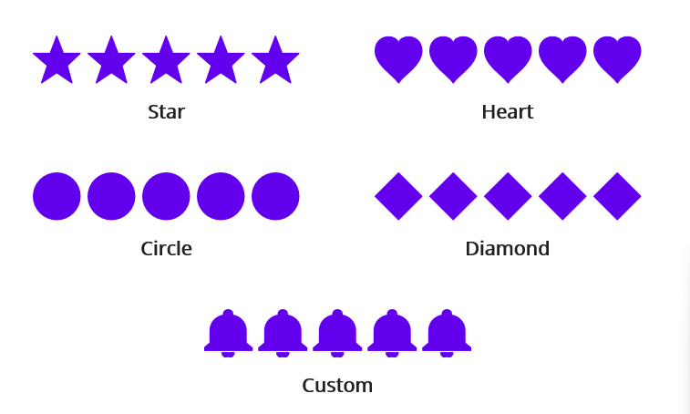

---

layout: post
title: Rating Shape in .NET MAUI Rating control | Syncfusion®
description: Learn here all about Rating Shape support in Syncfusion® .NET MAUI Rating (SfRating) control and more.
platform: maui
control: Rating
documentation: ug

---

# Rating Shape in .NET MAUI Rating (SfRating)

The [`RatingShape`](https://help.syncfusion.com/cr/maui/Syncfusion.Maui.Inputs.RatingShape.html) property allows you to display the rating in five different rating shapes:

* [`Star`](https://help.syncfusion.com/cr/maui/Syncfusion.Maui.Inputs.RatingShape.html#Syncfusion_Maui_Inputs_RatingShape_Star)
* [`Heart`](https://help.syncfusion.com/cr/maui/Syncfusion.Maui.Inputs.RatingShape.html#Syncfusion_Maui_Inputs_RatingShape_Heart)
* [`Diamond`](https://help.syncfusion.com/cr/maui/Syncfusion.Maui.Inputs.RatingShape.html#Syncfusion_Maui_Inputs_RatingShape_Diamond)
* [`Circle`](https://help.syncfusion.com/cr/maui/Syncfusion.Maui.Inputs.RatingShape.html#Syncfusion_Maui_Inputs_RatingShape_Circle)
* [`Custom`](https://help.syncfusion.com/cr/maui/Syncfusion.Maui.Inputs.RatingShape.html#Syncfusion_Maui_Inputs_RatingShape_Custom)

The default rating shape of the [`SfRating`](https://help.syncfusion.com/cr/maui/Syncfusion.Maui.Inputs.SfRating.html) control is [`Star`](https://help.syncfusion.com/cr/maui/Syncfusion.Maui.Inputs.RatingShape.html#Syncfusion_Maui_Inputs_RatingShape_Star).

## Custom

When [`RatingShape`](https://help.syncfusion.com/cr/maui/Syncfusion.Maui.Inputs.RatingShape.html) is set to [`Custom`](https://help.syncfusion.com/cr/maui/Syncfusion.Maui.Inputs.RatingShape.html#Syncfusion_Maui_Inputs_RatingShape_Star), the custom path should be given to the [`Path`](https://help.syncfusion.com/cr/maui/Syncfusion.Maui.Inputs.SfRating.html#Syncfusion_Maui_Inputs_SfRating_Path) property





<rating:SfRating x:Name="rating" RatingShape="Custom" ItemSize = "36"
                 Path="M17.5 35.5C19.9063 35.5 21.875 33.8846 21.875 31.9103H13.125C13.125 33.8846 15.0719 35.5 17.5 35.5ZM30.625 24.7308V15.7564C30.625 10.2462 27.0375 5.63334 20.7812 4.41282V3.19231C20.7812 1.70256 19.3156 0.5 17.5 0.5C15.6844 0.5 14.2188 1.70256 14.2188 3.19231V4.41282C7.94063 5.63334 4.375 10.2282 4.375 15.7564V24.7308L0 28.3205V30.1154H35V28.3205L30.625 24.7308Z"/>
	




SfRating rating = new SfRating();
rating.ItemSize = 36;
rating.RatingShape = RatingShape.Custom;
rating.Path = "M17.5 35.5C19.9063 35.5 21.875 33.8846 21.875 31.9103H13.125C13.125 33.8846 15.0719 35.5 17.5 35.5ZM30.625 24.7308V15.7564C30.625 10.2462 27.0375 5.63334 20.7812 4.41282V3.19231C20.7812 1.70256 19.3156 0.5 17.5 0.5C15.6844 0.5 14.2188 1.70256 14.2188 3.19231V4.41282C7.94063 5.63334 4.375 10.2282 4.375 15.7564V24.7308L0 28.3205V30.1154H35V28.3205L30.625 24.7308Z";

 



N> The Item size should be the same as the path size for Custom Rating Shape

