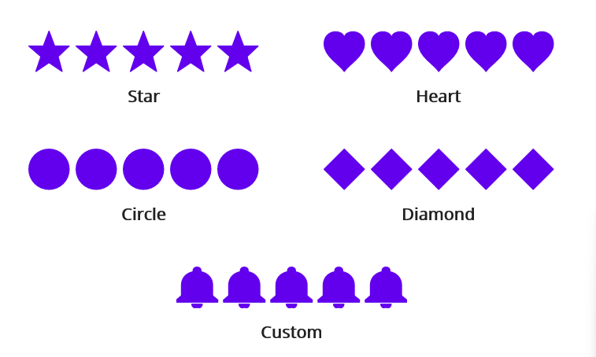

---

layout: post
title: Rating Shape in .NET MAUI Rating control | Syncfusion®
description: Learn here all about Rating Shape support in Syncfusion® .NET MAUI Rating (SfRating) control and more.
platform: maui
control: Rating
documentation: ug

---

# Rating Shape in .NET MAUI Rating (SfRating)

## Prerequisites

Before using the [SfRating](https://help.syncfusion.com/cr/maui/Syncfusion.Maui.Inputs.SfRating.html), ensure the following NuGet package is installed in your .NET MAUI project:

- `Syncfusion.Maui.Inputs`

For step-by-step setup, refer to the [Getting Started](https://help.syncfusion.com/maui/rating/getting-started) documentation.

## Overview

The `Rating` control supports five built-in rating shapes through the [`RatingShape`](https://help.syncfusion.com/cr/maui/Syncfusion.Maui.Inputs.RatingShape.html) property. The following shapes are available:

* [`Star`](https://help.syncfusion.com/cr/maui/Syncfusion.Maui.Inputs.RatingShape.html#Syncfusion_Maui_Inputs_RatingShape_Star)
* [`Heart`](https://help.syncfusion.com/cr/maui/Syncfusion.Maui.Inputs.RatingShape.html#Syncfusion_Maui_Inputs_RatingShape_Heart)
* [`Diamond`](https://help.syncfusion.com/cr/maui/Syncfusion.Maui.Inputs.RatingShape.html#Syncfusion_Maui_Inputs_RatingShape_Diamond)
* [`Circle`](https://help.syncfusion.com/cr/maui/Syncfusion.Maui.Inputs.RatingShape.html#Syncfusion_Maui_Inputs_RatingShape_Circle)
* [`Custom`](https://help.syncfusion.com/cr/maui/Syncfusion.Maui.Inputs.RatingShape.html#Syncfusion_Maui_Inputs_RatingShape_Custom)

The default rating shape of the `Rating` control is `Star`.

The `Star`, `Heart`, `Diamond`, and `Circle` shapes are built-in and require no additional configuration. The `Custom` shape lets you supply your own SVG path data.

## Custom

When [`RatingShape`](https://help.syncfusion.com/cr/maui/Syncfusion.Maui.Inputs.RatingShape.html) is set to `Custom`, provide a custom SVG path to the [`Path`](https://help.syncfusion.com/cr/maui/Syncfusion.Maui.Inputs.SfRating.html#Syncfusion_Maui_Inputs_SfRating_Path) property. The `Path` value uses standard [SVG path data](https://developer.mozilla.org/en-US/docs/Web/SVG/Attribute/d) syntax (move, line, curve commands), and is rendered at the size defined by [`ItemSize`](https://help.syncfusion.com/cr/maui/Syncfusion.Maui.Inputs.SfRating.html#Syncfusion_Maui_Inputs_SfRating_ItemSize). The fill color is determined by the `RatedFill` and `UnratedFill` properties.





<rating:SfRating RatingShape="Custom"
                 ItemSize="36"
                 Path="M17.5 35.5C19.9063 35.5 21.875 33.8846 21.875 31.9103H13.125C13.125 33.8846 15.0719 35.5 17.5 35.5ZM30.625 24.7308V15.7564C30.625 10.2462 27.0375 5.63334 20.7812 4.41282V3.19231C20.7812 1.70256 19.3156 0.5 17.5 0.5C15.6844 0.5 14.2188 1.70256 14.2188 3.19231V4.41282C7.94063 5.63334 4.375 10.2282 4.375 15.7564V24.7308L0 28.3205V30.1154H35V28.3205L30.625 24.7308Z" />





SfRating rating = new SfRating
{
    ItemSize = 36,
    RatingShape = RatingShape.Custom,
    Path = "M17.5 35.5C19.9063 35.5 21.875 33.8846 21.875 31.9103H13.125C13.125 33.8846 15.0719 35.5 17.5 35.5ZM30.625 24.7308V15.7564C30.625 10.2462 27.0375 5.63334 20.7812 4.41282V3.19231C20.7812 1.70256 19.3156 0.5 17.5 0.5C15.6844 0.5 14.2188 1.70256 14.2188 3.19231V4.41282C7.94063 5.63334 4.375 10.2282 4.375 15.7564V24.7308L0 28.3205V30.1154H35V28.3205L30.625 24.7308Z"
};





N> The Item size should be the same as the path size for Custom Rating Shape

## See also

* [Appearance and Styling in .NET MAUI Rating](https://help.syncfusion.com/maui/rating/appearance-and-styling)
* [Precision Mode in .NET MAUI Rating](https://help.syncfusion.com/maui/rating/precision-mode)
* [Appearance Customization in .NET MAUI Rating](https://help.syncfusion.com/maui/rating/appearance-customization)
