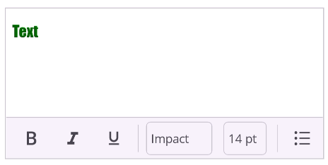

# Advanced Features in .NET MAUI Rich Text Editor (SfRichTextEditor)

This section covers the essential properties, methods, and events of the .NET MAUI [SfRichTextEditor](https://help.syncfusion.com/cr/maui/Syncfusion.Maui.RichTextEditor.SfRichTextEditor.html) for handling content and user interactions.

## Setting Plain Text

The Rich Text Editor control displays the plain text that can be set using the [Text](https://help.syncfusion.com/cr/maui/Syncfusion.Maui.RichTextEditor.SfRichTextEditor.html#Syncfusion_Maui_RichTextEditor_SfRichTextEditor_Text) property.

 

 

 <richtexteditor:SfRichTextEditor Text="The rich text editor component is WYSIWYG editor that provides the best user experience to create and update the content" />



 

SfRichTextEditor richTextEditor = new SfRichTextEditor();
richtexteditor.Text = "The rich text editor component is WYSIWYG editor that provides the best user experience to create and update the content";





## Setting HTML Formatted Text

The [HtmlText](https://help.syncfusion.com/cr/maui/Syncfusion.Maui.RichTextEditor.SfRichTextEditor.html#Syncfusion_Maui_RichTextEditor_SfRichTextEditor_HtmlText) property of the `SfRichTextEditor` control is used to set HTML formatted text.

 

 

 <richtexteditor:SfRichTextEditor HtmlText= "The &lt;b&gt; rich text editor &lt;/b&gt; component is WYSIWYG editor that provides the best user experience to create and update the content" />



 

SfRichTextEditor richTextEditor = new SfRichTextEditor();
richtexteditor.HtmlText = "The <b>rich text editor</b> component is WYSIWYG editor that provides the best user experience to create and update the content";





## Getting Selected HTML

To retrieve the HTML representation of the currently selected content, use the [GetSelectedText](https://help.syncfusion.com/cr/maui/Syncfusion.Maui.RichTextEditor.SfRichTextEditor.html#Syncfusion_Maui_RichTextEditor_SfRichTextEditor_GetSelectedText) method.





string selectedText = await rte.GetSelectedText();





## Default Text Style

You can define the default appearance for any new text typed into the editor. These settings apply to text that does not have any other specific formatting applied.

*   [DefaultFontFamily](https://help.syncfusion.com/cr/maui/Syncfusion.Maui.RichTextEditor.SfRichTextEditor.html#Syncfusion_Maui_RichTextEditor_SfRichTextEditor_DefaultFontFamily): Sets the default font family for the content.
*   [DefaultFontSize](https://help.syncfusion.com/cr/maui/Syncfusion.Maui.RichTextEditor.SfRichTextEditor.html#Syncfusion_Maui_RichTextEditor_SfRichTextEditor_DefaultFontSize): Sets the default font size.
*   [DefaultTextColor](https://help.syncfusion.com/cr/maui/Syncfusion.Maui.RichTextEditor.SfRichTextEditor.html#Syncfusion_Maui_RichTextEditor_SfRichTextEditor_DefaultTextColor): Sets the default color of the text.




<rte:SfRichTextEditor DefaultFontFamily="Impact"
                      DefaultFontSize="14"
                      DefaultTextColor="DarkGreen" />




SfRichTextEditor richTextEditor = new SfRichTextEditor();
richTextEditor.DefaultFontFamily = "Impact";
richTextEditor.DefaultFontSize = 14;
richTextEditor.DefaultTextColor = Colors.DarkGreen;




## Placeholder

The editor can display a [placeholder](https://help.syncfusion.com/cr/maui/Syncfusion.Maui.RichTextEditor.SfRichTextEditor.html#Syncfusion_Maui_RichTextEditor_SfRichTextEditor_Placeholder) text when the content is empty. This is useful for prompting the user. The placeholder is cleared as soon as the user starts typing.

*   [PlaceholderFontFamily](https://help.syncfusion.com/cr/maui/Syncfusion.Maui.RichTextEditor.SfRichTextEditor.html#Syncfusion_Maui_RichTextEditor_SfRichTextEditor_PlaceholderFontFamily) : Sets the font family of the placeholder text.
*   [PlaceholderFontSize](https://help.syncfusion.com/cr/maui/Syncfusion.Maui.RichTextEditor.SfRichTextEditor.html#Syncfusion_Maui_RichTextEditor_SfRichTextEditor_PlaceholderFontSize): Sets the font size of the placeholder text.
*   [PlaceholderColor](https://help.syncfusion.com/cr/maui/Syncfusion.Maui.RichTextEditor.SfRichTextEditor.html#Syncfusion_Maui_RichTextEditor_SfRichTextEditor_PlaceholderColor): Sets the color of the placeholder text.





<rte:SfRichTextEditor Placeholder="Type your content here..."
                      PlaceholderFontFamily="Impact"
                      PlaceholderFontSize="24"
                      PlaceholderColor="Green">
</rte:SfRichTextEditor>





SfRichTextEditor richTextEditor = new SfRichTextEditor();
richTextEditor.Placeholder = "Type your content here...";
richTextEditor.PlaceholderFontFamily = "Impact";
richTextEditor.PlaceholderFontSize = 24;
richTextEditor.PlaceholderColor = Colors.Green;




## Programmatic Control

The [SfRichTextEditor](https://help.syncfusion.com/cr/maui/Syncfusion.Maui.RichTextEditor.SfRichTextEditor.html) provides several methods to programmatically control its behavior, such as managing focus, history, and cursor position.

### Move Cursor to Start

Moves the cursor to the very beginning of the content in the editor.





richTextEditor.MoveCursorToStart();





### Move Cursor to End

Moves the cursor to the very end of the content in the editor.





richTextEditor.MoveCursorToEnd();





### Increase Indent

Increases the indentation of the current paragraph or selected paragraphs.





richTextEditor.IncreaseIndent();





### Decrease Indent

Decreases the indentation of the current paragraph or selected paragraphs.





richTextEditor.DecreaseIndent();





### Set Focus

Programmatically sets the input focus to the rich text editor.





richTextEditor.Focus();





### Remove Focus

Programmatically removes the input focus from the rich text editor.





richTextEditor.Unfocus();





### Undo Last Action

Reverts the last action performed in the editor.





richTextEditor.Undo();





### Redo Last Action

Re-applies the last action that was undone.





richTextEditor.Redo();





## Events
The [SfRichTextEditor](https://help.syncfusion.com/cr/maui/Syncfusion.Maui.RichTextEditor.SfRichTextEditor.html) provides a variety of events to notify the changes and user interactions within the control. You can subscribe to these events to execute custom logic in response to actions like text changes, focus shifts, or hyperlink clicks.

### FormatChanged Event

The [FormatChanged](https://help.syncfusion.com/cr/maui/Syncfusion.Maui.RichTextEditor.SfRichTextEditor.html#Syncfusion_Maui_RichTextEditor_SfRichTextEditor_FormatChanged) event is occurs when the formatting status changes. This is useful for implementing contextual formatting options.





<rte:SfRichTextEditor FormatChanged="OnFormatChanged" />





private void OnFormatChanged(object sender, RichTextEditorFormatChangedEventArgs e)
{
    // Handle when format changed
}





### HyperlinkClicked Event

The [HyperlinkClicked](https://help.syncfusion.com/cr/maui/Syncfusion.Maui.RichTextEditor.SfRichTextEditor.html#Syncfusion_Maui_RichTextEditor_SfRichTextEditor_HyperlinkClicked) event is fired when a user taps on a hyperlink within the content. The event arguments contain the URL and the text of the clicked link.





<rte:SfRichTextEditor HyperlinkClicked="OnHyperlinkClicked"/>





SfRichTextEditor richTextEditor = new SfRichTextEditor();
richTextEditor.HtmlText = "
Visit the <a href='https://www.syncfusion.com'>Syncfusion</a> website.
";
richTextEditorHyperlinkClicked += OnHyperlinkClicked

private void OnHyperlinkClicked(object sender, RichTextEditorHyperlinkClickedEventArgs e)
{
    string url =  e.URL;
    string text = e.DisplayText;
    // Handle when hyperlink clicked
}





### TextChanged Event

The [TextChanged](https://help.syncfusion.com/cr/maui/Syncfusion.Maui.RichTextEditor.SfRichTextEditor.html#Syncfusion_Maui_RichTextEditor_SfRichTextEditor_TextChanged) event is fired whenever the content in the editor is changed. The event arguments provide the old and new HTML content.





<rte:SfRichTextEditor TextChanged="OnTextChanged" />





private void OnTextChanged(object sender, RichTextEditorTextChangedEventArgs e)
{
    string oldHtml = e.OldText;
    string newHtml = e.NewText;
    // Handle when Text changed
}





### Focused Event

The [Focused](https://help.syncfusion.com/cr/maui/Syncfusion.Maui.RichTextEditor.SfRichTextEditor.html#Syncfusion_Maui_RichTextEditor_SfRichTextEditor_Focused) event occurs when the Rich Text Editor receives input focus.




<rte:SfRichTextEditor Focused="OnEditorFocused" />



richTextEditor.Focused += OnEditorFocused;

private void OnEditorFocused(object sender, EventArgs e)
{
    // Handle when editor focused
}



### Unfocused Event

The [Unfocused](https://help.syncfusion.com/cr/maui/Syncfusion.Maui.RichTextEditor.SfRichTextEditor.html#Syncfusion_Maui_RichTextEditor_SfRichTextEditor_Unfocused) event occurs when the Rich Text Editor loses input focus.




<rte:SfRichTextEditor Unfocused="OnEditorUnfocused" />



richTextEditor.Unfocused += OnEditorUnfocused;

private void OnEditorUnfocused(object sender, EventArgs e)
{
    // Handle when editor loses focus
}


