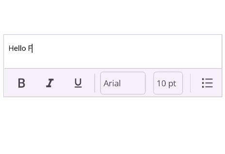

# AutoSize in .NET MAUI Rich Text Editor (SfRichTextEditor)

The .NET MAUI Rich Text Editor control can dynamically change its height to fit the content by setting the [EnableAutoSize](https://help.syncfusion.com/cr/maui/Syncfusion.Maui.RichTextEditor.SfRichTextEditor.html#Syncfusion_Maui_RichTextEditor_SfRichTextEditor_EnableAutoSize) property to `True`. By default, this property is `False`.

When [EnableAutoSize](https://help.syncfusion.com/cr/maui/Syncfusion.Maui.RichTextEditor.SfRichTextEditor.html#Syncfusion_Maui_RichTextEditor_SfRichTextEditor_EnableAutoSize)  is active, the editor’s height will grow or shrink as content is added or removed. For the best results, place the editor within a layout that can accommodate its changing height, such as a `VerticalStackLayout`.

The following example demonstrates how to place an auto-sizing [SfRichTextEditor](https://help.syncfusion.com/cr/maui/Syncfusion.Maui.RichTextEditor.SfRichTextEditor.html) inside a `VerticalStackLayout`.





<VerticalStackLayout>
    <rte:SfRichTextEditor x:Name="richTextEditor"
                          EnableAutoSize="True"/>
</VerticalStackLayout>





VerticalStackLayout verticalStackLayout = new VerticalStackLayout();
SfRichTextEditor richTextEditor = new SfRichTextEditor();
richTextEditor.EnableAutoSize = true;
verticalStackLayout.Children.Add(richTextEditor);
this.Content = verticalStackLayout;




The editor will now automatically resize to match the content's height.

N> When using `EnableAutoSize`, it is recommended not to set the `HeightRequest` property on the `SfRichTextEditor`, as this may interfere with the automatic resizing behavior.
