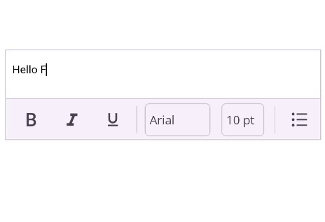

# AutoSize in .NET MAUI Rich Text Editor (SfRichTextEditor)

The [.NET MAUI Rich Text Editor](https://www.syncfusion.com/maui-controls/maui-rich-text-editor) control can dynamically change its height to fit the content by setting the [EnableAutoSize](https://help.syncfusion.com/cr/maui/Syncfusion.Maui.RichTextEditor.SfRichTextEditor.html#Syncfusion_Maui_RichTextEditor_SfRichTextEditor_EnableAutoSize) property to `True`.

By default, `EnableAutoSize` is `False`. In this state, the SfRichTextEditor maintains a fixed height based on the HeightRequest value, the parent layout's constraints, or the control's default height — in that order of precedence. Content that exceeds this height is scrolled within the editor, and the control does not resize.

When `EnableAutoSize` is active, the editor’s height will grow or shrink as content is added or removed. For the best results, place the editor within a layout that can accommodate its changing height, such as a `VerticalStackLayout`.

The following example demonstrates how to place an auto-sizing [SfRichTextEditor](https://help.syncfusion.com/cr/maui/Syncfusion.Maui.RichTextEditor.SfRichTextEditor.html) inside a `VerticalStackLayout`.




xmlns:richTextEditor="clr-namespace:Syncfusion.Maui.RichTextEditor;assembly=Syncfusion.Maui.RichTextEditor"

<VerticalStackLayout>
    <richTextEditor:SfRichTextEditor x:Name="richTextEditor"
                          EnableAutoSize="True"/>
</VerticalStackLayout>




using Syncfusion.Maui.RichTextEditor;

VerticalStackLayout verticalStackLayout = new VerticalStackLayout();
SfRichTextEditor richTextEditor = new SfRichTextEditor();
richTextEditor.EnableAutoSize = true;
verticalStackLayout.Children.Add(richTextEditor);
this.Content = verticalStackLayout;




The editor will now automatically resize to match the content's height.

N> When using `EnableAutoSize`, it is recommended not to set the `HeightRequest` property on the `SfRichTextEditor`, as this may interfere with the automatic resizing behavior. Setting the `WidthRequest` property does not affect auto-sizing, since `EnableAutoSize` only adjusts the editor's height to fit its content.