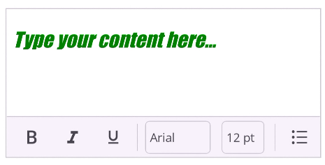

# Basic Features in .NET MAUI Rich Text Editor (SfRichTextEditor)

This section covers the essential properties, methods, and events of the .NET MAUI `SfRichTextEditor` for handling content and user interactions.

## Handling Content

### Setting and Getting HTML Content

The rich content of the editor, including all formatting, is accessible through the `Text` property. You can use this property to both load and retrieve the content as an HTML string.





<rte:SfRichTextEditor Text="The Syncfusion .NET MAUI Rich Text Editor is a WYSIWYG editor for creating and editing rich text content." />





SfRichTextEditor richTextEditor = new SfRichTextEditor();
richTextEditor.Text = "The Syncfusion .NET MAUI Rich Text Editor is a WYSIWYG editor for creating and editing rich text content.";
this.Content = richTextEditor;





### Getting HTML Content Asynchronously

To ensure you get the most up-to-date content, especially after recent edits, you can retrieve the HTML string asynchronously using the `GetHtmlString` method.





string htmlContent = await rte.GetHtmlText();





### Getting Selected HTML

To retrieve the HTML representation of the currently selected content, use the `GetSelectedText` method.





string selectedText = await rte.GetSelectedText();





## Placeholder

The editor can display a placeholder text when the content is empty. This is useful for prompting the user. The placeholder is cleared as soon as the user starts typing.





<rte:SfRichTextEditor Placeholder="Type Here..." />





SfRichTextEditor richTextEditor = new SfRichTextEditor();
richTextEditor.Placeholder = "Type Here...";





## Events

### TextChanged Event

The `TextChanged` event is fired whenever the content in the editor is changed. The event arguments provide the old and new HTML content.





<rte:SfRichTextEditor TextChanged="OnTextChanged" />





private void OnTextChanged(object sender, RichTextEditorTextChangedEventArgs e)
{
    string oldHtml = e.OldValue;
    string newHtml = e.NewValue;
    // Logic to execute when the Text changes.
}





### FormatChanged Event

The `FormatChanged` event is Occurs when the formatting status changes. This is useful for implementing contextual formatting options.





<rte:SfRichTextEditor FormatChanged="OnFormatChanged" />





private void OnFormatChanged(object sender, RichTextEditorFormatChangedEventArgs e)
{
    // Logic to execute when the Format changes.
}





### HyperlinkClicked Event

The `HyperlinkClicked` event is fired when a user taps on a hyperlink within the content. The event arguments contain the URL and the text of the Clicked link.





<rte:SfRichTextEditor HyperlinkClicked="OnHyperlinkClicked"/>





SfRichTextEditor richTextEditor = new SfRichTextEditor();
richTextEditor.Text = "
Visit the <a href='https://www.syncfusion.com'>Syncfusion</a> website.
";
richTextEditorHyperlinkClicked += OnHyperlinkClicked

private void OnHyperlinkClicked(object sender, RichTextEditorHyperlinkClickedEventArgs e)
{
    string url =  e.URL;
    string text = e.DisplayText;
    // You can handle the navigation here, for example:
}





## Focus Management

You can programmatically set or remove focus from the editor control using the `Focus()` and `Unfocus()` methods.





// To set focus on the Rich Text Editor
richTextEditor.Focus();

// To remove focus from the Rich Text Editor
richTextEditor.Unfocus();



