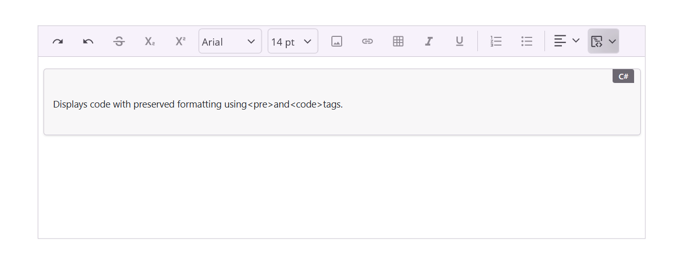

# Code block support in .NET MAUI Rich Text Editor

The [.NET MAUI SfRichTextEditor](https://help.syncfusion.com/cr/maui/Syncfusion.Maui.RichTextEditor.SfRichTextEditor.html) includes built-in support for inserting and managing code blocks. This feature enables developers and end users to embed formatted code snippets within rich text content while preserving structure, readability, and formatting consistency.

Code blocks are especially useful in applications that involve technical documentation, blogging platforms, or developer-centric tools.

## Insert code block

You can insert a code block using the `CodeBlock` toolbar item available in the rich text editor toolbar.

### Example




xmlns:richTextEditor="clr-namespace:Syncfusion.Maui.RichTextEditor;assembly=Syncfusion.Maui.RichTextEditor"

 <richTextEditor:SfRichTextEditor ShowToolbar="True">
        <richTextEditor:SfRichTextEditor.ToolbarItems>
            <richTextEditor:RichTextToolbarItem Type="CodeBlock" />
        </richTextEditor:SfRichTextEditor.ToolbarItems>
</richTextEditor:SfRichTextEditor>




using Syncfusion.Maui.RichTextEditor;

// Create the Rich Text Editor
SfRichTextEditor richTextEditor = new SfRichTextEditor
{
    ShowToolbar = true
};

// Add CodeBlock toolbar item
// For default toolbar behavior, see: https://help.syncfusion.com/maui/rich-text-editor/toolbar#customizing-the-toolbar
richTextEditor.ToolbarItems.Add(new RichTextToolbarItem
{
    Type = RichTextToolbarOptions.CodeBlock
});





