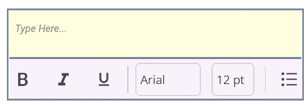

# Customization in .NET MAUI Rich Text Editor (SfRichTextEditor)

The .NET MAUI Rich Text Editor control provides extensive options for customizing its appearance and functionality, from the toolbar and editor area to programmatic formatting and hyperlink management.

## Customizing Editor Appearance

The [SfRichTextEditor](https://help.syncfusion.com/cr/maui/Syncfusion.Maui.RichTextEditor.SfRichTextEditor.html) provides several properties to customize the appearance of the main editor area, including its background, border, and text wrapping behavior.

*   [EditorBackgroundColor](https://help.syncfusion.com/cr/maui/Syncfusion.Maui.RichTextEditor.SfRichTextEditor.html#Syncfusion_Maui_RichTextEditor_SfRichTextEditor_EditorBackgroundColor): Sets the background color of the content area.
*   [BorderColor](https://help.syncfusion.com/cr/maui/Syncfusion.Maui.RichTextEditor.SfRichTextEditor.html#Syncfusion_Maui_RichTextEditor_SfRichTextEditor_BorderColor): Sets the color of the border around the editor control.
*   [BorderThickness](https://help.syncfusion.com/cr/maui/Syncfusion.Maui.RichTextEditor.SfRichTextEditor.html#Syncfusion_Maui_RichTextEditor_SfRichTextEditor_BorderThickness): Sets the thickness of the border.
*   [EnableWordWrap](https://help.syncfusion.com/cr/maui/Syncfusion.Maui.RichTextEditor.SfRichTextEditor.html#Syncfusion_Maui_RichTextEditor_SfRichTextEditor_EnableWordWrap): Specifies whether text should wrap when it reaches the edge of the editor. By default, this is `True`.




<rte:SfRichTextEditor EditorBackgroundColor="LightYellow"
                      BorderColor="SlateGray"
                      BorderThickness="2"
                      EnableWordWrap="True" />




SfRichTextEditor richTextEditor = new SfRichTextEditor();
richTextEditor.EditorBackgroundColor = Colors.LightYellow;
richTextEditor.BorderColor = Colors.SlateGray;
richTextEditor.BorderThickness = 2;
richTextEditor.EnableWordWrap = true;




## Programmatic Formatting

The `SfRichTextEditor` provides a comprehensive set of methods to apply formatting programmatically. These methods are useful when you want to create your own custom UI for formatting or apply styles dynamically without relying on the built-in toolbar.

The following code examples assume you have an instance of `SfRichTextEditor` named `richTextEditor`.

### Toggling Character Formatting

You can easily toggle common text styles like bold, italic, and underline on the current text selection.

*   [ToggleBold()](https://help.syncfusion.com/cr/maui/Syncfusion.Maui.RichTextEditor.SfRichTextEditor.html#Syncfusion_Maui_RichTextEditor_SfRichTextEditor_ToggleBold): Toggles the bold style.
*   [ToggleItalic()](https://help.syncfusion.com/cr/maui/Syncfusion.Maui.RichTextEditor.SfRichTextEditor.html#Syncfusion_Maui_RichTextEditor_SfRichTextEditor_ToggleItalic): Toggles the italic style.
*   [ToggleUnderline()](https://help.syncfusion.com/cr/maui/Syncfusion.Maui.RichTextEditor.SfRichTextEditor.html#Syncfusion_Maui_RichTextEditor_SfRichTextEditor_ToggleUnderline) : Toggles the underline style.
*   [ToggleStrikethrough()](https://help.syncfusion.com/cr/maui/Syncfusion.Maui.RichTextEditor.SfRichTextEditor.html#Syncfusion_Maui_RichTextEditor_SfRichTextEditor_ToggleStrikethrough): Toggles the strikethrough style.
*   [ToggleSubscript()](https://help.syncfusion.com/cr/maui/Syncfusion.Maui.RichTextEditor.SfRichTextEditor.html#Syncfusion_Maui_RichTextEditor_SfRichTextEditor_ToggleSubscript): Toggles the subscript style.
*   [ToggleSuperscript()](https://help.syncfusion.com/cr/maui/Syncfusion.Maui.RichTextEditor.SfRichTextEditor.html#Syncfusion_Maui_RichTextEditor_SfRichTextEditor_ToggleSuperscript): Toggles the superscript style.




// Toggle bold on the selected text
richTextEditor.ToggleBold();

// Toggle italic on the selected text
richTextEditor.ToggleItalic();

// Toggle underline on the selected text
richTextEditor.ToggleUnderline();




### Toggling List Formatting

You can format the selected paragraphs as a bulleted or numbered list.

*   [ToggleBulletList()](https://help.syncfusion.com/cr/maui/Syncfusion.Maui.RichTextEditor.SfRichTextEditor.html#Syncfusion_Maui_RichTextEditor_SfRichTextEditor_ToggleBulletList): Toggles a bulleted list for the selected paragraphs.
*   [ToggleNumberList()](https://help.syncfusion.com/cr/maui/Syncfusion.Maui.RichTextEditor.SfRichTextEditor.html#Syncfusion_Maui_RichTextEditor_SfRichTextEditor_ToggleNumberedList): Toggles a numbered list for the selected paragraphs.




// Apply or remove a bulleted list from the current paragraph
richTextEditor.ToggleBulletList();

// Apply or remove a numbered list from the current paragraph
richTextEditor.ToggleNumberList();




### Applying Text Alignment

These methods allow you to set the text alignment for the selected paragraphs.

*   [AlignLeft()](https://help.syncfusion.com/cr/maui/Syncfusion.Maui.RichTextEditor.SfRichTextEditor.html#Syncfusion_Maui_RichTextEditor_SfRichTextEditor_AlignLeft): Aligns the text to the left.
*   [AlignRight()](https://help.syncfusion.com/cr/maui/Syncfusion.Maui.RichTextEditor.SfRichTextEditor.html#Syncfusion_Maui_RichTextEditor_SfRichTextEditor_AlignRight) : Aligns the text to the right.
*   [AlignCenter()](https://help.syncfusion.com/cr/maui/Syncfusion.Maui.RichTextEditor.SfRichTextEditor.html#Syncfusion_Maui_RichTextEditor_SfRichTextEditor_AlignCenter) : Centers the text.
*   [AlignJustify()](https://help.syncfusion.com/cr/maui/Syncfusion.Maui.RichTextEditor.SfRichTextEditor.html#Syncfusion_Maui_RichTextEditor_SfRichTextEditor_AlignJustify): Justifies the text.




// Justify the text in the current paragraph
richTextEditor.AlignJustify();

// Align the text to the right
richTextEditor.AlignRight();




### Applying Specific Styles

These methods apply a specific value for a given formatting attribute to the current selection.

*   [ApplyFontFamily(string fontName)](https://help.syncfusion.com/cr/maui/Syncfusion.Maui.RichTextEditor.SfRichTextEditor.html#Syncfusion_Maui_RichTextEditor_SfRichTextEditor_ApplyFontFamily_System_String_): Applies the specified font family.
*   [ApplyFontSize(double fontSize)](https://help.syncfusion.com/cr/maui/Syncfusion.Maui.RichTextEditor.SfRichTextEditor.html#Syncfusion_Maui_RichTextEditor_SfRichTextEditor_ApplyFontSize_System_Double_): Applies the specified font size.
*   [ApplyTextColor(Color textColor)](https://help.syncfusion.com/cr/maui/Syncfusion.Maui.RichTextEditor.SfRichTextEditor.html#Syncfusion_Maui_RichTextEditor_SfRichTextEditor_ApplyTextColor_Microsoft_Maui_Graphics_Color_): Applies the specified text color.
*   [ApplyHighlightColor(Color highlightColor)](https://help.syncfusion.com/cr/maui/Syncfusion.Maui.RichTextEditor.SfRichTextEditor.html#Syncfusion_Maui_RichTextEditor_SfRichTextEditor_ApplyHighlightColor_Microsoft_Maui_Graphics_Color_): Applies the specified highlight color.
*   [ApplyParagraphFormat(RichTextEditorParagraphFormat format)](https://help.syncfusion.com/cr/maui/Syncfusion.Maui.RichTextEditor.SfRichTextEditor.html#Syncfusion_Maui_RichTextEditor_SfRichTextEditor_ApplyParagraphFormat_Syncfusion_Maui_RichTextEditor_RichTextEditorParagraphFormat_): Applies a paragraph format, such as a heading.




// Apply a new font family and size
richTextEditor.ApplyFontFamily("Arial");
richTextEditor.ApplyFontSize(18);

// Apply a text color and highlight color
richTextEditor.ApplyTextColor(Colors.Blue);
richTextEditor.ApplyHighlightColor(Colors.Yellow);

// Format the current paragraph as a heading 1
richTextEditor.ApplyParagraphFormat(RichTextEditorParagraphFormat.Heading1);




## Managing Hyperlinks

The [SfRichTextEditor](https://help.syncfusion.com/cr/maui/Syncfusion.Maui.RichTextEditor.SfRichTextEditor.html) allows you to programmatically insert, edit, and remove hyperlinks from the content.

### Insert a Hyperlink

Use the [InsertHyperlink(string displayText, string Url)](https://help.syncfusion.com/cr/maui/Syncfusion.Maui.RichTextEditor.SfRichTextEditor.html#Syncfusion_Maui_RichTextEditor_SfRichTextEditor_InsertHyperlink_System_String_System_String_) method to add a new hyperlink at the current cursor position or over the selected text.

*   `displayText`: The text to be displayed for the hyperlink.
*   `Url`: The URL the hyperlink will point to.




// Insert a new hyperlink
richTextEditor.InsertHyperlink("Example", "https://example.com");




### Edit a Hyperlink

Use the [EditHyperlink(string text, string oldUrl, string newUrl)](https://help.syncfusion.com/cr/maui/Syncfusion.Maui.RichTextEditor.SfRichTextEditor.html#Syncfusion_Maui_RichTextEditor_SfRichTextEditor_EditHyperlink_System_String_System_String_System_String_) method to modify an existing hyperlink. You can change its target URL.

*   `text`: The existing display text for the hyperlink.
*   `oldUrl`: The original URL of the hyperlink you want to edit.
*   `newUrl`: The new URL for the hyperlink.




// Change the URL of an existing hyperlink
richTextEditor.InsertHyperlink("Example", "https://example.com", "https://www.google.com/");




### Remove a Hyperlink

Use the [RemoveHyperlink(string text, string Url)](https://help.syncfusion.com/cr/maui/Syncfusion.Maui.RichTextEditor.SfRichTextEditor.html#Syncfusion_Maui_RichTextEditor_SfRichTextEditor_RemoveHyperlink_System_String_System_String_) method to remove a hyperlink from the document. The link's text will remain in place as plain text.

*   `text`: The display text of the hyperlink to remove.
*   `Url`: The URL of the hyperlink to remove.




// Remove a specific hyperlink, keeping its text
richTextEditor.RemoveHyperlink("Example", "https://www.google.com/");




