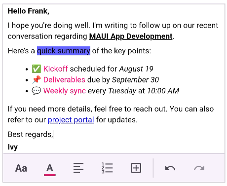

# Getting Started with .NET MAUI Rich Text Editor

This section guides you through setting up and configuring a **Rich Text Editor** in your .NET MAUI application. Follow the steps below to add a basic Rich Text Editor to your project.

To get start quickly with our [.NET MAUI Rich Text Editor](https://help.syncfusion.com/cr/maui/Syncfusion.Maui.RichTextEditor.SfRichTextEditor.html), you can check the below video.






## Prerequisites

Before proceeding, ensure the following are in place:

1. Install [.NET 8 SDK](https://dotnet.microsoft.com/en-us/download/dotnet/8.0) or later.
2. Set up a .NET MAUI environment with Visual Studio 2022 (v17.8 or later).

## Step 1: Create a New MAUI Project

1. Go to **File > New > Project** and choose the **.NET MAUI App** template.
2. Name the project and choose a location. Then, click **Next**.
3. Select the .NET framework version and click **Create**.

## Step 2: Install the Syncfusion®.MAUI RichTextEditor NuGet Package

1. In **Solution Explorer**, right-click the project and choose **Manage NuGet Packages**.
2. Search for and install the latest version.
3. Ensure the necessary dependencies are installed correctly, and the project is restored.

## Step 3: Register the Handler

[Syncfusion.Maui.Core](https://www.nuget.org/packages/Syncfusion.Maui.Core) nuget is a dependent package for all Syncfusion® controls of .NET MAUI. In the **MauiProgram.cs file**, register the handler for Syncfusion® core.



using Microsoft.Maui;
using Microsoft.Maui.Hosting;
using Microsoft.Maui.Controls.Compatibility;
using Microsoft.Maui.Controls.Hosting;
using Microsoft.Maui.Controls.Xaml;
using Syncfusion.Maui.Core.Hosting;

namespace RichTextEditorSample
{
    public static class MauiProgram
    {
        public static MauiApp CreateMauiApp()
        {
            var builder = MauiApp.CreateBuilder();
            builder
            .UseMauiApp<App>()
            .ConfigureSyncfusionCore()
            .ConfigureFonts(fonts =>
            {
                fonts.AddFont("OpenSans-Regular.ttf", "OpenSansRegular");
            });

            return builder.Build();
        }      
    }
}   

 

## Step 4: Add a Basic Rich Text Editor

Step 1: Add the namespace as shown in the following code sample.




    xmlns:rte="clr-namespace:Syncfusion.Maui.RichTextEditor;assembly=Syncfusion.Maui.RichTextEditor"




    using Syncfusion.Maui.RichTextEditor;




Step 2: Add the [SfRichTextEditor](https://help.syncfusion.com/cr/maui/Syncfusion.Maui.RichTextEditor.SfRichTextEditor.html) control with a required optimal name using the included namespace.





<?xml version="1.0" encoding="utf-8" ?>
<ContentPage xmlns="http://schemas.microsoft.com/dotnet/2021/maui"
             xmlns:x="http://schemas.microsoft.com/winfx/2009/xaml"
             xmlns:rte="clr-namespace:Syncfusion.Maui.RichTextEditor;assembly=Syncfusion.Maui.RichTextEditor"
             x:Class="RichTextEditorSample.MainPage">
    <Grid>
        <rte:SfRichTextEditor />
    </Grid>
</ContentPage>
	


		

using Syncfusion.Maui.RichTextEditor;

namespace RichTextEditorSample
{
    public partial class MainPage : ContentPage
    {
        public MainPage()
        {
            InitializeComponent();
            SfRichTextEditor richTextEditor = new SfRichTextEditor();
            this.Content = richTextEditor;
        }
    }
}
        







## Prerequisites

Before proceeding, ensure the following are set up:

1. Install [.NET 8 SDK](https://dotnet.microsoft.com/en-us/download/dotnet/8.0) or later is installed.
2. Set up a .NET MAUI environment with Visual Studio Code.
3. Ensure that the .NET MAUI extension is installed and configured as described [here.](https://learn.microsoft.com/en-us/dotnet/maui/get-started/installation?view=net-maui-8.0&tabs=visual-studio-code)

## Step 1: Create a New .NET MAUI Project

1. Open the Command Palette by pressing **Ctrl+Shift+P** and type **.NET:New Project** and press Enter.
2. Choose the **.NET MAUI App** template.
3. Select the project location, type the project name and press Enter.
4. Then choose **Create project**

## Step 2: Install the Syncfusion®.MAUI RichTextEditor NuGet Package

1. Press <kbd>Ctrl</kbd> + <kbd>`</kbd> (backtick) to open the integrated terminal in Visual Studio Code.
2. Ensure you're in the project root directory where your .csproj file is located.
3. Run the command `dotnet add package Syncfusion.Maui.RichTextEditor` to install the Syncfusion .NET MAUI Rich Text Editor package.
4. To ensure all dependencies are installed, run `dotnet restore`.

## Step 3: Register the Handler

[Syncfusion.Maui.Core](https://www.nuget.org/packages/Syncfusion.Maui.Core) nuget is a dependent package for all Syncfusion® controls of .NET MAUI. In the **MauiProgram.cs file**, register the handler for Syncfusion® core.



using Microsoft.Maui;
using Microsoft.Maui.Hosting;
using Microsoft.Maui.Controls.Compatibility;
using Microsoft.Maui.Controls.Hosting;
using Microsoft.Maui.Controls.Xaml;
using Syncfusion.Maui.Core.Hosting;

namespace RichTextEditorSample
{
    public static class MauiProgram
    {
        public static MauiApp CreateMauiApp()
        {
            var builder = MauiApp.CreateBuilder();
            builder
            .UseMauiApp<App>()
            .ConfigureSyncfusionCore()
            .ConfigureFonts(fonts =>
            {
                fonts.AddFont("OpenSans-Regular.ttf", "OpenSansRegular");
            });

            return builder.Build();
        }      
    }
}   

 

## Step 4: Add a Basic Rich Text Editor

Step 1: Add the namespace as shown in the following code sample.




    xmlns:rte="clr-namespace:Syncfusion.Maui.RichTextEditor;assembly=Syncfusion.Maui.RichTextEditor"




    using Syncfusion.Maui.RichTextEditor;




Step 2: Add the [SfRichTextEditor](https://help.syncfusion.com/cr/maui/Syncfusion.Maui.RichTextEditor.SfRichTextEditor.html) control with a required optimal name using the included namespace.





<?xml version="1.0" encoding="utf-8" ?>
<ContentPage xmlns="http://schemas.microsoft.com/dotnet/2021/maui"
             xmlns:x="http://schemas.microsoft.com/winfx/2009/xaml"
             xmlns:rte="clr-namespace:Syncfusion.Maui.RichTextEditor;assembly=Syncfusion.Maui.RichTextEditor"
             x:Class="RichTextEditorSample.MainPage">
    <Grid>
        <rte:SfRichTextEditor />
    </Grid>
</ContentPage>
	


		

using Syncfusion.Maui.RichTextEditor;

namespace RichTextEditorSample
{
    public partial class MainPage : ContentPage
    {
        public MainPage()
        {
            InitializeComponent();
            SfRichTextEditor richTextEditor = new SfRichTextEditor();
            this.Content = richTextEditor;
        }
    }
}
        








## Prerequisites

Before proceeding, ensure the following are set up:

1. Ensure you have the latest version of JetBrains Rider.
2. Install [.NET 8 SDK](https://dotnet.microsoft.com/en-us/download/dotnet/8.0) or later is installed.
3. Make sure the MAUI workloads are installed and configured as described [here.](https://www.jetbrains.com/help/rider/MAUI.html#before-you-start)

## Step 1: Create a new .NET MAUI Project

1. Go to **File > New Solution,** Select .NET (C#) and choose the .NET MAUI App template.
2. Enter the Project Name, Solution Name, and Location.
3. Select the .NET framework version and click Create.

## Step 2: Install the Syncfusion® MAUI RichTextEditor NuGet Package

1. In **Solution Explorer,** right-click the project and choose **Manage NuGet Packages.**
2. Search for [Syncfusion.Maui.Core](https://www.nuget.org/packages/Syncfusion.Maui.Core) and install the latest version.
3. Ensure the necessary dependencies are installed correctly, and the project is restored. If not, Open the Terminal in Rider and manually run: `dotnet restore`

## Step 3: Register the handler

Syncfusion.Maui.Core nuget is a dependent package for all Syncfusion® controls of .NET MAUI. In the **MauiProgram.cs** file, register the handler for Syncfusion® core.




using Microsoft.Maui;
using Microsoft.Maui.Hosting;
using Microsoft.Maui.Controls.Compatibility;
using Microsoft.Maui.Controls.Hosting;
using Microsoft.Maui.Controls.Xaml;
using Syncfusion.Maui.Core.Hosting;

namespace ChartGettingStarted
{
    public static class MauiProgram
    {
        public static MauiApp CreateMauiApp()
        {
            var builder = MauiApp.CreateBuilder();
            builder
            .UseMauiApp<App>()
            .ConfigureSyncfusionCore()
            .ConfigureFonts(fonts =>
            {
                fonts.AddFont("OpenSans-Regular.ttf", "OpenSansRegular");
            });

            return builder.Build();
        }
    }
}

 


## Step 4: Add a Basic Rich Text Editor

Step 1: Add the namespace as shown in the following code sample.




    xmlns:rte="clr-namespace:Syncfusion.Maui.RichTextEditor;assembly=Syncfusion.Maui.RichTextEditor"




    using Syncfusion.Maui.RichTextEditor;




Step 2: Add the [SfRichTextEditor](https://help.syncfusion.com/cr/maui/Syncfusion.Maui.RichTextEditor.SfRichTextEditor.html) control with a required optimal name using the included namespace.





<?xml version="1.0" encoding="utf-8" ?>
<ContentPage xmlns="http://schemas.microsoft.com/dotnet/2021/maui"
             xmlns:x="http://schemas.microsoft.com/winfx/2009/xaml"
             xmlns:rte="clr-namespace:Syncfusion.Maui.RichTextEditor;assembly=Syncfusion.Maui.RichTextEditor"
             x:Class="RichTextEditorSample.MainPage">
    <Grid>
        <rte:SfRichTextEditor />
    </Grid>
</ContentPage>
	


		

using Syncfusion.Maui.RichTextEditor;

namespace RichTextEditorSample
{
    public partial class MainPage : ContentPage
    {
        public MainPage()
        {
            InitializeComponent();
            SfRichTextEditor richTextEditor = new SfRichTextEditor();
            this.Content = richTextEditor;
        }
    }
}
        








## Enable the Toolbar

The [SfRichTextEditor](https://help.syncfusion.com/cr/maui/Syncfusion.Maui.RichTextEditor.SfRichTextEditor.html) provides a comprehensive toolbar that allows users to format their content easily. You can enable it by setting the [ShowToolbar](https://help.syncfusion.com/cr/maui/Syncfusion.Maui.RichTextEditor.SfRichTextEditor.html#Syncfusion_Maui_RichTextEditor_SfRichTextEditor_ShowToolbar) property to `True`.





<rte:SfRichTextEditor ShowToolbar="True" />





SfRichTextEditor richTextEditor = new SfRichTextEditor();
richTextEditor.ShowToolbar = true;
this.Content = richTextEditor;





## Customize Toolbar Items

By default, the toolbar shows a predefined set of items. You can customize which items are displayed by populating the [ToolbarItems](https://help.syncfusion.com/cr/maui/Syncfusion.Maui.RichTextEditor.SfRichTextEditor.html#Syncfusion_Maui_RichTextEditor_SfRichTextEditor_ToolbarItems) collection.





<rte:SfRichTextEditor ShowToolbar="True">
    <rte:SfRichTextEditor.ToolbarItems>
        <rte:RichTextToolbarItem Type="Bold" />
        <rte:RichTextToolbarItem Type="Italic" />
        <rte:RichTextToolbarItem Type="Underline" />
        <rte:RichTextToolbarItem Type="Separator" />
        <rte:RichTextToolbarItem Type="NumberList" />
        <rte:RichTextToolbarItem Type="BulletList" />
        <rte:RichTextToolbarItem Type="Separator" />
        <rte:RichTextToolbarItem Type="Hyperlink" />
        <rte:RichTextToolbarItem Type="Image" />
    </rte:SfRichTextEditor.ToolbarItems>
</rte:SfRichTextEditor>





SfRichTextEditor richTextEditor = new SfRichTextEditor();
ShowToolbar = true;
richTextEditor.ToolbarItems.Add(new RichTextToolbarItem() { Type = RichTextToolbarOptions.Bold });
richTextEditor.ToolbarItems.Add(new RichTextToolbarItem() { Type = RichTextToolbarOptions.Italic });
richTextEditor.ToolbarItems.Add(new RichTextToolbarItem() { Type = RichTextToolbarOptions.Underline });
richTextEditor.ToolbarItems.Add(new RichTextToolbarItem() { Type = RichTextToolbarOptions.Separator });
richTextEditor.ToolbarItems.Add(new RichTextToolbarItem() { Type = RichTextToolbarOptions.NumberList });
richTextEditor.ToolbarItems.Add(new RichTextToolbarItem() { Type = RichTextToolbarOptions.BulletList });
richTextEditor.ToolbarItems.Add(new RichTextToolbarItem() { Type = RichTextToolbarOptions.Separator });
richTextEditor.ToolbarItems.Add(new RichTextToolbarItem() { Type = RichTextToolbarOptions.Hyperlink });
richTextEditor.ToolbarItems.Add(new RichTextToolbarItem() { Type = RichTextToolbarOptions.Image });
this.Content = richTextEditor;





N> You can find the getting started sample of .NET MAUI SfRichTextEditor from this [link](https://github.com/SyncfusionExamples/maui-richtexteditor-samples).

