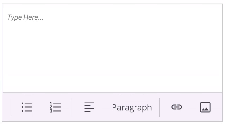

# Image Insertion in .NET MAUI Rich Text Editor (SfRichTextEditor)

The [SfRichTextEditor](https://help.syncfusion.com/cr/maui/Syncfusion.Maui.RichTextEditor.SfRichTextEditor.html) supports inserting images (JPEG, PNG) into the content area. Images can be added by the end-user through the toolbar or programmatically from various sources like a stream or a file path.

**Enable File Access Permission**

On MacCatalyst devices, you need to enable file access by adding the required permission in the platform specific "Entitlements.plist" file, as illustrated in the following code snippet.




<key>com.apple.security.files.user-selected.read-write</key>
<true/>




## Insert an image from the gallery

When the user taps the Image toolbar button, the [ImageRequested](https://help.syncfusion.com/cr/maui/Syncfusion.Maui.RichTextEditor.SfRichTextEditor.html#Syncfusion_Maui_RichTextEditor_SfRichTextEditor_ImageRequested) event is triggered. You can handle this event to open the device's media gallery and insert the selected image. .NET MAUI provides a built-in `IsHandled` API to select photos from the gallery.

The following example shows how to use the [ImageRequested](https://help.syncfusion.com/cr/maui/Syncfusion.Maui.RichTextEditor.SfRichTextEditor.html#Syncfusion_Maui_RichTextEditor_SfRichTextEditor_ImageRequested) to insert an image:




<rte:SfRichTextEditor x:Name="richTextEditor"
                      ShowToolbar="True"
                      ImageRequested="OnImageInserting" />




private async void OnImageInserting(object sender, RichTextEditorImageRequestedEventArgs e)
{
    e.IsHandled = true;
    RichTextEditorImageSource richTextEditorImageSource = new();
    richTextEditorImageSource.ImageFormat = RichTextEditorImageFormat.Base64;
    richTextEditorImageSource.Source =ImageSource.FromUri(new Uri("https://aka.ms/campus.jpg"));
    richTextEditorImageSource.Width = 250;
    richTextEditorImageSource.Height = 100;
    richTextEditor.InsertImage(richTextEditorImageSource);
}




