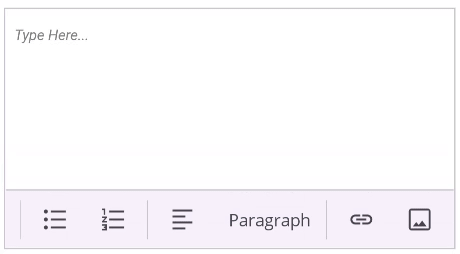

# Image Insertion in .NET MAUI Rich Text Editor (SfRichTextEditor)

The [SfRichTextEditor](https://help.syncfusion.com/cr/maui/Syncfusion.Maui.RichTextEditor.SfRichTextEditor.html) supports inserting images (JPEG, PNG) into the content area. Images can be added by the end-user through the toolbar or programmatically from various sources like a stream or a file path.

## Enable File Access Permission

On MacCatalyst devices, you need to enable file access by adding the required permission in the platform specific `Entitlements.plist` file located under Platforms → MacCatalyst → Entitlements.plist in your .NET MAUI project, as illustrated in the following code snippet.




<key>com.apple.security.files.user-selected.read-write</key>
<true/>




## Insert an image using the default picker

When the user taps the image toolbar button, the [ImageRequested](https://help.syncfusion.com/cr/maui/Syncfusion.Maui.RichTextEditor.SfRichTextEditor.html#Syncfusion_Maui_RichTextEditor_SfRichTextEditor_ImageRequested) event is triggered and the built-in image picker is launched automatically. No additional handling is required — the selected image is inserted into the editor content.

## Insert an image from a custom source

To override the default picker (for example, to insert an image from a URI, stream, or other custom source), set `e.IsHandled = true` in the `ImageRequested` handler, then call `InsertImage` with a `RichTextEditorImageSource`. 

### RichTextEditorImageSource properties

* **Source** Type: `ImageSource?` Default: `null` The image to insert. Accepts a URI, stream, file path, or resource via ImageSource.

* **ImageFormat** Type: `RichTextEditorImageFormat` Default: `Default` Specifies how the image is embedded in the editor content, as a blob URL (Default) or as a base64 string (Base64).

* **Width** Type: `double` Default: `-1` Width of the inserted image. A value of -1 uses the image's actual width.

* **Height** Type: `double` Default: `-1` Height of the inserted image. A value of -1 uses the image's actual height.

### RichTextEditorImageFormat enum members

* `Default` - Saves the image as a blob URL in the editor content.

* `Base64` - Saves the image as a base64-encoded string in the editor content.

The following example inserts an image from a remote URI:



xmlns:richTextEditor="clr-namespace:Syncfusion.Maui.RichTextEditor;assembly=Syncfusion.Maui.RichTextEditor"

<richTextEditor:SfRichTextEditor x:Name="richTextEditor"
                      ShowToolbar="True"
                      ImageRequested="OnImageInserting"/>



using Syncfusion.Maui.RichTextEditor;

SfRichTextEditor richTextEditor = new SfRichTextEditor();
richTextEditor.ImageRequested += OnImageInserting;

private async void OnImageInserting(object sender, RichTextEditorImageRequestedEventArgs e)
{
    e.IsHandled = true;
    RichTextEditorImageSource richTextEditorImageSource = new();
    richTextEditorImageSource.ImageFormat = RichTextEditorImageFormat.Base64;
    richTextEditorImageSource.Source = ImageSource.FromUri(new Uri("https://aka.ms/campus.jpg"));
    richTextEditorImageSource.Width = 250;
    richTextEditorImageSource.Height = 100;
    richTextEditor.InsertImage(richTextEditorImageSource);
}




