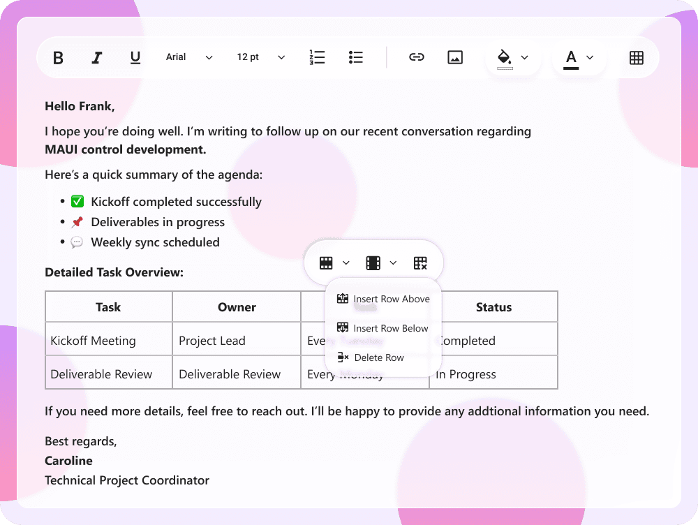

# Liquid Glass Effect in .NET MAUI RichTextEditor

The Liquid Glass Effect is a modern design style that provides a sleek, minimalist appearance with clean lines, subtle visual effects, and elegant styling. It features smooth rounded corners, refined color palettes, and sophisticated visual treatments that create a polished, professional look for your RichTextEditor.

N> The liquid glass effect is supported only on `.NET 10` and on `iOS` and `macOS` versions 26 or later

## How it Enhances RichTextEditor UI on macOS and iOS

The Liquid Glass Effect elevates the SfRichTextEditor with a modern, glassy aesthetic and a refined, high-quality editing experience.

- Toolbar:
    - Font family picker
    - Font size picker
    - Text alignment options
    - Text style pickers
    - Insert link popup
    - Table selection
    - Table context menu popup
    - Inline toolbar for links
- Editor: Presents a sleek, polished text editing area optimized for clear, focused content creation.

## Apply Liquid Glass Effect to SfRichTextEditor

To enable the Cupertino theme's liquid glass effect, set the [EnableLiquidGlassEffect](https://help.syncfusion.com/cr/maui/Syncfusion.Maui.RichTextEditor.SfRichTextEditor.html#Syncfusion_Maui_RichTextEditor_SfRichTextEditor_EnableLiquidGlassEffect) property to `True` on the SfRichTextEditor. For optimal visual appearance with a sleek and glassy output, set transparent backgrounds for both the editor and toolbar using the [EditorBackgroundColor](https://help.syncfusion.com/cr/maui/Syncfusion.Maui.RichTextEditor.SfRichTextEditor.html#Syncfusion_Maui_RichTextEditor_SfRichTextEditor_EditorBackgroundColor) property of SfRichTextEditor and the [BackgroundColor](https://help.syncfusion.com/cr/maui/Syncfusion.Maui.RichTextEditor.RichTextEditorToolbarSettings.html#Syncfusion_Maui_RichTextEditor_RichTextEditorToolbarSettings_BackgroundColor) property of ToolbarSettings.





<editor:SfRichTextEditor EnableLiquidGlassEffect="True"
                         EditorBackgroundColor="Transparent">
    <editor:SfRichTextEditor.ToolbarSettings>
        <editor:RichTextEditorToolbarSettings BackgroundColor="Transparent" />
    </editor:SfRichTextEditor.ToolbarSettings>
</editor:SfRichTextEditor>





SfRichTextEditor richTextEditor = new SfRichTextEditor()
{
    EnableLiquidGlassEffect = true,
    EditorBackgroundColor = Colors.Transparent
};

richTextEditor.ToolbarSettings = new RichTextEditorToolbarSettings()
{
    BackgroundColor = Colors.Transparent
};





#### Customize Toolbar and Editor Corner Radius

The toolbar corner radius, toolbar selection corner radius and editor corner radius can be customized using Syncfusion theme keys:





<Application xmlns="http://schemas.microsoft.com/dotnet/2021/maui"
             xmlns:x="http://schemas.microsoft.com/winfx/2009/xaml"
             xmlns:syncTheme="clr-namespace:Syncfusion.Maui.Themes;assembly=Syncfusion.Maui.Core">
    <Application.Resources>
        <ResourceDictionary>
            <ResourceDictionary.MergedDictionaries>
                <syncTheme:SyncfusionThemeResourceDictionary VisualTheme="CupertinoLight"/>
                <ResourceDictionary>
                    <sys:Double x:Key="SfRichTextEditorToolbarCornerRadius">25</sys:Double>
                    <sys:Double x:Key="SfRichTextEditorToolbarSelectionCornerRadius">25</sys:Double>
                    <sys:Double x:Key="SfRichTextEditorCornerRadius">15</sys:Double>
                </ResourceDictionary>
            </ResourceDictionary.MergedDictionaries>
        </ResourceDictionary>
    </Application.Resources>
</Application>





