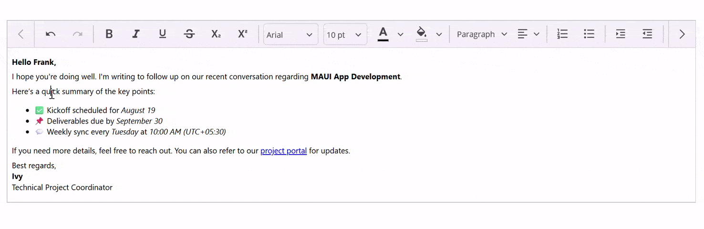

# .NET MAUI Rotator (SfRotator) Overview

The .NET MAUI Rich Text Editor provides a simple yet powerful editor interface to compose richly formatted text with all the common formatting options like bold and italics. The Rich Text Editor is used to create messaging applications, email composers, blog editors, forum post text boxes, feedback and review sections, notes sections, and more. It has a variety of tools to edit and format rich content and returns valid HTML markup content.

## Key features

* `WYSIWYG editing` - Offers a user-friendly, what-you-see-is-what-you-get editing experience for formatted text.
* `Comprehensive formatting tools` - Supports bold, italic, underline, strikethrough, font family, font size, text color, background highlighting, lists, indentation, alignment, and more.
* `Hyperlink support` - Allows insertion and editing of hyperlinks within the editor.
* `Insert images and tables` - Enables seamless embedding of images and tables within the editor.
* `Customizable toolbar` - Includes a rich, configurable toolbar for quick access to formatting actions. Developers can show, hide, or customize toolbar items.
* `Copy, paste, and cut` - Features built-in clipboard operations for user convenience.
* `Undo and redo` - Provides robust undo and redo history for user-friendly editing.
* `Clear formatting` - Includes an option to reset formatting and styles for selected text.
* `Localization and accessibility` - Supports right-to-left layouts and accessibility features.
