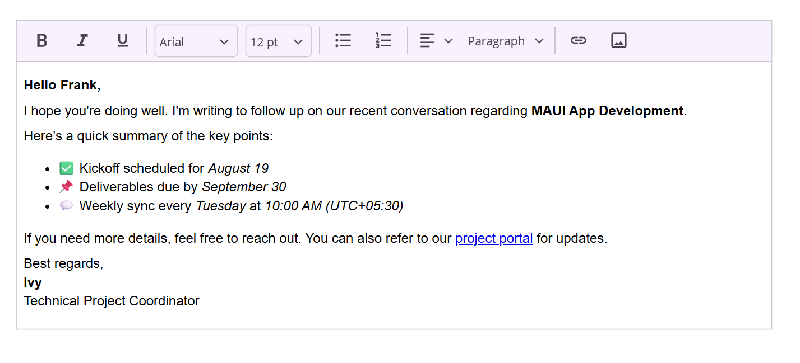

# .NET MAUI Rich Text Editor (SfRichTextEditor) Overview

The .NET MAUI Rich Text Editor provides a simple yet powerful editor interface to compose richly formatted text with all the common formatting options like bold and italics. The Rich Text Editor is used to create messaging applications, email composers, blog editors, forum post text boxes, feedback and review sections, notes sections, and more. It has a variety of tools to edit and format rich content and returns valid HTML markup content.

## Business use cases

- Messaging and email applications that require **rich text composition with formatting options**.  
- Content management systems that allow users to **create and edit blogs, articles, or posts**.  
- Feedback and review sections that support **formatted text input with links, lists, and styling**.  
- Note-taking applications that require **structured and visually formatted content editing**.  

## Key features

- **WYSIWYG editing** allows editing content visually with real-time formatting feedback.  
- **Comprehensive formatting tools** allow applying styles such as bold, italic, underline, font size, color, alignment, lists, and indentation.  
- **Hyperlink support** allows inserting and editing links within the content.  
- **Image and table insertion** allows embedding media and structured data within the editor.  
- **Customizable toolbar** allows configuring toolbar actions and visibility based on application requirements.  
- **Clipboard operation** allows copy, paste, and cut actions for efficient editing.  
- **Undo and redo** allows managing editing history for better user control. 

## Globalization

The following table summarizes the globalization support available in the [SfRichTextEditor](https://www.syncfusion.com/maui-controls/maui-rich-text-editor) control.

 Full Support  
 No Support   

<table>
<tr>
<th align="center">Control</th>
<th align="center">Localization</th>
<th align="center">RTL</th>
<th align="center">Time zone</th>
<th align="center">Screen reader</th>
<th align="center">Keyboard navigation</th>
</tr>
<tr>
<td><a href="/maui/rich-text-editor/overview">Rich Text Editor</a></td>
<td align="center"></td>
<td align="center"></td>
<td align="center"></td>
<td align="center"></td>
<td align="center"></td>
</tr> 
</table>

## Related controls

- **[MarkdownViewer](https://help.syncfusion.com/maui/markdownviewer/overview)** for rendering formatted Markdown content in applications.  
- **[TextInputLayout](https://help.syncfusion.com/maui/textinputlayout/overview)** for enhancing simple text input fields with labels and validation.  

## Next steps

Explore further resources:

- [Getting Started](https://help.syncfusion.com/maui/rich-text-editor/getting-started) - step-by-step guide to begin using the Rich Text Editor control.  
- [Toolbar](https://help.syncfusion.com/maui/rich-text-editor/toolbar) - configure toolbar items and actions.  
- [Customization](https://help.syncfusion.com/maui/rich-text-editor/customization) - adjust look, behavior, and features to match your needs.
- [UI Kit](https://www.syncfusion.com/demos/maui#maui-ui-control) - explore interactive demos and ready‑made UI examples.

## Learnings

<!-- Card 1 -->
<a href="https://www.syncfusion.com/blogs/category/net-maui" class="form-card" target="_blank">
  

    <h3 class="form-title">Explore Blogs</h3>
    

      Read insights, tutorials, and developer journeys.
    

  

</a>
<!-- Card 2 -->
<a href="https://support.syncfusion.com/kb/cross-platforms/category/76" class="form-card" target="_blank">
  

    <h3 class="form-title">Explore KB's</h3>
    

      Find quick solutions and step‑by‑step guidance.
    

  

</a>
<!-- Card 3 -->
<a href="https://www.syncfusion.com/maui-controls/maui-rich-text-editor" class="form-card" target="_blank">
  

    <h3 class="form-title">Feature Tour</h3>
    

      Walk through highlights and core capabilities.
    

  

</a>
<!-- Card 4 -->
<a href="https://github.com/syncfusion/maui-demos/tree/master/MAUI/RichTextEditor" class="form-card" target="_blank">
  

    <h3 class="form-title">Showcase Samples</h3>
    

      Explore sample scenarios for real apps.
    

  

</a>
<!-- Card 5 -->
<a href="https://www.syncfusion.com/tutorial-videos/maui/rich-text-editor" class="form-card" target="_blank">
  

    <h3 class="form-title">Tutorial Videos</h3>
    

      Step‑by‑step guidance through video tutorials.
    

  

</a>
