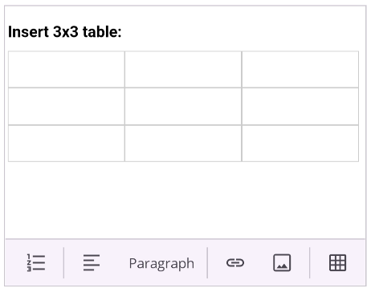

# Table Insertion in .NET MAUI Rich Text Editor (SfRichTextEditor)

The [SfRichTextEditor](https://help.syncfusion.com/cr/maui/Syncfusion.Maui.RichTextEditor.SfRichTextEditor.html) allows users to organize content in a structured format by creating, editing, and formatting tables. Tables can be added by the end-user through the toolbar or programmatically.

## Insert a table from the toolbar

The most common way to insert a table is by using the **Table** item on the toolbar. When the user taps this button, a dialog appears, allowing them to specify the number of rows and columns for the new table.

To enable this functionality, ensure the `Table` toolbar item is included in your [ToolbarItems](https://help.syncfusion.com/cr/maui/Syncfusion.Maui.RichTextEditor.SfRichTextEditor.html#Syncfusion_Maui_RichTextEditor_SfRichTextEditor_ToolbarItems) collection.




<rte:SfRichTextEditor ShowToolbar="True">
    <rte:SfRichTextEditor.ToolbarItems>
        <rte:RichTextToolbarItem Type="FontFamily" />
        <rte:RichTextToolbarItem Type="FontSize" />
        <rte:RichTextToolbarItem Type="Separator" />
        <rte:RichTextToolbarItem Type="Bold" />
        <rte:RichTextToolbarItem Type="Italic" />
        <rte:RichTextToolbarItem Type="Underline" />
        <rte:RichTextToolbarItem Type="Separator" />
        <!-- Add the Table toolbar item -->
        <rte:RichTextToolbarItem Type="Table" />
        <rte:RichTextToolbarItem Type="Separator" />
        <rte:RichTextToolbarItem Type="Hyperlink" />
        <rte:RichTextToolbarItem Type="Image" />
    </rte:SfRichTextEditor.ToolbarItems>
</rte:SfRichTextEditor>




## Programmatic table insertion

You can insert a table into the editor programmatically using the [InsertTable](https://help.syncfusion.com/cr/maui/Syncfusion.Maui.RichTextEditor.SfRichTextEditor.html#Syncfusion_Maui_RichTextEditor_SfRichTextEditor_InsertTable_System_Int32_System_Int32_) method. This method requires the number of rows and columns as arguments.

The following example demonstrates how to insert a 3x3 table at the current cursor position.




richtexteditor.InsertTable(3, 3);




