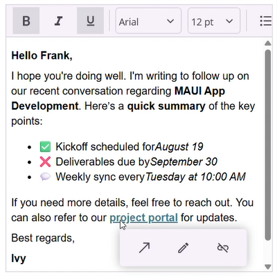

# Toolbar in .NET MAUI Rich Text Editor (SfRichTextEditor)

## Toolbar position

The Rich Text Editor allows you to position the toolbar at the top or bottom of the content area, depending on your layout requirements. By default, the toolbar appears at the top on Windows and macOS, and at the bottom on Android and iOS for better accessibility.





<rte:SfRichTextEditor ToolbarPosition="Bottom" />





SfRichTextEditor richTextEditor = new SfRichTextEditor();
richTextEditor.ToolbarPosition = RichTextEditorToolbarPosition.Bottom;




## Link quick toolbar

The link quick toolbar appears when you click on a link in the editor. The Rich Text Editor provides essential tools in the link quick toolbar, including “Open”, “Edit Link” and “Remove Link”.

