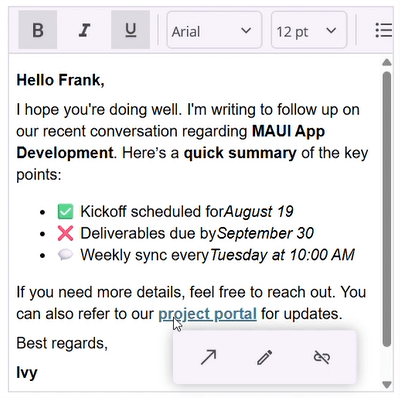
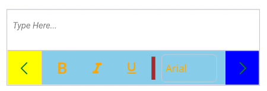

# Toolbar in .NET MAUI Rich Text Editor (SfRichTextEditor)

## Toolbar position

The Rich Text Editor allows you to position the toolbar at the top or bottom of the content area, depending on your layout requirements. By default, the toolbar appears at the top on Windows and macOS, and at the bottom on Android and iOS for better accessibility.





<rte:SfRichTextEditor ToolbarPosition="Bottom" />





SfRichTextEditor richTextEditor = new SfRichTextEditor();
richTextEditor.ToolbarPosition = RichTextEditorToolbarPosition.Bottom;




## Inline tooltip for link

The link quick tooltip appears when you click on a link in the editor. The Rich Text Editor provides essential tools in the link quick tooltip, including “Open”, “Edit Link” and “Remove Link”.

N> The link quick tooltip will automatically disappear after 2 seconds if there is no user interaction.

## Customizing the Toolbar

The [SfRichTextEditor](https://help.syncfusion.com/cr/maui/Syncfusion.Maui.RichTextEditor.SfRichTextEditor.html) toolbar is highly customizable, allowing you to control its items, styling, and position.

### Add or Remove Toolbar Items

By default, the toolbar includes a comprehensive set of formatting tools. You can specify a custom set of items by populating the [ToolbarItems](https://help.syncfusion.com/cr/maui/Syncfusion.Maui.RichTextEditor.SfRichTextEditor.html#Syncfusion_Maui_RichTextEditor_SfRichTextEditor_ToolbarItems) collection. This allows you to add or remove any built-in toolbar item.

The following items are available to be added to the `ToolbarItems` collection:
*   `Bold`, `Italic`, `Underline`, `Strikethrough`
*   `SubScript`, `SuperScript`
*   `FontFamily`, `FontSize`, `TextColor`, `HighlightColor`
*   `ParagraphFormat` , `Alignment`
*   `NumberList`, `BulletList`
*   `IncreaseIndent`, `DecreaseIndent`
*   `Hyperlink`, `Image`, `Table`
*   `Undo`, `Redo`
*   `Separator`




<rte:SfRichTextEditor ShowToolbar="True">
    <rte:SfRichTextEditor.ToolbarItems>
        <!-- Define a custom set of toolbar items -->
        <rte:RichTextToolbarItem Type="Bold" />
        <rte:RichTextToolbarItem Type="Italic" />
        <rte:RichTextToolbarItem Type="Underline" />
        <rte:RichTextToolbarItem Type="Separator" />
        <rte:RichTextToolbarItem Type="NumberList" />
        <rte:RichTextToolbarItem Type="BulletList" />
    </rte:SfRichTextEditor.ToolbarItems>
</rte:SfRichTextEditor>




SfRichTextEditor richTextEditor = new SfRichTextEditor();
richTextEditor.ShowToolbar = true;
richTextEditor.ToolbarItems.Add(new RichTextToolbarItem() { Type = RichTextToolbarOptions.Bold });
richTextEditor.ToolbarItems.Add(new RichTextToolbarItem() { Type = RichTextToolbarOptions.Italic });
richTextEditor.ToolbarItems.Add(new RichTextToolbarItem() { Type = RichTextToolbarOptions.Underline });
richTextEditor.ToolbarItems.Add(new RichTextToolbarItem() { Type = RichTextToolbarOptions.Separator });
richTextEditor.ToolbarItems.Add(new RichTextToolbarItem() { Type = RichTextToolbarOptions.NumberList });
richTextEditor.ToolbarItems.Add(new RichTextToolbarItem() { Type = RichTextToolbarOptions.BulletList });




### Customize Toolbar Appearance

You can customize the visual style of the toolbar using the `ToolbarSettings` property. This gives you access to the [RichTextEditorToolbarSettings](https://help.syncfusion.com/cr/maui/Syncfusion.Maui.RichTextEditor.RichTextEditorToolbarSettings.html) object, which has several properties for changing its appearance.

*   [BackgroundColor](https://help.syncfusion.com/cr/maui/Syncfusion.Maui.RichTextEditor.RichTextEditorToolbarSettings.html#Syncfusion_Maui_RichTextEditor_RichTextEditorToolbarSettings_BackgroundColor): Sets the Background color or brush of the toolbar.
*   [TextColor](https://help.syncfusion.com/cr/maui/Syncfusion.Maui.RichTextEditor.RichTextEditorToolbarSettings.html#Syncfusion_Maui_RichTextEditor_RichTextEditorToolbarSettings_TextColor) : Sets the color of the toolbar item icons.
*   [IsScrollButtonVisible](https://help.syncfusion.com/cr/maui/Syncfusion.Maui.RichTextEditor.RichTextEditorToolbarSettings.html#Syncfusion_Maui_RichTextEditor_RichTextEditorToolbarSettings_IsScrollButtonVisible): Sets the scroll button visibility.
*   [SeparatorColor](https://help.syncfusion.com/cr/maui/Syncfusion.Maui.RichTextEditor.RichTextEditorToolbarSettings.html#Syncfusion_Maui_RichTextEditor_RichTextEditorToolbarSettings_SeparatorColor): Sets the color of the separator lines between toolbar items.
*   [SeparatorThickness](https://help.syncfusion.com/cr/maui/Syncfusion.Maui.RichTextEditor.RichTextEditorToolbarSettings.html#Syncfusion_Maui_RichTextEditor_RichTextEditorToolbarSettings_SeparatorThickness): Sets the thickness of the separator lines.
*   [ForwardIconBackground](https://help.syncfusion.com/cr/maui/Syncfusion.Maui.RichTextEditor.RichTextEditorToolbarSettings.html#Syncfusion_Maui_RichTextEditor_RichTextEditorToolbarSettings_ForwardIconBackground): Sets the background color of the forward scroll icon.
*   [ForwardIconColor](https://help.syncfusion.com/cr/maui/Syncfusion.Maui.RichTextEditor.RichTextEditorToolbarSettings.html#Syncfusion_Maui_RichTextEditor_RichTextEditorToolbarSettings_ForwardIconColor): Sets the color of the forward scroll icon.
*   [BackwardIconBackground](https://help.syncfusion.com/cr/maui/Syncfusion.Maui.RichTextEditor.RichTextEditorToolbarSettings.html#Syncfusion_Maui_RichTextEditor_RichTextEditorToolbarSettings_BackwardIconBackground): Sets the background color of the backward scroll icon.
*   [BackwardIconColor](https://help.syncfusion.com/cr/maui/Syncfusion.Maui.RichTextEditor.RichTextEditorToolbarSettings.html#Syncfusion_Maui_RichTextEditor_RichTextEditorToolbarSettings_BackwardIconColor): Sets the color of the backward scroll icon.
*   [SelectionColor](https://help.syncfusion.com/cr/maui/Syncfusion.Maui.RichTextEditor.RichTextEditorToolbarSettings.html#Syncfusion_Maui_RichTextEditor_RichTextEditorToolbarSettings_SelectionColor): Sets the color for toolbar text hover and selection color.




<rte:SfRichTextEditor ShowToolbar="True">
    <rte:SfRichTextEditor.ToolbarSettings>
        <rte:RichTextEditorToolbarSettings BackgroundColor="SkyBlue" SelectionColor="Brown"
                                   TextColor="Orange" IsScrollButtonVisible="True"
                                   SeparatorColor="Brown" SeparatorThickness="5" 
                                   ForwardIconBackground="Blue" ForwardIconColor="Green"
                                   BackwardIconBackground="Yellow" BackwardIconColor="Green"/>
    </rte:SfRichTextEditor.ToolbarSettings>
</rte:SfRichTextEditor>




SfRichTextEditor richTextEditor = new SfRichTextEditor();
richTextEditor.ShowToolbar = true;
richTextEditor.ToolbarSettings = new RichTextEditorToolbarSettings
{
    IsScrollButtonVisible = true,
    TextColor = Colors.Orange,
    BackgroundColor = Colors.SkyBlue,
    SelectionColor = Colors.Brown,
    SeparatorColor = Colors.Brown,
    SeparatorThickness = 5,
    ForwardIconBackground = Colors.Blue,
    ForwardIconColor = Colors.Green,
    BackwardIconBackground = Colors.Yellow,
    BackwardIconColor = Colors.Green
};




