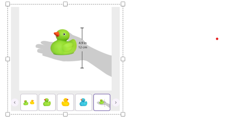

# Accessibility in .NET MAUI Rotator (SfRotator)

The [`SfRotator`](https://help.syncfusion.com/cr/xamarin/Syncfusion.SfRotator.XForms.SfRotator.html) control has built-in `AutomationId` for inner elements. The `AutomationId` API allows the automation framework to find and interact with the inner elements of the [`SfRotator`](https://help.syncfusion.com/cr/xamarin/Syncfusion.SfRotator.XForms.SfRotator.html) control. To keep unique AutomationId, these inner elements' AutomationIds are updated based on the control's `AutomationId`. 

For example, if you set SfRotator's `AutomationId` as "Book Display Rotator" and you want to select the fifth index, then the automation framework will interact with the [`Thumbnail`](https://help.syncfusion.com/cr/xamarin/Syncfusion.SfRotator.XForms.NavigationStripMode.html#Syncfusion_SfRotator_XForms_NavigationStripMode_Thumbnail) as "Book Display Rotator Index 5 of 5".

The automation framework will interact only to the [`Dots`](https://help.syncfusion.com/cr/xamarin/Syncfusion.SfRotator.XForms.NavigationStripMode.html#Syncfusion_SfRotator_XForms_NavigationStripMode_Dots) and [`Thumbnail`](https://help.syncfusion.com/cr/xamarin/Syncfusion.SfRotator.XForms.NavigationStripMode.html#Syncfusion_SfRotator_XForms_NavigationStripMode_Thumbnail) [`NavigationStripMode`](https://help.syncfusion.com/cr/xamarin/Syncfusion.SfRotator.XForms.SfRotator.html#Syncfusion_SfRotator_XForms_SfRotator_NavigationStripMode). You cannot interact with the rotator item when you want to select the index that is not visible in the view. 

N> You cannot provide AutomationId when the rotator item is populated with custom template.

