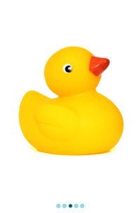
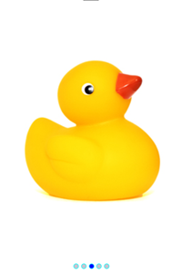
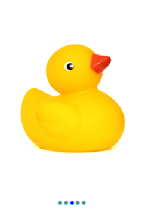

# Dots Customization in .NET MAUI Rotator (SfRotator)

The Rotator control supports to customize the dots border color, selected dots color and unselected dots color.

## DotsBorder Color

The [`DotsBorderColor`](https://help.syncfusion.com/cr/xamarin/Syncfusion.SfRotator.XForms.SfRotator.html#Syncfusion_SfRotator_XForms_SfRotator_DotsBorderColor) property is used to customize the color of dots border in [`SfRotator`](https://help.syncfusion.com/cr/xamarin/Syncfusion.SfRotator.XForms.SfRotator.html).




    <?xml version="1.0" encoding="utf-8" ?>
    <ContentPage xmlns="http://schemas.microsoft.com/dotnet/2021/maui"
                xmlns:x="http://schemas.microsoft.com/winfx/2009/xaml"
                xmlns:syncfusion="clr-namespace:Syncfusion.Maui.Rotator;assembly=Syncfusion.Maui.Rotator"
                xmlns:local="clr-namespace:Rotator"
                x:Class="Rotator.Rotator">
        <ContentPage.BindingContext>
            <local:RotatorViewModel/>
        </ContentPage.BindingContext>
        <ContentPage.Content>
            <syncfusion:SfRotator x:Name="rotator" 
                                ItemsSource="{Binding ImageCollection}" 
                                SelectedIndex="2"
                                BackgroundColor="#ececec"
                                NavigationStripPosition="Bottom"
                                DotsBorderColor="Aqua"
                                WidthRequest="550"
                                HeightRequest="550">
                <syncfusion:SfRotator.ItemTemplate>
                    <DataTemplate>
                        <Image  Source="{Binding Image}"/>
                    </DataTemplate>
                </syncfusion:SfRotator.ItemTemplate>
            </syncfusion:SfRotator>
        </ContentPage.Content>
    </ContentPage>




    using Syncfusion.Maui.Core.Rotator;
    using Syncfusion.Maui.Rotator;

    namespace Rotator
    {
        public partial class Rotator : ContentPage
        {
            public Rotator()
            {
                InitializeComponent ();
                SfRotator rotator = new SfRotator();
                var ImageCollection = new List<RotatorModel> {
                new RotatorModel ("image1.png"),
                new RotatorModel ("image2.png"),
                new RotatorModel ("image3.png"),
                new RotatorModel ("image4.png"),
                new RotatorModel ("image5.png")
                };
                var itemTemplate = new DataTemplate(() =>
                {
                    var grid = new Grid();
                    var nameLabel = new Image();
                    nameLabel.SetBinding(Image.SourceProperty, "Image");
                    grid.Children.Add(nameLabel);
                    return grid;
                });
                rotator.ItemTemplate = itemTemplate;
                rotator.DotsBorderColor = Colors.Aqua;
                rotator.ItemsSource = ImageCollection;
                rotator.WidthRequest=550;
                rotator.HeightRequest=550;
                this.Content = rotator;
            }
        }
        public class RotatorModel
        {
            public RotatorModel(string imageString)
            {
                Image = imageString;
            }
            private String _image;
            public String Image
            {
                get { return _image; }
                set { _image = value; }
            }
        }
    }




## Selected Dot Color

The [`SelectedDotColor`](https://help.syncfusion.com/cr/xamarin/Syncfusion.SfRotator.XForms.SfRotator.html#Syncfusion_SfRotator_XForms_SfRotator_SelectedDotColor) property is used to customize the color of selected dots in [`SfRotator`](https://help.syncfusion.com/cr/xamarin/Syncfusion.SfRotator.XForms.SfRotator.html).




    <?xml version="1.0" encoding="utf-8" ?>
    <ContentPage xmlns="http://schemas.microsoft.com/dotnet/2021/maui"
                xmlns:x="http://schemas.microsoft.com/winfx/2009/xaml"
                xmlns:syncfusion="clr-namespace:Syncfusion.Maui.Rotator;assembly=Syncfusion.Maui.Rotator"
                xmlns:local="clr-namespace:Rotator"
                x:Class="Rotator.Rotator">
        <ContentPage.BindingContext>
            <local:RotatorViewModel/>
        </ContentPage.BindingContext>
        <ContentPage.Content>
            <syncfusion:SfRotator x:Name="rotator" 
                                ItemsSource="{Binding ImageCollection}" 
                                SelectedIndex="2"
                                BackgroundColor="#ececec"
                                NavigationStripPosition="Bottom"
                                DotsBorderColor="Aqua" 
                                SelectedDotColor="Blue"
                                WidthRequest="550"
                                HeightRequest="550">
                <syncfusion:SfRotator.ItemTemplate>
                    <DataTemplate>
                        <Image  Source="{Binding Image}"/>
                    </DataTemplate>
                </syncfusion:SfRotator.ItemTemplate>
            </syncfusion:SfRotator>
        </ContentPage.Content>
    </ContentPage>




    using Syncfusion.Maui.Core.Rotator;
    using Syncfusion.Maui.Rotator;

    namespace Rotator
    {
        public partial class Rotator : ContentPage
        {
            public Rotator()
            {
                InitializeComponent ();
                SfRotator rotator = new SfRotator();
                var ImageCollection = new List<RotatorModel> {
                new RotatorModel ("image1.png"),
                new RotatorModel ("image2.png"),
                new RotatorModel ("image3.png"),
                new RotatorModel ("image4.png"),
                new RotatorModel ("image5.png")
                };
                var itemTemplate = new DataTemplate(() =>
                {
                    var grid = new Grid();
                    var nameLabel = new Image();
                    nameLabel.SetBinding(Image.SourceProperty, "Image");
                    grid.Children.Add(nameLabel);
                    return grid;
                });
                rotator.ItemTemplate = itemTemplate;
                rotator.DotsBorderColor = Color.Aqua;
                rotator.SelectedDotColor = Color.Blue;
                rotator.ItemsSource = ImageCollection;
                rotator.WidthRequest=550;
                rotator.HeightRequest=550;
                this.Content = rotator;
            }
        }
        public class RotatorModel
        {
            public RotatorModel(string imageString)
            {
                Image = imageString;
            }
            private String _image;
            public String Image
            {
                get { return _image; }
                set { _image = value; }
            }
        }
    }




## Unselected Dot Color

The [`UnselectedDotColor`](https://help.syncfusion.com/cr/xamarin/Syncfusion.SfRotator.XForms.SfRotator.html#Syncfusion_SfRotator_XForms_SfRotator_UnselectedDotColor) property is used to customize the color of unselected dots in [`SfRotator`](https://help.syncfusion.com/cr/xamarin/Syncfusion.SfRotator.XForms.SfRotator.html).




    <?xml version="1.0" encoding="utf-8" ?>
    <ContentPage xmlns="http://schemas.microsoft.com/dotnet/2021/maui"
                xmlns:x="http://schemas.microsoft.com/winfx/2009/xaml"
                xmlns:syncfusion="clr-namespace:Syncfusion.Maui.Rotator;assembly=Syncfusion.Maui.Rotator"
                xmlns:local="clr-namespace:Rotator"
                x:Class="Rotator.Rotator">
        <ContentPage.BindingContext>
            <local:RotatorViewModel/>
        </ContentPage.BindingContext>
        <ContentPage.Content>
            <syncfusion:SfRotator x:Name="rotator" 
                                ItemsSource="{Binding ImageCollection}" 
                                SelectedIndex="2"
                                BackgroundColor="#ececec"
                                NavigationStripPosition="Bottom"
                                DotsBorderColor="Aqua" 
                                SelectedDotColor="Blue"
                                UnselectedDotColor="Gray"
                                WidthRequest="550"
                                HeightRequest="550">
                <syncfusion:SfRotator.ItemTemplate>
                    <DataTemplate>
                        <Image  Source="{Binding Image}"/>
                    </DataTemplate>
                </syncfusion:SfRotator.ItemTemplate>
            </syncfusion:SfRotator>
        </ContentPage.Content>
    </ContentPage>




    using Syncfusion.Maui.Core.Rotator;
    using Syncfusion.Maui.Rotator;

    namespace Rotator
    {
        public partial class Rotator : ContentPage
        {
            public Rotator()
            {
                InitializeComponent ();
                SfRotator rotator = new SfRotator();
                var ImageCollection = new List<RotatorModel> {
                new RotatorModel ("image1.png"),
                new RotatorModel ("image2.png"),
                new RotatorModel ("image3.png"),
                new RotatorModel ("image4.png"),
                new RotatorModel ("image5.png")
                };
                var itemTemplate = new DataTemplate(() =>
                {
                    var grid = new Grid();
                    var nameLabel = new Image();
                    nameLabel.SetBinding(Image.SourceProperty, "Image");
                    grid.Children.Add(nameLabel);
                    return grid;
                });
                rotator.ItemTemplate = itemTemplate;
                rotator.DotsBorderColor = Color.Aqua;
                rotator.SelectedDotColor = Color.Blue;
                rotator.UnselectedDotColor = Color.Gray;
                rotator.ItemsSource = ImageCollection;
                rotator.WidthRequest=550;
                rotator.HeightRequest=550;
                this.Content = rotator;
            }
        }
        public class RotatorModel
        {
            public RotatorModel(string imageString)
            {
                Image = imageString;
            }
            private String _image;
            public String Image
            {
                get { return _image; }
                set { _image = value; }
            }
        }
    }




