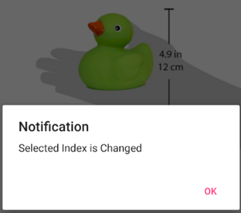
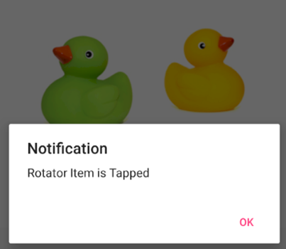

# Events in .NET MAUI Rotator (SfRotator)

## Selected Index Changed Event

The SelectedIndexChanged event is used to notify when the selection is changed by swiping or dynamically setting the [`SelectedIndex`](https://help.syncfusion.com/cr/maui/Syncfusion.Maui.Rotator.SfRotator.html#Syncfusion_Maui_Rotator_SfRotator_SelectedIndex) property of the [`SfRotator`](https://help.syncfusion.com/cr/maui/Syncfusion.Maui.Rotator.SfRotator.html?tabs=tabid-1).





<?xml version="1.0" encoding="utf-8" ?>
<ContentPage xmlns="http://schemas.microsoft.com/dotnet/2021/maui"
            xmlns:x="http://schemas.microsoft.com/winfx/2009/xaml"
            xmlns:syncfusion="clr-namespace:Syncfusion.Maui.Rotator;assembly=Syncfusion.Maui.Rotator"
            xmlns:local="clr-namespace:Rotator"
            x:Class="Rotator.Rotator">
    <rotator:SfRotator.BindingContext>
        <local:RotatorViewModel/>
    </rotator:SfRotator.BindingContext>
    <ContentPage.Content>
        <Grid HorizontalOptions="FillAndExpand" VerticalOptions="Fill">
            <rotator:SfRotator x:Name="rotator" 
                        SelectedIndexChanged="Rotator_SelectedIndexChanged"
                        ItemsSource="{Binding ImageCollection}" 
                        VerticalOptions="Start">
                <rotator:SfRotator.ItemTemplate>
                    <DataTemplate>
                            <Image Source="{Binding Image}" />
                    </DataTemplate>
                </rotator:SfRotator.ItemTemplate>
            </rotator:SfRotator>
        </Grid>
    </ContentPage.Content>
</ContentPage>





using Syncfusion.Maui.Core.Rotator;

namespace Rotator
{
    public partial class Rotator : ContentPage
    {

    RotatorViewModel viewmodel = new RotatorViewModel();
        public MainPage()
        {
            InitializeComponent();
            StackLayout layout = new StackLayout();
            SfRotator rotator = new SfRotator();
            rotator.SelectedIndexChanged += Rotator_SelectedIndexChanged;
            rotator.ItemsSource = viewmodel.ImageCollection;
            var itemTemplate = new DataTemplate(() =>
            {
                var grid = new Grid();
                var nameLabel = new Image();
                nameLabel.SetBinding(Image.SourceProperty, "Image");
                grid.Children.Add(nameLabel);
                return grid;
            });
            rotator.ItemTemplate = itemTemplate;
            layout.Children.Add(rotator);
            this.Content = layout;
            this.BindingContext = viewmodel;

        }

        private void Rotator_SelectedIndexChanged(object sender, SelectedIndexChangedEventArgs e)
        {
            DisplayAlert("Notification", "Selected Index is Changed", "Ok");
        }
    }

    public class RotatorModel
    {
        public RotatorModel(string imageString)
        {
            Image = imageString;
        }
        private String _image;
        public String Image
        {
            get { return _image; }
            set { _image = value; }
        }
    }
}

RotatorViewModel Class:

namespace Rotator
{
    public class RotatorViewModel
    {
        public RotatorViewModel()
        {
            ImageCollection.Add(new RotatorModel("image1.png"));
            ImageCollection.Add(new RotatorModel("image2.png"));
            ImageCollection.Add(new RotatorModel("image3.png"));
            ImageCollection.Add(new RotatorModel("image4.png"));
            ImageCollection.Add(new RotatorModel("image5.png"));
        }

        private ObservableCollection<RotatorModel> imageCollection = new ObservableCollection<RotatorModel>();
        public ObservableCollection<RotatorModel> ImageCollection
        {
            get { return imageCollection; }
            set { imageCollection = value; }
        }
    }
}





## Item Tapped Event

The [`ItemTapped`](https://help.syncfusion.com/cr/maui/Syncfusion.Maui.Rotator.SfRotator.html#Syncfusion_Maui_Rotator_SfRotator_ItemTapped) event will be triggered whenever tapping the item.





<?xml version="1.0" encoding="utf-8" ?>
<ContentPage xmlns="http://schemas.microsoft.com/dotnet/2021/maui"
            xmlns:x="http://schemas.microsoft.com/winfx/2009/xaml"
            xmlns:syncfusion="clr-namespace:Syncfusion.Maui.Rotator;assembly=Syncfusion.Maui.Rotator"
            xmlns:local="clr-namespace:Rotator"
            x:Class="Rotator.Rotator">
    <rotator:SfRotator.BindingContext>
        <local:RotatorViewModel/>
    </rotator:SfRotator.BindingContext>
    <ContentPage.Content>
        <Grid HorizontalOptions="FillAndExpand" VerticalOptions="Fill">
            <rotator:SfRotator x:Name="rotator" 
                            ItemTapped="Rotator_ItemTapped"
                        ItemsSource="{Binding ImageCollection}" 
                        VerticalOptions="Start">
                <rotator:SfRotator.ItemTemplate>
                    <DataTemplate>
                            <Image Source="{Binding Image}" />
                    </DataTemplate>
                </rotator:SfRotator.ItemTemplate>
            </rotator:SfRotator>
        </Grid>
    </ContentPage.Content>
</ContentPage>





using Syncfusion.Maui.Core.Rotator;

namespace Rotator
{
    public partial class Rotator : ContentPage
    {

    RotatorViewModel viewmodel = new RotatorViewModel();
        public MainPage()
        {
            InitializeComponent();
            StackLayout layout = new StackLayout();
            SfRotator rotator = new SfRotator();
            rotator.ItemTapped += Rotator_ItemTapped;
            rotator.ItemsSource = viewmodel.ImageCollection;
            var itemTemplate = new DataTemplate(() =>
            {
                var grid = new Grid();
                var nameLabel = new Image();
                nameLabel.SetBinding(Image.SourceProperty, "Image");
                grid.Children.Add(nameLabel);
                return grid;
            });
            rotator.ItemTemplate = itemTemplate;
            layout.Children.Add(rotator);
            this.Content = layout;
            this.BindingContext = viewmodel;

        }

        private void Rotator_ItemTapped(object sender, EventArgs e)
        {
            DisplayAlert("Notification", "Rotator Item is Tapped", "Ok");
        }
    }

    public class RotatorModel
    {
        public RotatorModel(string imageString)
        {
            Image = imageString;
        }
        private String _image;
        public String Image
        {
            get { return _image; }
            set { _image = value; }
        }
    }
}

RotatorViewModel Class:

namespace Rotator
{
    public class RotatorViewModel
    {
        public RotatorViewModel()
        {
            ImageCollection.Add(new RotatorModel("image1.png"));
            ImageCollection.Add(new RotatorModel("image2.png"));
            ImageCollection.Add(new RotatorModel("image3.png"));
            ImageCollection.Add(new RotatorModel("image4.png"));
            ImageCollection.Add(new RotatorModel("image5.png"));
        }

        private ObservableCollection<RotatorModel> imageCollection = new ObservableCollection<RotatorModel>();
        public ObservableCollection<RotatorModel> ImageCollection
        {
            get { return imageCollection; }
            set { imageCollection = value; }
        }
    }
}





   

