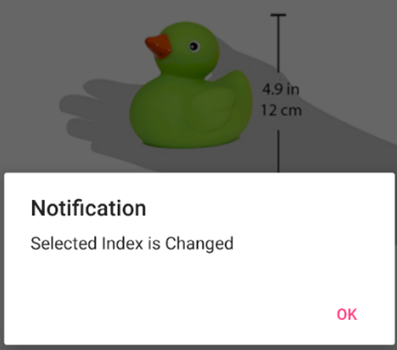
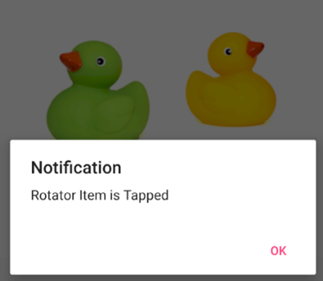

# Events in .NET MAUI Rotator (SfRotator)

The [`.NET MAUI Rotator`](https://help.syncfusion.com/cr/maui/Syncfusion.Maui.Rotator.SfRotator.html) control exposes events that you can handle to respond to user interaction and selection changes. This page covers:

* **SelectedIndexChanged** - raised when the selected item changes.
* **ItemTapped** - raised when an item is tapped.

## Prerequisites

Before using the [SfRotator](https://help.syncfusion.com/cr/maui/Syncfusion.Maui.Rotator.SfRotator.html), ensure the following NuGet package is installed in your .NET MAUI project:

- `Syncfusion.Maui.Rotator`

For step-by-step setup, refer to the [Getting Started](https://help.syncfusion.com/maui/rotator/getting-started) documentation.

## SelectedIndexChanged Event

The [`SelectedIndexChanged`](https://help.syncfusion.com/cr/maui/Syncfusion.Maui.Rotator.SfRotator.html#Syncfusion_Maui_Rotator_SfRotator_SelectedIndexChanged) event is raised when the selected item changes, either by swiping between items, by tapping a thumbnail or dot, or by setting the [`SelectedIndex`](https://help.syncfusion.com/cr/maui/Syncfusion.Maui.Rotator.SfRotator.html#Syncfusion_Maui_Rotator_SfRotator_SelectedIndex) property programmatically.




<rotator:SfRotator x:Name="rotator"
                    ItemsSource="{Binding ImageCollection}"
                    SelectedIndexChanged="Rotator_SelectedIndexChanged"
                    VerticalOptions="Start">
    <rotator:SfRotator.ItemTemplate>
        <DataTemplate>
            <Image Source="{Binding Image}" />
        </DataTemplate>
    </rotator:SfRotator.ItemTemplate>
</rotator:SfRotator>
    


    
RotatorViewModel rotatorViewModel = new RotatorViewModel();
SfRotator rotator = new SfRotator()
{
    VerticalOptions = LayoutOptions.Start,
    ItemsSource = rotatorViewModel.ImageCollection,
    ItemTemplate = new DataTemplate(() =>
    {
        var image = new Image();
        image.SetBinding(Image.SourceProperty, "Image");
        return image;
    }),
};
rotator.SelectedIndexChanged += Rotator_SelectedIndexChanged;
 



// Model
public class RotatorModel
{
    public RotatorModel(string imageString)
    {
        Image = imageString;
    }
    private string _image;
    public string Image
    {
        get { return _image; }
        set { _image = value; }
    }
}

// ViewModel
public class RotatorViewModel
{
    public RotatorViewModel()
    {
        imageCollection = new List<RotatorModel>
        {
            new RotatorModel("image1.png"),
            new RotatorModel("image2.png"),
            new RotatorModel("image3.png"),
            new RotatorModel("image4.png"),
            new RotatorModel("image5.png")
        };
    }
    private List<RotatorModel> imageCollection;
    public List<RotatorModel> ImageCollection
    {
        get { return imageCollection; }
        set { imageCollection = value; }
    }
}




The `SelectedIndexChanged` event can be handled in C# as follows:




private void Rotator_SelectedIndexChanged(object sender, SelectedIndexChangedEventArgs e)
{
    // e.Index is the new index; e.OldIndex is the previous index.
    DisplayAlert("Notification",
        $"Selected index changed from {e.OldIndex} to {e.Index}",
        "OK");
}
    



## ItemTapped Event

The [`ItemTapped`](https://help.syncfusion.com/cr/maui/Syncfusion.Maui.Rotator.SfRotator.html#Syncfusion_Maui_Rotator_SfRotator_ItemTapped) event is raised when an item in the [`SfRotator`](https://help.syncfusion.com/cr/maui/Syncfusion.Maui.Rotator.SfRotator.html) is tapped. The event does not provide item data; use the [`SelectedIndex`](https://help.syncfusion.com/cr/maui/Syncfusion.Maui.Rotator.SfRotator.html#Syncfusion_Maui_Rotator_SfRotator_SelectedIndex) property to identify the tapped item and retrieve the corresponding data from the `ItemsSource` collection.




<rotator:SfRotator x:Name="rotator"
                    ItemsSource="{Binding ImageCollection}"
                    ItemTapped="Rotator_ItemTapped"
                    VerticalOptions="Start">
    <rotator:SfRotator.ItemTemplate>
        <DataTemplate>
            <Image Source="{Binding Image}" />
        </DataTemplate>
    </rotator:SfRotator.ItemTemplate>
</rotator:SfRotator>




    
RotatorViewModel rotatorViewModel = new RotatorViewModel();
SfRotator rotator = new SfRotator()
{
    VerticalOptions = LayoutOptions.Start,
    ItemsSource = rotatorViewModel.ImageCollection,
    ItemTemplate = new DataTemplate(() =>
    {
        var image = new Image();
        image.SetBinding(Image.SourceProperty, "Image");
        return image;
    }),
};
rotator.ItemTapped += Rotator_ItemTapped;
 



// Model
public class RotatorModel
{
    public RotatorModel(string imageString)
    {
        Image = imageString;
    }
    private string _image;
    public string Image
    {
        get { return _image; }
        set { _image = value; }
    }
}

// ViewModel
public class RotatorViewModel
{
    public RotatorViewModel()
    {
        imageCollection = new List<RotatorModel>
        {
            new RotatorModel("image1.png"),
            new RotatorModel("image2.png"),
            new RotatorModel("image3.png"),
            new RotatorModel("image4.png"),
            new RotatorModel("image5.png")
        };
    }
    private List<RotatorModel> imageCollection;
    public List<RotatorModel> ImageCollection
    {
        get { return imageCollection; }
        set { imageCollection = value; }
    }
}




The `ItemTapped` event can be handled in C# as follows:




private void Rotator_ItemTapped(object sender, EventArgs e)
{
    DisplayAlert("Notification", "Rotator Item is Tapped", "Ok");
}
    



## See Also

- [Navigation Customization in .NET MAUI Rotator](https://help.syncfusion.com/maui/rotator/navigation-customization)
- [Navigation Mode in .NET MAUI Rotator](https://help.syncfusion.com/maui/rotator/navigation-modes)
- [Populating data in .NET MAUI Rotator](https://help.syncfusion.com/maui/rotator/populating-data)
- [Placement Modes in.NET MAUI Rotator](https://help.syncfusion.com/maui/rotator/placement-modes)