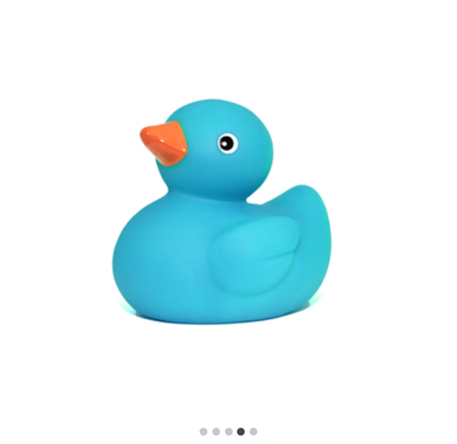

# Getting Started with .NET MAUI Rotator

This section guides you through setting up and configuring a [Rotator](https://help.syncfusion.com/cr/maui/Syncfusion.Maui.Rotator.SfRotator.html?tabs=tabid-1) in your .NET MAUI application. Follow the steps below to add a basic Rotator to your project.

To quickly get started with the .NET MAUI Rotator, watch this video.






## Prerequisites

Before proceeding, ensure the following are in place:

1. Install [.NET 9 SDK](https://dotnet.microsoft.com/en-us/download/dotnet/9.0) or later.
2. Set up a .NET MAUI environment with Visual Studio 2022 v17.12 or later.

## Step 1: Create a new .NET MAUI project

1. Go to **File > New > Project** and choose the **.NET MAUI App** template.
2. Name the project and choose a location. Then, click **Next**.
3. Select the .NET framework version and click **Create**.

## Step 2: Install the Syncfusion® MAUI Rotator NuGet package

1. In **Solution Explorer**, right-click the project and choose **Manage NuGet Packages**.
2. Search for [Syncfusion.Maui.Rotator](https://www.nuget.org/packages/Syncfusion.Maui.Rotator) and install the latest version.
3. Ensure the necessary dependencies are installed correctly, and the project is restored.




## Prerequisites

Before proceeding, ensure the following are set up:

1. Install [.NET 9 SDK](https://dotnet.microsoft.com/en-us/download/dotnet/9.0) or later.
2. Set up a .NET MAUI environment with Visual Studio Code.
3. Ensure that the .NET MAUI workloads are installed and configured as described [here](https://learn.microsoft.com/en-us/dotnet/maui/get-started/installation?view=net-maui-9.0&tabs=visual-studio-code).

## Step 1: Create a new .NET MAUI project

1. Open the Command Palette by pressing **Ctrl+Shift+P** and type **.NET:New Project** and press Enter.
2. Choose the **.NET MAUI App** template.
3. Select the project location, type the project name and press Enter.
4. Then choose **Create project**

## Step 2: Install the Syncfusion® MAUI Rotator NuGet package

1. Press <kbd>Ctrl</kbd> + <kbd>`</kbd> (backtick) to open the integrated terminal in Visual Studio Code.
2. Ensure you're in the project root directory where your .csproj file is located.
3. Run the command `dotnet add package Syncfusion.Maui.Rotator` to install the Syncfusion® .NET MAUI Rotator package.
4. To ensure all dependencies are installed, run `dotnet restore`.




## Prerequisites

Before proceeding, ensure the following are set up:

1. Ensure you have the latest version of JetBrains Rider.
2. Install [.NET 9 SDK](https://dotnet.microsoft.com/en-us/download/dotnet/9.0) or later is installed.
3. Make sure the MAUI workloads are installed and configured as described [here.](https://www.jetbrains.com/help/rider/MAUI.html#before-you-start)

## Step 1: Create a new .NET MAUI project

1. Go to **File > New Solution,** Select .NET (C#) and choose the .NET MAUI App template.
2. Enter the Project Name, Solution Name, and Location.
3. Select the .NET framework version and click Create.

## Step 2: Install the Syncfusion® MAUI Rotator NuGet package

1. In **Solution Explorer,** right-click the project and choose **Manage NuGet Packages.**
2. Search for [Syncfusion.Maui.Rotator](https://www.nuget.org/packages/Syncfusion.Maui.Rotator) and install the latest version.
3. Ensure the necessary dependencies are installed correctly, and the project is restored. If not, Open the Terminal in Rider and manually run: `dotnet restore`




## Step 3: Register Syncfusion handler

Make sure to add the namespace.



using Syncfusion.Maui.Core.Hosting;



Register the Syncfusion core handler in your `CreateMauiApp` method of `MauiProgram.cs` file to use Syncfusion controls.



builder.ConfigureSyncfusionCore();
 


## Step 4: Import Rotator namespace

Add the following namespace in your XAML or C#.




xmlns:rotator="clr-namespace:Syncfusion.Maui.Rotator;assembly=Syncfusion.Maui.Rotator"




using Syncfusion.Maui.Rotator;




## Step 5: Add the Rotator component

Initialize the `Rotator` control and we can populate the rotator’s items by using any one of the following ways,

* Through [SfRotatorItem](https://help.syncfusion.com/cr/maui/Syncfusion.Maui.Rotator.SfRotatorItem.html)

* Through [ItemTemplate](https://help.syncfusion.com/cr/maui/Syncfusion.Maui.Rotator.SfRotator.html#Syncfusion_Maui_Rotator_SfRotator_ItemTemplate)

Below is a simple example for adding rotator items using SfRotatorItem. For more details on populating data, click [Here](https://help.syncfusion.com/maui/rotator/Populating-data)

The following code example illustrates how to add a list of Images in a Rotator ,

N> Ensure that the images mentioned in the code snippets are located in the **Resources** folder of your sample project.





<rotator:SfRotator x:Name="rotator" 
                    ItemsSource="{Binding ImageCollection}" >
    <rotator:SfRotator.BindingContext>
        <local:RotatorViewModel />
    </rotator:SfRotator.BindingContext>
    <rotator:SfRotator.ItemTemplate>
        <DataTemplate>
            <Image Source="{Binding Image}"/>
        </DataTemplate>
    </rotator:SfRotator.ItemTemplate>
</rotator:SfRotator>
 
 
 


SfRotator rotator = new SfRotator();
public Rotator()
{
    List<SfRotatorItem> collectionOfItems = new List<SfRotatorItem>();
    collectionOfItems.Add(new SfRotatorItem() { Image = "image1.png" });
    collectionOfItems.Add(new SfRotatorItem() { Image = "image2.png" });
    collectionOfItems.Add(new SfRotatorItem() { Image = "image3.png" });
    collectionOfItems.Add(new SfRotatorItem() { Image = "image4.png" });
    collectionOfItems.Add(new SfRotatorItem() { Image = "image5.png" });
    rotator.ItemsSource = collectionOfItems;
    this.Content = rotator;
}





    // Model Class for Rotator.

    public class RotatorModel
    {
        public RotatorModel(string imageString)
        {
            Image = imageString;
        }
        private string _image;
        public string Image
        {
            get { return _image; }
            set { _image = value; }
        }
    }
    
    // ViewModel class for Rotator.

    public class RotatorViewModel
    {
        public RotatorViewModel()
        {
            imageCollection = new List<RotatorModel>
        {
            new RotatorModel("image1.png"),
            new RotatorModel("image2.png"),
            new RotatorModel("image3.png"),
            new RotatorModel("image4.png"),
            new RotatorModel("image5.png")
        };
        }

        private List<RotatorModel> imageCollection;
        public List<RotatorModel> ImageCollection
        {
            get { return imageCollection; }
            set { imageCollection = value; }
        }
    }




You can download the Rotator Getting Started sample from [GitHub](https://github.com/SyncfusionExamples/Getting-Started-with-.NET-MAUI-Rotator).
