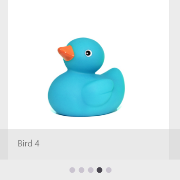

# Header Visibility in .NET MAUI Rotator (SfRotator)

The [`IsTextVisible`](https://help.syncfusion.com/cr/maui/Syncfusion.Maui.Rotator.SfRotator.html#Syncfusion_Maui_Rotator_SfRotator_IsTextVisible) property can be used to enable text visibility in the bottom area of the [`SfRotator`](https://help.syncfusion.com/cr/maui/Syncfusion.Maui.Rotator.SfRotator.html?tabs=tabid-1) to provide additional information about items. The `IsTextVisible` property is utilized to change the visibility of the text pane when the [`SfRotatorItem`](https://help.syncfusion.com/cr/maui/Syncfusion.Maui.Rotator.SfRotatorItem.html) collection is set. It has no effect when setting the ItemTemplate.

> **Note**: By default, the property value is `false`.





<?xml version="1.0" encoding="utf-8" ?>
<ContentPage xmlns="http://schemas.microsoft.com/dotnet/2021/maui"
            xmlns:x="http://schemas.microsoft.com/winfx/2009/xaml"
            xmlns:syncfusion="clr-namespace:Syncfusion.Maui.Rotator;assembly=Syncfusion.Maui.Rotator"
            xmlns:local="clr-namespace:Rotator"
            x:Class="Rotator.Rotator">
    <ContentPage.BindingContext>
    <local:RotatorViewModel/>
    </ContentPage.BindingContext>
    <ContentPage.Content>
            <syncfusion:SfRotator x:Name="rotator" 
                        BackgroundColor="#ececec"
                        IsTextVisible="True"
                        ItemsSource="{Binding ImageCollection}" 
                        VerticalOptions="Start">
                <syncfusion:SfRotator.ItemTemplate>
                    <DataTemplate>
                            <Image Source="{Binding Image}" />
                    </DataTemplate>
                </syncfusion:SfRotator.ItemTemplate>
            </syncfusion:SfRotator>
    </ContentPage.Content>
</ContentPage>





using Syncfusion.Maui.Core.Rotator;
using Syncfusion.Maui.Rotator;

namespace Rotator
{
    public partial class Rotator : ContentPage
    {
        SfRotator rotator = new SfRotator();
        StackLayout stackLayout = new StackLayout();
        public Rotator()
        {
            InitializeComponent();
            stackLayout.HeightRequest = 300;
            List<SfRotatorItem> collectionOfItems = new List<SfRotatorItem>();
            collectionOfItems.Add(new SfRotatorItem() { Image = "image1.png", ItemText = "Bird 1" });
            collectionOfItems.Add(new SfRotatorItem() { Image = "image2.png", ItemText = "Bird 2" });
            collectionOfItems.Add(new SfRotatorItem() { Image = "image3.png", ItemText = "Bird 3" });
            collectionOfItems.Add(new SfRotatorItem() { Image = "image4.png", ItemText = "Bird 4" });
            collectionOfItems.Add(new SfRotatorItem() { Image = "image5.png", ItemText = "Bird 5" });
            rotator.ItemsSource = collectionOfItems;
            rotator.IsTextVisible = true;
            rotator.DotPlacement = DotsPlacement.OutSide;
            rotator.HeightRequest = 300;
            rotator.WidthRequest = 300;
            stackLayout.Children.Add(rotator);
            this.Content = stackLayout;
        }
    }
}





