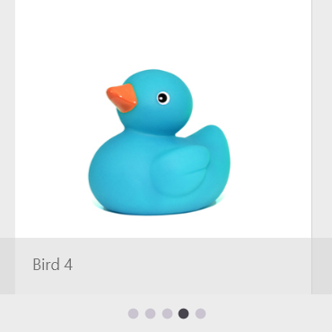

# Header Visibility in .NET MAUI Rotator (SfRotator)

## Prerequisites

Before using the [SfRotator](https://help.syncfusion.com/cr/maui/Syncfusion.Maui.Rotator.SfRotator.html), ensure the following NuGet package is installed in your .NET MAUI project:

- `Syncfusion.Maui.Rotator`

For step-by-step setup, refer to the [Getting Started](https://help.syncfusion.com/maui/rotator/getting-started) documentation.

The [`IsTextVisible`](https://help.syncfusion.com/cr/maui/Syncfusion.Maui.Rotator.SfRotator.html#Syncfusion_Maui_Rotator_SfRotator_IsTextVisible) property enables the text area at the bottom of the [`SfRotator`](https://help.syncfusion.com/cr/maui/Syncfusion.Maui.Rotator.SfRotator.html) control, which displays additional information about each item.

The text area is populated from the [`ItemText`](https://help.syncfusion.com/cr/maui/Syncfusion.Maui.Rotator.SfRotatorItem.html#Syncfusion_Maui_Rotator_SfRotatorItem_ItemText) property of [`SfRotatorItem`](https://help.syncfusion.com/cr/maui/Syncfusion.Maui.Rotator.SfRotatorItem.html) when items are added through the `SfRotatorItem` collection. When items are populated through an `ItemTemplate`, the text area does not appear, even when `IsTextVisible` is `true`.

> **Note:** By default, `IsTextVisible` is `false`.

## Show the Header Text

To display the header text, set `IsTextVisible` to `true` and populate the `ItemsSource` with `SfRotatorItem` objects that have their `ItemText` property set. The following example uses the C# code-behind to create the items.

The corresponding XAML page is shown below. Note that the XAML approach uses `SfRotatorItem` instances in the code-behind; the `IsTextVisible` text area is not supported with `ItemTemplate`-based data binding.





<rotator:SfRotator x:Name="rotator"
                    ItemsSource="{Binding ImageCollection}"
                    BackgroundColor="#ececec"
                    IsTextVisible="True"
                    VerticalOptions="Start">
    <rotator:SfRotator.ItemTemplate>
        <DataTemplate>
            <Image Source="{Binding Image}" />
        </DataTemplate>
    </rotator:SfRotator.ItemTemplate>
</rotator:SfRotator>




    
RotatorViewModel rotatorViewModel = new RotatorViewModel();
SfRotator rotator = new SfRotator()
{
    VerticalOptions = LayoutOptions.Start,
    rotator.IsTextVisible = true,
    BackgroundColor = Color.FromArgb("#ececec"),
    ItemsSource = rotatorViewModel.ImageCollection,
    ItemTemplate = new DataTemplate(() =>
    {
        var image = new Image();
        image.SetBinding(Image.SourceProperty, "Image");
        return image;
    }),
};
 



// Model
public class RotatorModel
{
    public RotatorModel(string imageString)
    {
        Image = imageString;
    }
    private string _image;
    public string Image
    {
        get { return _image; }
        set { _image = value; }
    }
}

// ViewModel
public class RotatorViewModel
{
    public RotatorViewModel()
    {
        imageCollection = new List<RotatorModel>
        {
            new RotatorModel("image1.png"),
            new RotatorModel("image2.png"),
            new RotatorModel("image3.png"),
            new RotatorModel("image4.png"),
            new RotatorModel("image5.png")
        };
    }
    private List<RotatorModel> imageCollection;
    public List<RotatorModel> ImageCollection
    {
        get { return imageCollection; }
        set { imageCollection = value; }
    }
}




## See also

- [Navigation Customization in .NET MAUI Rotator](https://help.syncfusion.com/maui/rotator/navigation-customization)
- [Navigation Mode in .NET MAUI Rotator](https://help.syncfusion.com/maui/rotator/navigation-modes)
- [Populating data in .NET MAUI Rotator](https://help.syncfusion.com/maui/rotator/populating-data)
- [Placement Modes in.NET MAUI Rotator](https://help.syncfusion.com/maui/rotator/placement-modes)